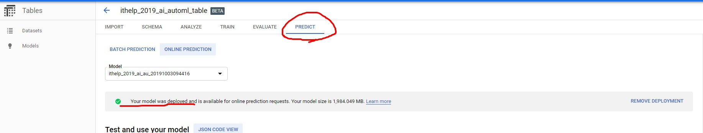
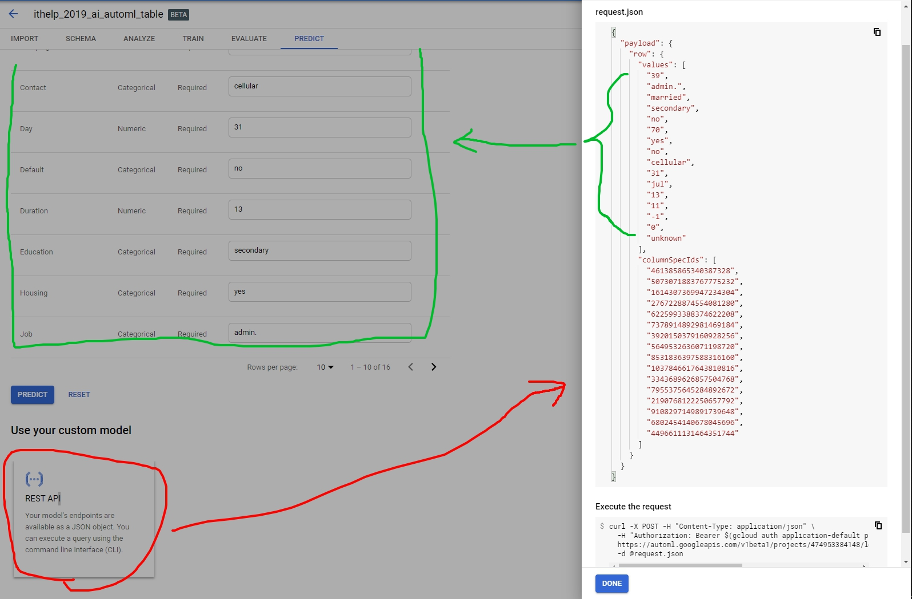
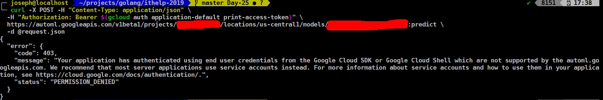
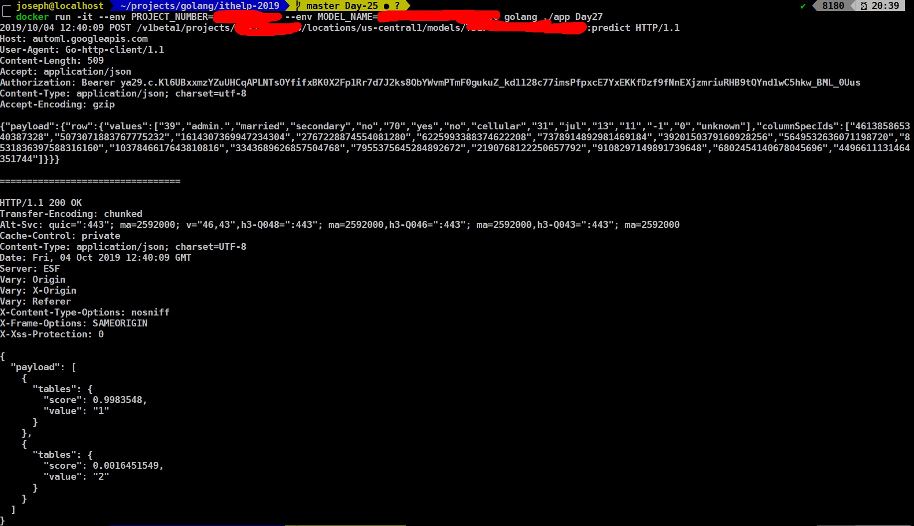

今天要來串接AutoML Table的API了，在串接之前一樣要先把Model deploy。


> 大家可以先拿的資料在UI介面上online predict一下。
<!-- more -->

記得昨天的UI介面嗎？最下面有個`REST API`點下去就會把上方feature column的值變成json，並給你一個URL讓你呼叫。


不過我這邊CURL的方式一直會出現403，看來不是用我的service account去呼叫，而是使用我的google user去呼叫，所以一直驗證失敗。


這讓我想到我用了REST API呼叫Translation API，就照本宣科來一次AutoML Table。先按照JSON格式來定義`struct`，他需要`Payload`裡面有個`Row`，`Row`內有`Values` & `ColumnSpecIds`。
```golang
type Body struct {
  Payload Payload `json:"payload"`
}
type Payload struct {
  Row Row `json:"row"`
}
type Row struct {
  Values        []string `json:"values"`
  ColumnSpecIds []string `json:"columnSpecIds"`
}
```

> 實際的格式可以參考這裡：https://cloud.google.com/automl-tables/docs/reference/rest/v1beta1/projects.locations.models/predict
> (你也可以看到其實Values, ColumnSpecIds是deprecated的狀態，可以用cells代替。

接下來看看function：
```golang
func OnlinePredict() error {
  token, _ := auth.ServiceAccount("./authentication.json", "https://www.googleapis.com/auth/cloud-platform")

  header := req.Header{
    "Accept":        "application/json",
    "Content-Type":  "application/json; charset=utf-8",
    "Authorization": "Bearer " + token.AccessToken,
  }

  body := Body{
    Payload: Payload{
      Row: Row{
        Values: []string{
          "39", "admin.", "married", "secondary", "no", "70", "yes", "no", "cellular", "31", "jul", "13", "11", "-1", "0", "unknown",
        },
        ColumnSpecIds: []string{
          "461385865340387328", "5073071883767775232", "1614307369947234304", "2767228874554081280", "6225993388374622208", "7378914892981469184",
"3920150379160928256", "5649532636071198720", "8531836397588316160", "1037846617643810816", "3343689626857504768", "7955375645284892672", "2190768122250657792",
"9108297149891739648", "6802454140678045696", "4496611131464351744",
        },
      },
    },
  }
  json_string, _ := json.Marshal(body)

  param := req.BodyJSON(json_string)
  // only url is required, others are optional.
  // params {name} = "projects/PROJECT_NUMBER/locations/us-central1/models/MODEL_NAME"
  r, err := req.Post(
    fmt.Sprintf("https://automl.googleapis.com/v1beta1/projects/%s/locations/us-central1/models/%s:predict", os.Getenv("PROJECT_NUMBER"), os.Getenv("MODEL_NAME")),
    header,
    param,
  )
  if err != nil {
    log.Fatal(err)
  }
  log.Printf("%+v", r) // print info (try it, you may surprise)

  return nil
}
```

這邊除了建立body json以外，要注意的就是[Predict API](https://cloud.google.com/automl-tables/docs/reference/rest/v1beta1/projects.locations.models/predict)裡的`{name}`其實很長，裡面包含`PROJECT_NUMBER`跟`MODEL_NAME`，應該長這樣子`projects/PROJECT_NUMBER/locations/us-central1/models/MODEL_NAME`。

然後我們就來看看結果：

預測結果是99.83% Deposit=1 (存款不會透過銀行), 0.16% Deposit=2 (存款會透過銀行)，跟在UI結果直接按predict差不多。

> 寫到最後才發現原來其實有Go API可以呼叫，可是要去翻翻Github: https://github.com/googleapis/google-cloud-go/tree/master/automl/apiv1beta1

OK，今天就寫到這邊，謝謝大家的觀看。
> 今天的code可以看Github：https://github.com/josephMG/ithelp-2019/tree/Day-27
