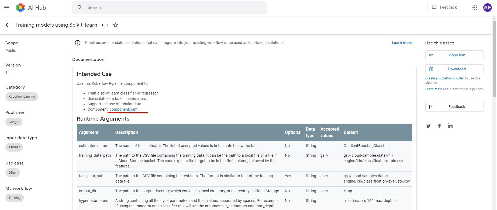
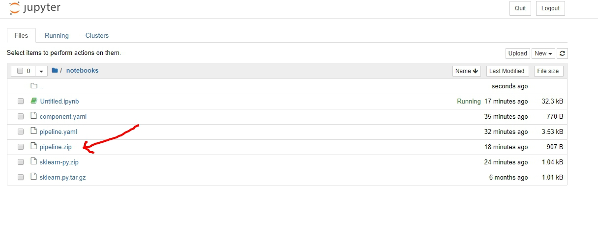

今天要來玩的是AI Hub裡面的**Reusing a pipeline component**，對Python超不熟的我弄了超久。

> 這邊會需要run起tensorflow的docker
> `docker pull tensorflow/tensorflow:latest-py3-jupyter`
> `docker run -it --rm -v $(realpath ~/notebooks):/tf/notebooks -p 8888:8888 --name jupyter tensorflow/tensorflow:latest-py3-jupyter` 
<!-- more -->

### pipeline component
首先，我們先透過[AI Hub Kubeflow pipeline](https://aihub.cloud.google.com/u/1/s?category=pipeline)找到要用的pipeline component，[doc文件](https://cloud.google.com/ai-hub/docs/use-component)裡推薦我們找**Scikit-learn Trainer**。


> 這邊我們選擇下載component.yaml，因為還沒找到正確的方法使用**Copy link**跟**Download**

### install kubeflow pipeline sdk
接著我們照著[kubeflow pipeline](https://www.kubeflow.org/docs/pipelines/sdk/install-sdk/)的教學，逐步安裝SDK。

> 這裡需要`docker exec -it jupyter /bin/bash`進入docker shell

```shell
apt-get update; apt-get install -y wget bzip2
wget https://repo.continuum.io/miniconda/Miniconda3-latest-Linux-x86_64.sh
bash Miniconda3-latest-Linux-x86_64.sh

# 因為在docker裡面run
export PATH=/root/miniconda3/bin:$PATH 

conda create --name mlpipeline python=3.7
conda activate mlpipeline

pip install https://storage.googleapis.com/ml-pipeline/release/latest/kfp.tar.gz --upgrade
```

### 建立pipeline.zip
回到[文件](https://cloud.google.com/ai-hub/docs/use-component)，開始建立pipeline.zip
```python
from kfp import compiler
import kfp.dsl as dsl
import kfp.components as comp

scikit_learn_train = comp.load_component_from_file('component.yaml')
@dsl.pipeline(
    name='Scikit-learn Trainer',
    description='Trains a Scikit-learn model')
# Use a function to define the pipeline.
def scikit_learn_trainer(
    training_data_path='gs://cloud-samples-data/ml-engine/iris/classification/train.csv',
    test_data_path='gs://cloud-samples-data/ml-engine/iris/classification/evaluate.csv',
    output_dir='/tmp',
    estimator_name='GradientBoostingClassifier',
    hyperparameters='n_estimators 100 max_depth 4'):

    # Use the component you loaded in the previous step to create a pipeline task.
    sklearn_op = scikit_learn_train(training_data_path, test_data_path, output_dir,
                                    estimator_name, hyperparameters)
compiler.Compiler().compile(scikit_learn_trainer, './pipeline.zip')    
```

接著呢，就可以看到產生的pipeline.zip了。

可以看出來，這邊我們用別人提供的pipeline，建立自己要用的pipeline.zip，接著就可以透過kubeflow pipeline上傳、測試，大大節省了很多步驟，也就是**plug-and-play AI components**。

OK，今天的文章就到這邊，謝謝大家的觀看。
