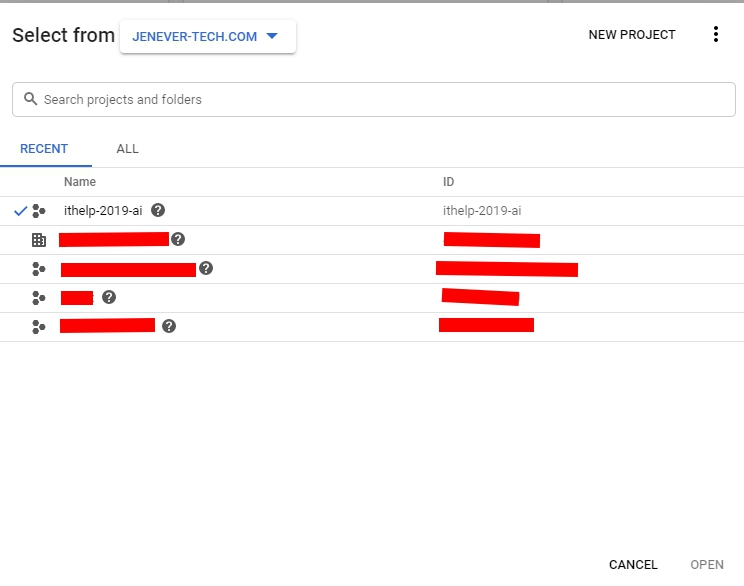
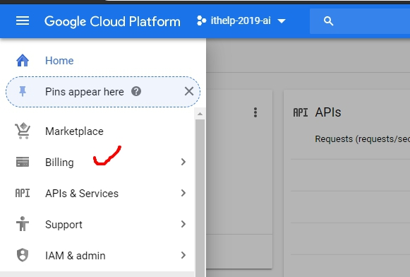
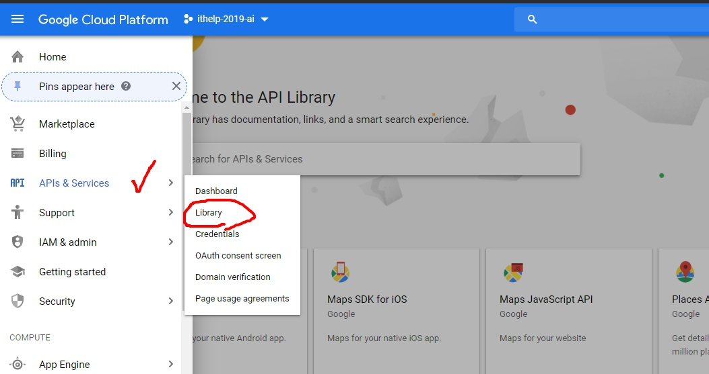
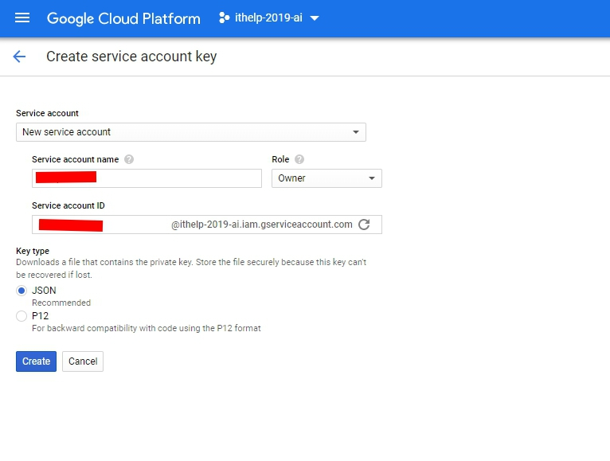
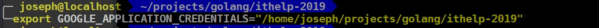
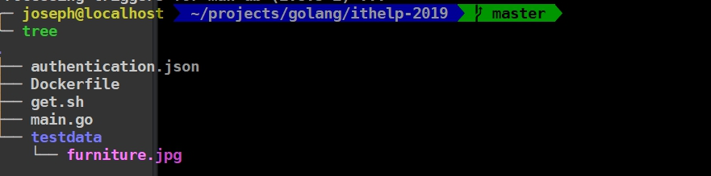
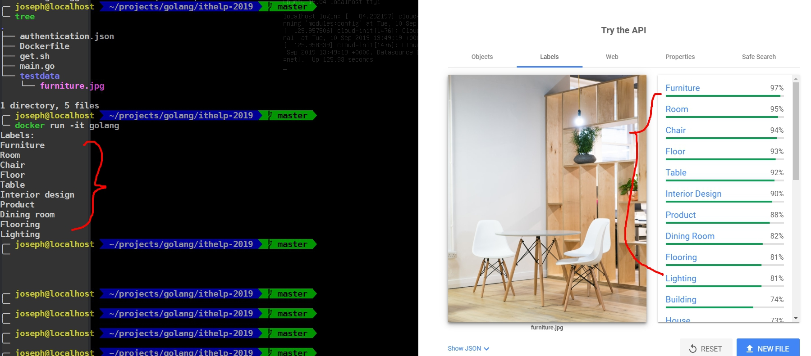

今天來入門Google Vision AI的API，文件部分可以看[這裡](https://cloud.google.com/vision/docs/quickstarts)。練功嘛！語言部分我就來順便玩一下一直想入門的Golang。

跟著Quickstarts裡的[Using client libraries](https://cloud.google.com/vision/docs/quickstart-client-libraries)走先。
1. 打開或選擇專案

這邊要注意你的ProjectName跟ProjectID不見得會一樣，每個地方會用到不同的資訊。
<!-- more -->

2. 連結帳單

如果初次連結的人，會需要填一些信用卡資訊，不過也會有三百塊的免費試用。

3. 啟用API

透過搜尋Library裡的Vision AI可以enable他。

4. 下載認證JSON

這邊建立完就得到一個含有private key的JSON了。

5. 加入環境變數
我本身是Linux環境，所以我選擇export的方式引入。


到這邊應該以後都一樣，以後要啟用我都會毅然決然地跳過!

---


把furniture.jpg搬道專案底下以後，先複製了範例上的code來跑看看。
**這是透過30天文章介紹Google Machine Learning Products的關係，原諒我無法逐行講解指令。**

```golang
// Sample vision-quickstart uses the Google Cloud Vision API to label an image.
package main
import (
        "context"
        "fmt"
        "log"
        "os"
        vision "cloud.google.com/go/vision/apiv1"
)

func main() {
        ctx := context.Background()

        // Creates a client.
        client, err := vision.NewImageAnnotatorClient(ctx)
        if err != nil {
                log.Fatalf("Failed to create client: %v", err)
        }
        defer client.Close()

        // Sets the name of the image file to annotate.
        filename := "./testdata/furniture.jpg"
        file, err := os.Open(filename)
        if err != nil {
                log.Fatalf("Failed to read file: %v", err)
        }
        defer file.Close()
        image, err := vision.NewImageFromReader(file)
        if err != nil {
                log.Fatalf("Failed to create image: %v", err)
        }
        labels, err := client.DetectLabels(ctx, image, nil, 10) //只顯示10個
        if err != nil {
                log.Fatalf("Failed to detect labels: %v", err)
        }
        fmt.Println("Labels:")
        for _, label := range labels {
                fmt.Println(label.Description)
        }
}
```
*我放在docker裡面，所以會透過docker run執行*

恩，物件的Label確實有前10個Label。改改看上面 `labels, err := client.DetectLabels(ctx, image, nil, 10)`的10，看看出來的Label數量會不會跟著變吧。

踩入Vision API的第一步完成，可以看看我的Github: [https://github.com/josephMG/ithelp-2019](https://github.com/josephMG/ithelp-2019) 取得所有的code。

今天就到這邊，話說我其實也不太知道明天是該繼續寫Vision API裡其他的detect好，還是該進入到下一個Topic好。沒關係，明天再看看。
