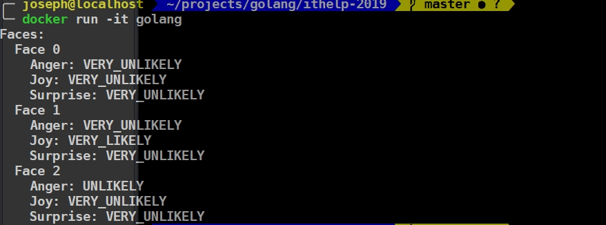

今天還是繼續多玩幾個Vision AI API好了，初步教學可以看

## [Detech text in images](https://cloud.google.com/vision/docs/ocr?authuser=1#vision_text_detection_gcs-go)
我這邊用的圖片是Google搜尋到的拉斯維加斯:

<!-- more -->

老實說這張圖不仔細看，還看不出來有"welcome"的字眼。code的部分一樣跑範例程式
```golang
package vision

import (
  "context"
  "fmt"
  "io"
  "log"
  "os"
  vision "cloud.google.com/go/vision/apiv1"
)

func DetectText(w io.Writer, file string) error {
	ctx := context.Background()

	client, err := vision.NewImageAnnotatorClient(ctx)
	if err != nil {
		return err
	}

	f, err := os.Open(file)
	if err != nil {
		return err
	}
	defer f.Close()

	image, err := vision.NewImageFromReader(f)
	if err != nil {
		return err
	}
	annotations, err := client.DetectTexts(ctx, image, nil, 10)
	if err != nil {
		return err
	}

	if len(annotations) == 0 {
		fmt.Fprintln(w, "No text found.")
	} else {
		fmt.Fprintln(w, "Text:")
		for _, annotation := range annotations {
			fmt.Fprintf(w, "%q\n", annotation.Description)
		}
	}

	return nil
}
```

這邊因為我把它寫進module的緣故，所以把**DetechText**改成了大寫開頭，主程式只要`import vision "./modules/vision"`就可以使用`vision.DetechText`了。

```golang
package main

import (
  "os"

  vision "./modules/vision"
)

func main() {
  // vision.DetectLabel(os.Stdout, "./testdata/furniture.jpg")
  vision.DetectText(os.Stdout, "./testdata/las-vegas.jpg")
}
```

結果呢？來看看output:


果不其然有**Welcome to Fabulous LAS VEGAS**，至於你說怎麼會多了*backstroke*、*TAO*這些字？就大家來找碴一下好了XD


## [Detect faces](https://cloud.google.com/vision/docs/detecting-faces)
偉大的人臉辨識一定要來介紹一下，我這邊從[flintbox](http://www.flintbox.com/public/project/4742/)抓了他的demo人臉，分成自然、開心、厭惡三種表情，把這張丟進Vision API裡訓練看看


> 要更多的臉這邊也有：https://data.vision.ee.ethz.ch/cvl/rrothe/imdb-wiki/

```golang
func DetectFaces(w io.Writer, file string) error {
  ctx := context.Background()

  client, err := vision.NewImageAnnotatorClient(ctx)
  if err != nil {
    return err
  }
  defer client.Close()

  f, err := os.Open(file)
  if err != nil {
    return err
  }
  defer f.Close()

  image, err := vision.NewImageFromReader(f)
  if err != nil {
    return err
  }
  annotations, err := client.DetectFaces(ctx, image, nil, 10)
  if err != nil {
    return err
  }
  if len(annotations) == 0 {
    fmt.Fprintln(w, "No faces found.")
  } else {
    fmt.Fprintln(w, "Faces:")
    for i, annotation := range annotations {
      fmt.Fprintln(w, "  Face", i)
      fmt.Fprintln(w, "    Anger:", annotation.AngerLikelihood)
      fmt.Fprintln(w, "    Joy:", annotation.JoyLikelihood)
      fmt.Fprintln(w, "    Surprise:", annotation.SurpriseLikelihood)
    }
  }
  return nil
}
```

output則長下面這樣

有看到三個結果，並對三個結果進行情緒分析(生氣、開心、驚訝)，左邊**自然**表情確實三個都不符合，中間**開心**的在Joy的部分為非常可能，最後右邊這張**厭惡**說實在也很難定義到底是不是生氣，所以只有一點點不可能。
至於有哪些可能呢？查了一下[API文件](https://godoc.org/google.golang.org/genproto/googleapis/cloud/vision/v1#FaceAnnotation)發現有下面幾個：
1. JoyLikelihood 
2. SorrowLikelihood 
3. AngerLikelihood 
4. SurpriseLikelihood 
5. UnderExposedLikelihood (曝光不足，或許可再針對這張臉做光源調整)
6. BlurredLikelihood (模糊，或許可以針對比較清楚的臉做focus、比較不清楚的省略掉。)
7. HeadwearLikelihood (戴頭飾?)

這個[投影片](https://www.slideshare.net/bretmc/google-machine-learning-apis-puppies-or-muffins)第30頁有Demo了一張**HeadwearLikelihood**非常可能的圖，可以去體會體會。

OK！今天玩了兩個API，還把Golang整理一下，這部分就到今天結束了！
一樣看code可以到這邊 >> [Github](https://github.com/josephMG/ithelp-2019/tree/19293eaaa51d238a39b16de9d1ddce77ebf97569)
