今天是Google Vision AI這子系列最後一章節，我們今天要來講Vision AI的[Auto ML Vision](https://cloud.google.com/vision/automl/docs/)。我玩的是GCP上面的UI介面，側邊欄打開找到**Vision**點進去就可以看到了:
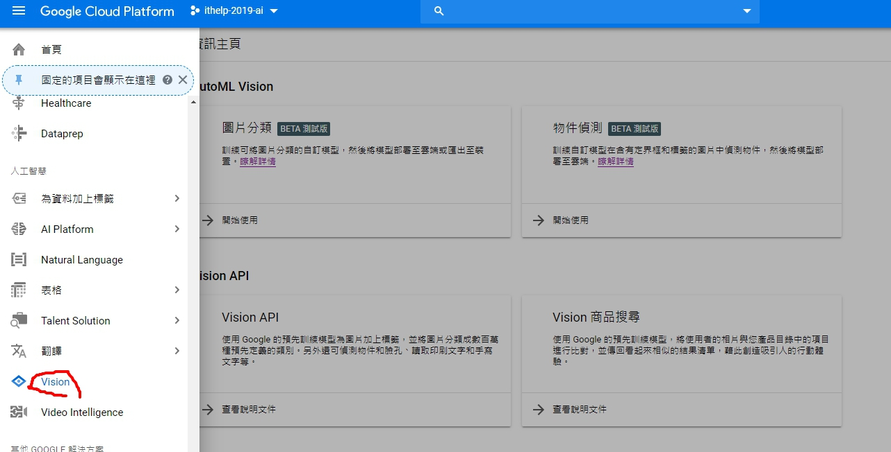
<!-- more -->

我選擇的是AutoML物件偵測，然後先建立一個資料集：
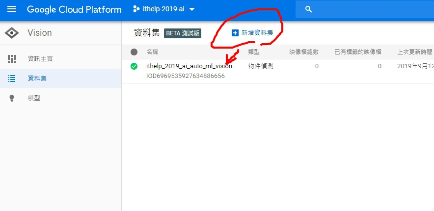

然後我在[Kaggle](https://www.kaggle.com/chetankv/dogs-cats-images/downloads/dogs-cats-images.zip/1)下載貓跟狗的dataset，準備匯入AutoML裡。進到Dateset以後選擇匯入、選擇圖片、然後選Google Cloud Storage Bucket，就可以繼續啦。
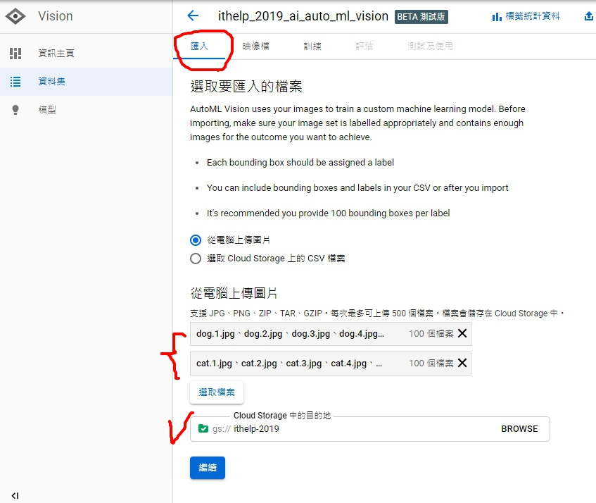
然後要建立一陣子映像檔案...........................

然後，先建立兩個標籤: Dog, Cat，
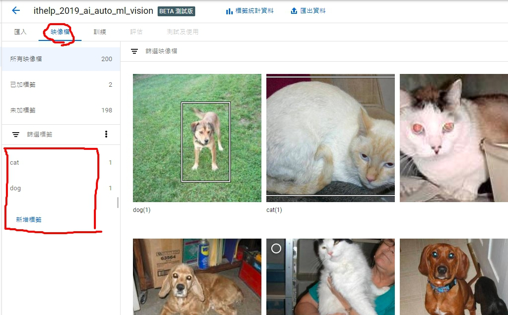
接著一張一張開始分類：
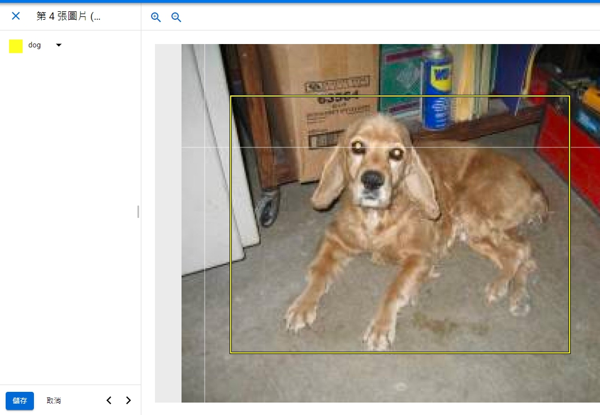

但這邊我分類了一陣子以後，跑訓練依然會失敗，至今不確定是不是操作上的問題，先上圖讓我再來研究一番...
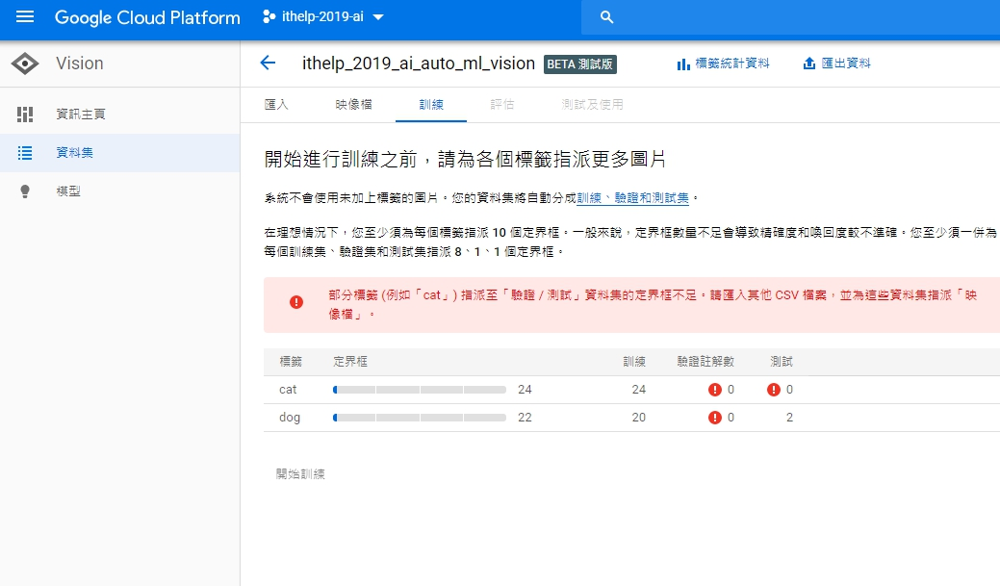

----

玩了一陣子以後，找到了一個暫時的解法：
1. 先把分類好的匯出CSV，
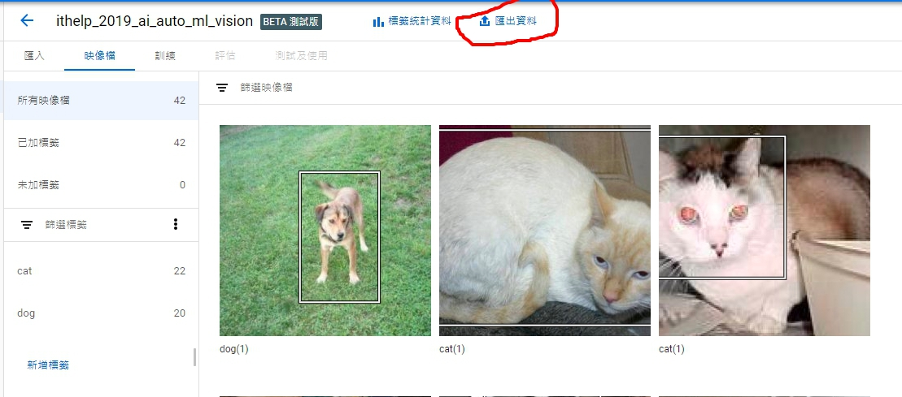

2. 去Google Cloud Storage下載，
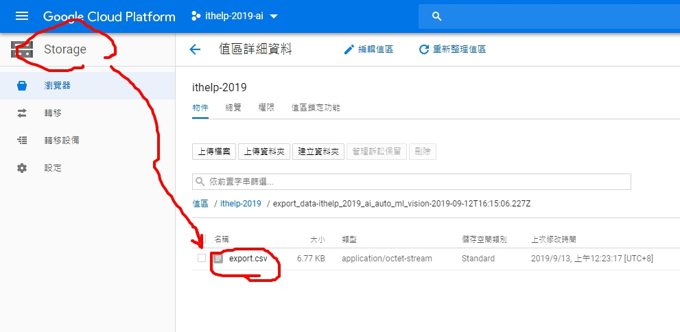

3. 然後去手動調整SET成8:1:1的training, test, validation set，奇怪的是分類的時候無法選擇，讓人很困擾。
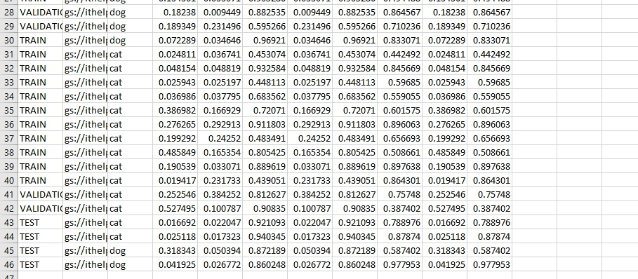

4. 開始訓練~~
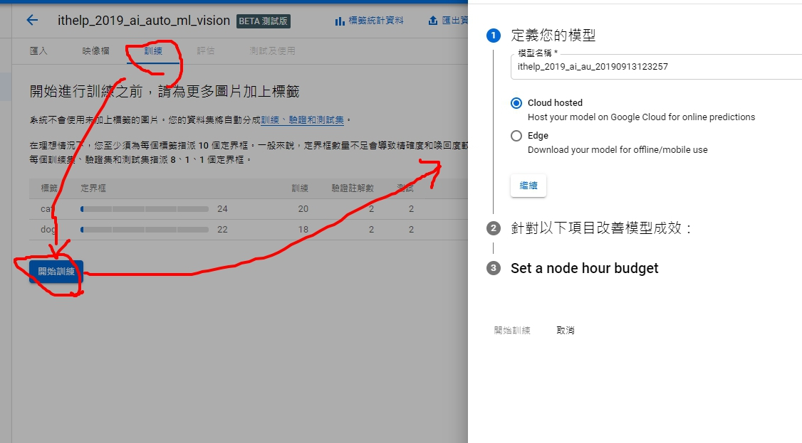
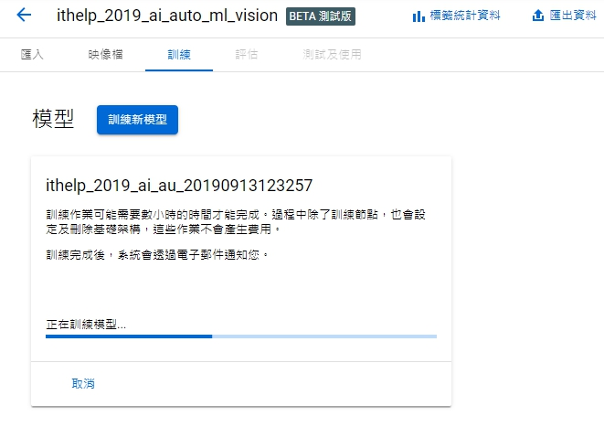

萬事起頭難之終於開始訓練了，訓練好壞就不是這邊的重點，好壞之後再繼續摸索。
Vision AI就先到這邊結束，明天來玩Video AI囉~。
