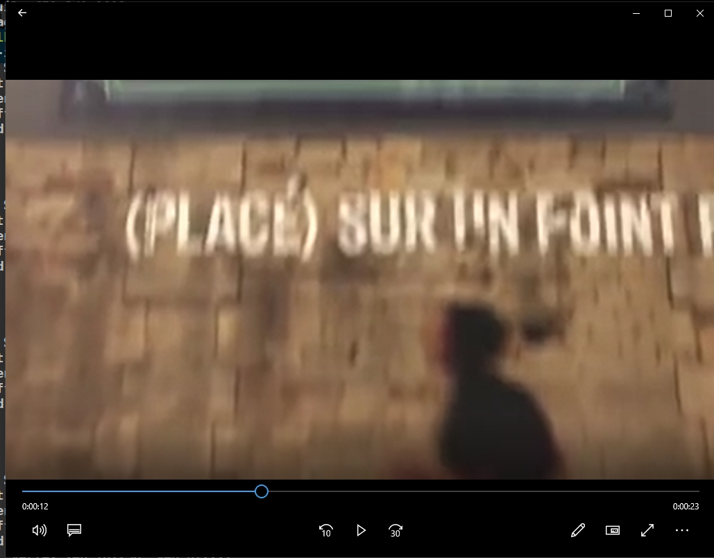

Google Video Intelligence AI API還有眾多的範例可以學習，今天再講兩個就結束這回合：[Detecting shot changes](https://cloud.google.com/video-intelligence/docs/analyze-shots?authuser=1)、[Recognizing text](https://cloud.google.com/video-intelligence/docs/text-detection?authuser=1)。

> 前情提要
> 我先從[python code example](https://github.com/GoogleCloudPlatform/python-docs-samples/tree/master/video/cloud-client/analyze)找到一些範例的影片
> - chicago.mp4: gs://cloud-ml-sandbox/video/chicago.mp4
> - gbikes_dinosaur.mp4: gs://cloud-samples-data/video/gbikes_dinosaur.mp4
> - googlework_short.mp4: gs://python-docs-samples-tests/video/googlework_short.mp4
<!-- more -->

### [Detecting shot changes](https://cloud.google.com/video-intelligence/docs/analyze-shots?authuser=1)
在範例裡我使用`gbikes_dinosaur.mp4`這個檔案，這是一部在Google園區拍gbike + 恐龍的影片。讓我直接把code貼上來，並改成大寫開頭讓外部呼叫。
```golang
func ShotChangeURI(w io.Writer, file string) error {
  ctx := context.Background()
  client, err := video.NewClient(ctx)
  if err != nil {
    return err
  }

  op, err := client.AnnotateVideo(ctx, &videopb.AnnotateVideoRequest{
    Features: []videopb.Feature{
      videopb.Feature_SHOT_CHANGE_DETECTION,
    },
    InputUri: file,
  })
  if err != nil {
    return err
  }

  fmt.Fprintf(w, "Running....")
  resp, err := op.Wait(ctx)
  if err != nil {
    return err
  }

  // A single video was processed. Get the first result.
  result := resp.AnnotationResults[0].ShotAnnotations

  for _, shot := range result {
    start, _ := ptypes.Duration(shot.StartTimeOffset)
    end, _ := ptypes.Duration(shot.EndTimeOffset)

    fmt.Fprintf(w, "Shot: %s to %s\n", start, end)
  }

  return nil
}
```
這邊的Feature使用了`Feature_SHOT_CHANGE_DETECTION`，影片乍看之下感覺是同一個場景，我來研究看看到底output會是怎樣的變化。

> 記得要先下載喔: `gsutil -m cp gs://cloud-samples-data/video/gbikes_dinosaur.mp4 .`

```
Running....
Shot: 0s to 5.166666s
Shot: 5.233333s to 10.066666s
Shot: 10.1s to 28.133333s
Shot: 28.166666s to 42.766666s
```

比對影片以後...
**Shot 0~5秒**都是在拍腳踏車
**Shot 5~10秒**在從腳踏車處移動到恐龍位置
**Shot 10~28秒**在從恐龍左側拍恐龍
**Shot 28~42秒**跑到了恐龍右側繼續拍恐龍

這些變化都能偵測出來，實在有趣。我們就趕快再來看下一個吧！

> 想看Python詳細介紹，請看這裡：https://cloud.google.com/video-intelligence/docs/shot_detection?authuser=1

### [Recognizing text](https://cloud.google.com/video-intelligence/docs/text-detection?authuser=1)

第二段來看看文字識別能力，據說可以偵測出影片裡的字，這又是能辨別到什麼程度呢？趕快把code複製下來看看。

```golang
func TextDetectionGCS(w io.Writer, gcsURI string) error {
  ctx := context.Background()

  // Creates a client.
  client, err := video.NewClient(ctx)
  if err != nil {
    log.Fatalf("Failed to create client: %v", err)
  }

  op, err := client.AnnotateVideo(ctx, &videopb.AnnotateVideoRequest{
    InputUri: gcsURI,
    Features: []videopb.Feature{
      videopb.Feature_TEXT_DETECTION,
    },
  })
  if err != nil {
    log.Fatalf("Failed to start annotation job: %v", err)
  }

  resp, err := op.Wait(ctx)
  if err != nil {
    log.Fatalf("Failed to annotate: %v", err)
  }

  // Only one video was processed, so get the first result.
  result := resp.GetAnnotationResults()[0]

  for _, annotation := range result.TextAnnotations {
    fmt.Fprintf(w, "Text: %q\n", annotation.GetText())

    // Get the first text segment.
    segment := annotation.GetSegments()[0]
    start, _ := ptypes.Duration(segment.GetSegment().GetStartTimeOffset())
    end, _ := ptypes.Duration(segment.GetSegment().GetEndTimeOffset())
    fmt.Fprintf(w, "\tSegment: %v to %v\n", start, end)

    fmt.Fprintf(w, "\tConfidence: %f\n", segment.GetConfidence())

    // Show the result for the first frame in this segment.
    frame := segment.GetFrames()[0]
    seconds := float32(frame.GetTimeOffset().GetSeconds())
    nanos := float32(frame.GetTimeOffset().GetNanos())
    fmt.Fprintf(w, "\tTime offset of the first frame: %fs\n", seconds+nanos/1e9)

    fmt.Fprintf(w, "\tRotated bounding box vertices:\n")
    for _, vertex := range frame.GetRotatedBoundingBox().GetVertices() {
      fmt.Fprintf(w, "\t\tVertex x=%f, y=%f\n", vertex.GetX(), vertex.GetY())
    }
  }
}
```

這次用的影片是googlework_short.mp4，前面大概有7秒的照片撥放，然後一直到20秒才有說13秒的話，影片總長度35秒，重點是**非常模糊**。
> 不信？載下來看看`gsutil -m cp gs://python-docs-samples-tests/video/googlework_short.mp4 .`

好我們來看看output。
```shell
Text: "(PLACE) SUR IN FOINT"
        Segment: 13.246566s to 13.246566s
        Confidence: 0.804059
        Time offset of the first frame: 13.246566s
        Rotated bounding box vertices:
                Vertex x=0.168750, y=0.650000
                Vertex x=0.965625, y=0.650000
                Vertex x=0.965625, y=0.861111
                Vertex x=0.168750, y=0.861111
Text: "(PLACE) SUR IN FOINTF"
        Segment: 12.946266s to 12.946266s
        Confidence: 0.846547
        Time offset of the first frame: 12.946266s
        Rotated bounding box vertices:
                Vertex x=0.175000, y=0.205556
                Vertex x=0.999993, y=0.211786
                Vertex x=0.999528, y=0.406229
                Vertex x=0.174535, y=0.399998
...
...
... 還有很多很多
```
分析出了文字、時間、還有文字出現在哪裡。為什麼我特別節錄這段？因為她出現時間非常....短，大概不到一秒的這張圖：

連這瞬間都不會放過，真的很強大。

今天玩的兩個服務都是以前要花很久時間才能做完的(frame by frame...)，現在丟進去就可以算出來，真希望有案子可以好好來玩這個服務。
好囉，如果你們要看更詳細的example，雖然沒有golang版本，但這邊有python版: https://github.com/GoogleCloudPlatform/python-docs-samples/tree/master/video/cloud-client/analyze

> 今天github: https://github.com/josephMG/ithelp-2019/tree/Day-8

今天就到這邊啦！謝謝各位。
