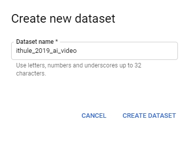
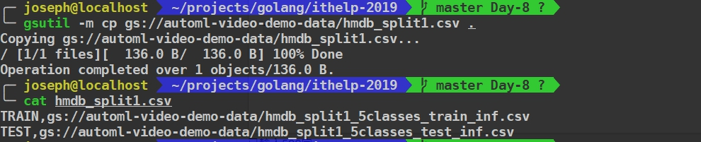
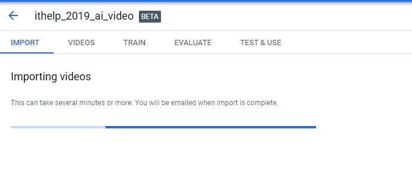
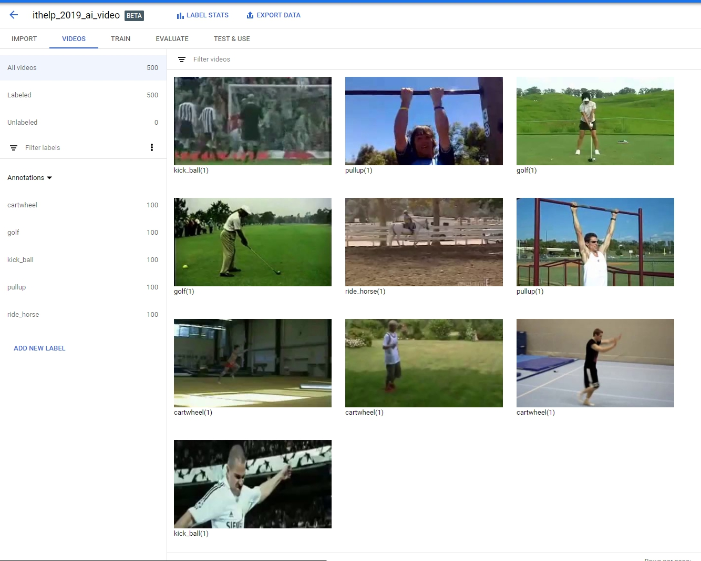
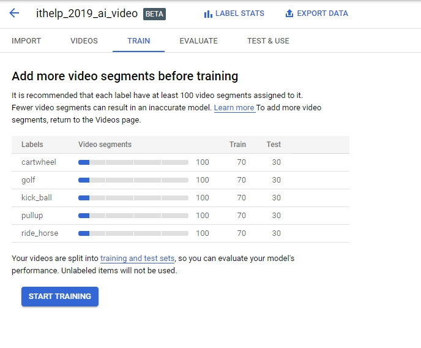
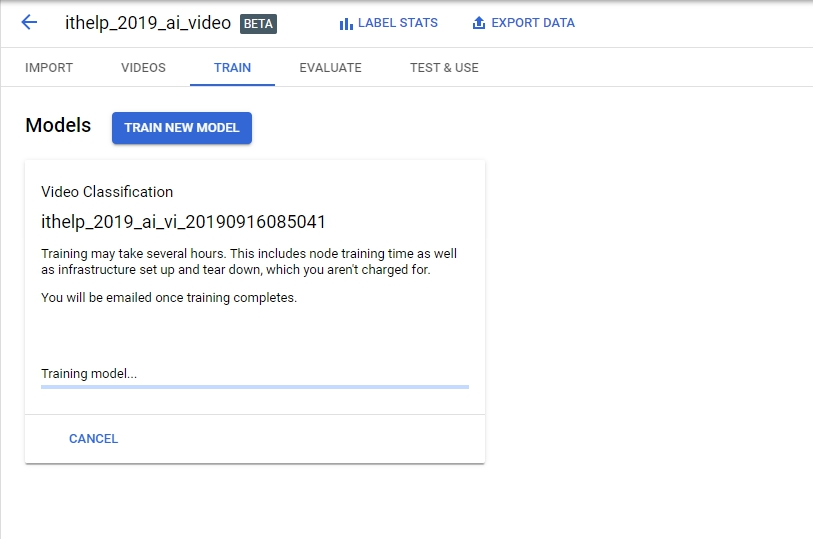
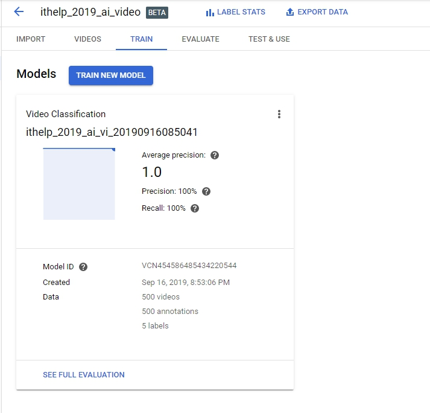
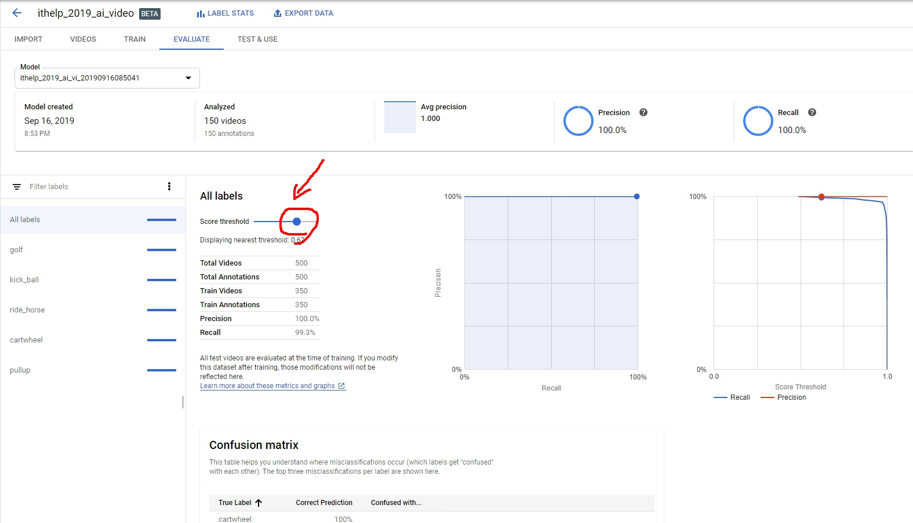
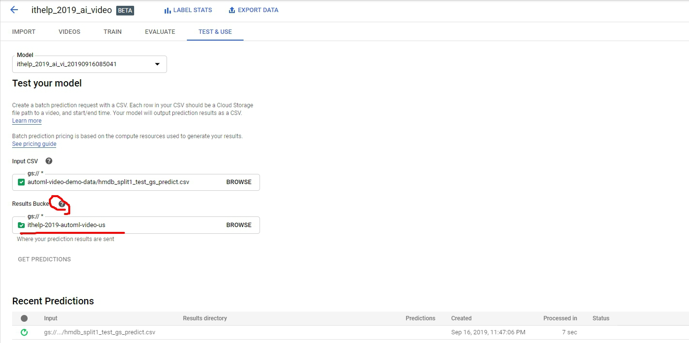

這系列的最後，也是要來AutoML一下。[AutoML Video Intelligence](https://cloud.google.com/video-intelligence/automl)，簡單的理解它就是Video Intelligence AI的UI版本，可以在這邊啟用：[Video Intelligence](https://console.cloud.google.com/video-intelligence/dashboard)

這有[Quick start](https://cloud.google.com/video-intelligence/automl/docs/quickstart-console)，我們就照著它做看一次。

首先，我們先建立dataset。

<!-- more -->

然後，我們觀察一下範例檔案`gsutil -m cp gs://automl-video-demo-data/hmdb_split1.csv .`


原來這裡面就只有兩行
```shell
TRAIN,gs://automl-video-demo-data/hmdb_split1_5classes_train_inf.csv
TEST,gs://automl-video-demo-data/hmdb_split1_5classes_test_inf.csv
```

那train data csv裡面呢？它其實每一列格式像下面這樣：
```shell
VIDEO_SOURCE,LABEL,START_TIEM,END_TIME
gs://automl-video-demo-data/hmdb51/metacafe_coolsoccer_kick_ball_f_cm_np1_ba_bad_7.avi,kick_ball,0.0,inf
```
> **END_TIME** `inf`則代表到結尾。
> 詳細CSV的格式這邊有更詳細的說明: https://cloud.google.com/video-intelligence/automl/docs/prepare?_ga=2.134679217.-1764044900.1562297905

> 載下來看看 `gsutil -m cp gs://automl-video-demo-data/hmdb51/Wayne_Rooney_At_Home_Funny_Must_See_kick_ball_f_cm_np1_le_bad_5.avi .`

好，開始import!!


大概跑了五六分鐘以後，會跑出影片跟其對應的label：

> (還好跟QuickStart不一樣，不然連圖片都還真有點像複製貼上)

接下來進入Train：


注意他給的建議是至少100部，並分成7:3的Train set vs Test set
> 這邊還有索費的情況要特別注意：https://cloud.google.com/video-intelligence/automl/pricing?_ga=2.201247470.-1764044900.1562297905
> **You pay only for the computer hours used; if training fails for any reason other than a user-initiated cancellation, you are not billed for the time. You will be charged for training time if you cancel the operation.**


這又是一個要跑幾個小時的動作......九點出門倒垃圾，回來一直等到11點才跑完。


我們跑到Evaluate，可以拖拉Threshold去調整你的Model，好讓後面的Test & Use使用。


最後最後，我們開始測試了，這邊有個地方讓我鬼打牆很久，它output bucket一定要選擇**us-central-1** region，我圈起來的地方你會看到這個小秘密。


跑出來以後點下面的 **VIEW** 就可以看到結果啦！然後還會吐出Restful API給你呼叫，讓你可以跟你的服務或產品串在一起。至於準不準，就見仁見智了，不準的話就在優化，準的話就進行部屬。

好囉！今天到此為止。又體會了一個新的AI服務，每次都可以激發出不同的想像‧
