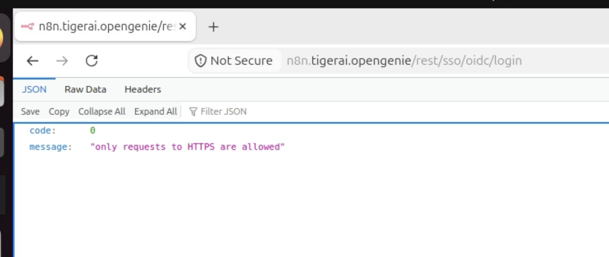
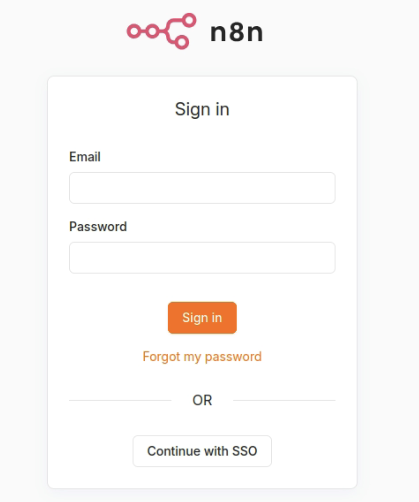

需求一句話講得完： **讓 n8n 支援 OIDC SSO 登入**。

這看似只是改改環境變數的小需求，但當初我和 AI 一起討論並嘗試串接時，發現真正折磨人的不是語法，而是這一路上幾乎每個坑都 **不會叫**：
Pod 正常 `Running`、Kubernetes 健檢全綠、`helm` 指令回傳 0、Log 裡沒有半點 Error，但使用者就是登不進去。

這篇以 Keycloak 為例做完整的技術分享與實戰踩坑紀錄，但絕大部分經驗適用於任何 OIDC Provider（例如 Auth0、Okta、Google Workspace 等）。凡是 Keycloak 專屬的細節我也都會特別標註出來。

<!-- more -->

### TOC

## 一、動手之前：三個不能繞的前提

### 前提 1：discovery endpoint 必須是 HTTPS

這是最容易低估的一條。先看症狀：

```
only requests to HTTPS are allowed
```



`/rest/sso/oidc/login` 回這一句就沒了。沒有 stack trace，沒有指出是哪個 URL。

**一開始我跟 AI 討論時直覺猜測**：大概是某個 secure cookie 或 protocol flag 沒開，找個開關關掉就好。

**真正的原因**：n8n 的 OIDC 底層是 `openid-client` → `oauth4webapi`。
`oauth4webapi` 的 `checkProtocol()` **只看 scheme、不看 host** —— discovery URL 不是 `https:` 就直接拒絕。 **沒有 localhost 例外，也沒有放寬開關。**

那條你以為存在的退路 —— 「反正是叢集內部，走 ClusterIP 用 http 打 IdP」—— 同樣不成立：
`tlsOnly` 掛在整個 Configuration 上，discovery 文件裡 **每一個 endpoint 都吃同一條規則**。
所以 IdP 自己對外宣告的 issuer 也必須是 `https://`，否則就算 discovery 過了，token 交換照樣被擋。

> **「要 n8n SSO」直接蘊含「要 HTTPS」，中間沒有折衷。**

值得記下的一點：同一個 IdP、同一份 discovery URL，換一個 client 函式庫的嚴格度可以完全不同。
這是 **函式庫差異，不是設定差異** —— 別拿「隔壁那個服務用 http 就能跑 OIDC」來推論 n8n 也能跑。

### 前提 2：Enterprise 授權

OIDC SSO 是 n8n 的 Enterprise 功能。授權沒生效時，SSO 環境變數設什麼都不會有登入按鈕。

確認方式不要靠肉眼看 UI：

```bash
curl -s http://localhost:5678/rest/settings | grep -o '"oidc":[a-z]*'
```

拿到 `"oidc":false` 就別往下設了，先處理授權（見第五節，那條線有自己的陷阱）。

### 前提 3：n8n 後端連得到 IdP

discovery 是 **n8n 後端** 去打的（backchannel），不是瀏覽器打。
DNS 解析與網路可達性都要從 n8n 那一側算，不是從你的筆電算。

叢集內部尤其容易搞混 —— 瀏覽器打得到不代表 pod 打得到。

---

## 二、最小設定

只有三個必填：

| 變數 | 說明 |
| --- | --- |
| `N8N_SSO_OIDC_DISCOVERY_ENDPOINT` | IdP 的 `.well-known/openid-configuration` |
| `N8N_SSO_OIDC_CLIENT_ID` | IdP 發給這個應用的識別碼 |
| `N8N_SSO_OIDC_CLIENT_SECRET` | 對應密鑰（n8n 走 confidential client，一定要有） |

n8n **只吃 discovery**，沒有手動指定 authorization / token / jwks endpoint 的設定。

加上三個控制參數：

| 變數 | 建議值 | 說明 |
| --- | --- | --- |
| `N8N_SSO_OIDC_LOGIN_ENABLED` | `true` | OIDC 登入總開關，預設 `false` |
| `N8N_SSO_MANAGED_BY_ENV` | `true` | env 成為唯一權威、UI 設定頁變唯讀 |
| `N8N_SSO_USER_ROLE_PROVISIONING` | `disabled` | 不做角色同步就一定要設，理由見第三節 |

`MANAGED_BY_ENV=true` 看起來只是「不讓人在 UI 亂改」，實際上它是授權出事時的 **唯一逃生出口** —— 這點第五節會回頭講。

### redirect URI 是算出來的

n8n 沒有「redirect URI」這個設定項。它由 `N8N_EDITOR_BASE_URL` 推導：

```
<N8N_EDITOR_BASE_URL>/rest/sso/oidc/callback
```

路徑是 n8n 寫死的，不能改。所以要改對外網址，改的是 `N8N_EDITOR_BASE_URL`（或它的來源 `WEBHOOK_URL`），然後到 IdP 把 redirect URI 同步改掉。兩邊不一致時 IdP 會拒絕回導。

當最小設定正確配置並取得授權後，登入介面便會成功顯示 SSO 登入按鈕：



---

## 三、IdP 側的三個陷阱（以 Keycloak 為例）

### 「我改了 secret 也重啟了，admin 密碼就是改不掉」

Keycloak 26 的 `KEYCLOAK_ADMIN` / `KEYCLOAK_ADMIN_PASSWORD` 建的是 **臨時 bootstrap admin**， **只在 DB 是空的時候生效**。DB 一旦有資料，這兩個變數就是裝飾品。

正式環境要在 master realm 另建永久 admin，再把臨時的刪掉。

### 「角色沒同步」—— 其實是登入整個失敗

這條線上有三重靜默，一層比一層難查：

1. **Keycloak 24+ 預設啟用 Declarative User Profile**，Unmanaged attributes 預設 `Disabled`。症狀是使用者頁面 **整個沒有 Attributes 分頁**，你根本沒地方設 role claim 的來源屬性。

2. **`N8N_SSO_USER_ROLE_PROVISIONING` 只要不是 `disabled`**，n8n 就會多要一個 scope（名稱來自 `N8N_SSO_SCOPES_NAME`，預設 `n8n`）。IdP 沒有同名 client scope → 回 `invalid_scope`。

 ⚠️ 注意症狀： **不是「角色沒同步」，是整個登入失敗。** 這是最容易誤判的一條 —— 你以為在 debug 角色對應，其實 OAuth 流程在更早的地方就被拒了。

3. 就算前兩層都對了，Keycloak mapper 的 User Attribute 欄位 **多一個前導空白**，Keycloak 會 **靜默不輸出 claim**：不報錯，UI 上只有一個紅框。要打 Admin API 列出 mapper config 才看得到那個空白。

 而 n8n 這頭 claim 缺席時，provisioning **整段不執行** —— 不是 fallback 成某個預設角色。

**建議：除非真的需要，把 `USER_ROLE_PROVISIONING` 設成 `disabled`，在 n8n 內部指派角色。** 不是因為做不到，是代價與收益不成比例。

### 版本冷知識

n8n 2.x 把角色搬到關聯表了。user 表上的欄位是 `roleSlug`（外鍵指向 role 表），值長得像 `global:owner` —— **不是舊版的 `role`**。照舊文件下 SQL 會查無此欄。

---

## 四、部署層的四個坑

這一節與 IdP 無關，是把設定送進 n8n 的過程中會遇到的。

### 坑 1：反向代理不要寫死（Hardcode）`X-Forwarded-Proto`

TLS 在 gateway 終止、n8n 與 IdP 跑純 HTTP，是很常見的架構。這時 IdP 要靠 `X-Forwarded-*` 才知道外面是 https（Keycloak 是 `KC_PROXY_HEADERS=xforwarded`）。

問題出在 **很多人（包含一開始 AI 產出的範例）會習慣性在路由上手動加一層 Header 覆寫**。

大多數 gateway（APISIX、nginx…）本來就無條件以 `$scheme` / `$server_port` 注入這兩個 header，在路由到處寫死只會 **把原本正確的值蓋掉**。在 HTTPS 前端下硬送 `http`，IdP 會以為請求是明文的，然後用 `http` 去組 issuer 與 redirect URL —— 而那正是 OIDC 流程裡最不能錯的兩個值。

**症狀是登入永遠不成功，而且沒有錯誤訊息。** 檢查 route 上有沒有多餘的 header 覆寫，有就拿掉。

### 坑 2：WebSocket

**症狀**：UI 顯示 `Lost connection to the server`，但 workflow **其實執行成功了**，只是結果推不回 UI。

**真因**：反向代理的 route 沒開 WebSocket。之所以容易潛伏很久，是因為 `/rest/push` 是整個 n8n 唯一用到 WebSocket 的場景 —— 登入、看設定、讀 API 全都正常，只有執行結果推不回來。

```yaml
# 路由 (例如 ApisixRoute / Ingress) 補上 websocket: true
- name: n8n
  match:
    hosts: ['n8n.example.com']
    paths: ['/*']
  websocket: true # ← 必須明確宣告，否則 101 Switching Protocols 無法穿透
  backends:
    - serviceName: n8n-main
      servicePort: http
```

判準很簡單： **後端有沒有真的用 WebSocket**。SSE 不算（走的是普通 HTTP），別無腦全加。

驗證看 Network 面板那條請求有沒有回 `101 Switching Protocols`，比看 UI 有沒有報錯精確得多。
⚠️ 要 **重開分頁**，光按重整不會重建連線。

### 坑 3：內部 CA —— 兩種完全相反的語意

只有在 IdP 用自簽或企業內部 CA 時才需要這一段。

**`NODE_EXTRA_CA_CERTS` 是「附加」語意** —— 加一張可信 CA，系統原有信任庫照常有效。這是對的做法。

對照組：某些 Python 服務用的 `SSL_CERT_FILE` 是 **「取代」語意**，只指向自簽 CA 會把整份公開 CA bundle 換掉。同一件事，兩種語意，混用就出事。

由此推出兩條硬規則：

- 🔴 **CA 不可掛到 `/etc/ssl/certs`。** 那會 **遮蔽系統信任庫**，結果是連 `license.n8n.io` 這種公開 CA 簽的站台都連不上 —— 自簽憑證修好了，Enterprise 授權掛了。掛專屬目錄，再用 `NODE_EXTRA_CA_CERTS` 指過去。

- 🔴 **絕對不要改用 `NODE_TLS_REJECT_UNAUTHORIZED=0`。** 那是關掉整個 Node 程序的憑證驗證，不是「信任這張憑證」—— 連授權伺服器的連線也一併不驗。而且它 **治不了** `only requests to HTTPS are allowed`，那是 scheme 檢查，與憑證無關。

**而這裡有本文第一個正面遇見的安靜失敗**：`NODE_EXTRA_CA_CERTS` 路徑寫錯的時候，Node 只印 **一行 warning**，rc=0，照常啟動。pod `Running`、健檢綠、什麼都看不出來。錯要等到有人按下 SSO 登入的那一刻才現形，訊息是 `UNABLE_TO_VERIFY_LEAF_SIGNATURE`。

而且它 **只在啟動時讀一次** —— 改了路徑或換了 CA 都要重啟。

如果 CA 是用 ConfigMap 掛進去的，`optional: true` 是一個明碼標價的取捨：
沒開 TLS 的環境上 ConfigMap 不存在，不加會卡在 `ContainerCreating`（大聲失敗）；加了，代價是 **把大聲的失敗換成安靜的失敗**。兩者都不完美，選之前要知道自己選了什麼。

### 坑 4：Helm overlay 會整份洗掉環境變數

這是我跟 AI 一起測試 Helm 模板時抓到的最大地雷，任何用 Helm 部署 n8n 的人都一定會撞到。

**目標**：把 SSO 的環境變數做成一份獨立的 values overlay，用 `-f base.yaml -f sso.yaml` 乾淨疊上去。

**症狀**：`helm template` rc=0， **stderr 零位元組**，沒有任何警告。表面上看起來完全成功。

**真因**：n8n 官方 Chart（1.11.0） **沒有任何原生 SSO 欄位**，所有自訂環境變數只能塞進 `config.extraEnv` —— 而它在 YAML 裡是一個 **List**， **Helm 對 List 的合併行為是「整份取代」，而不是像 Map 那樣做 Deep Merge**。

我和 AI 實際在測試容器中驗證（`alpine/helm:3.21.0`，`--kube-version v1.36.2`）：僅僅 **四行** overlay（`config` / `extraEnv` / `- name` / `value`），就直接讓 base 裡原本設定好的 **25 筆 extraEnv 瞬間被蓋到只剩 1 筆**！

被歸零的包括：

- JWT secret → 所有 session 全失效
- CA 路徑 → OIDC 報 `UNABLE_TO_VERIFY_LEAF_SIGNATURE`
- log streaming destinations → 日誌靜默斷流

唯一活下來的那一筆是授權金鑰，因為它走的是 chart 原生的 `license:` **map** （map 會 deep-merge）。

> **通則：走原生欄位的不受 list 取代影響，擠在 list 裡的全部陪葬。**
> 遇到 overlay 需求，先問「有沒有原生欄位」，能搬就搬。

**解法**：不要疊第二份 values。把值放進一個獨立的 ConfigMap，base values 裡用逐 key 的 `configMapKeyRef` + `optional: true` 引用：

```yaml
- name: N8N_SSO_OIDC_LOGIN_ENABLED
  valueFrom:
    configMapKeyRef:
      name: n8n-sso-env
      key: N8N_SSO_OIDC_LOGIN_ENABLED
      optional: true
```

支點是一句語意： **`configMapKeyRef` + `optional` 的語意是「變數不存在」，不是「空字串」。**

官方文件只寫 _will be empty_，答不出這個問題。最後是去讀 kubelet 原始碼（`pkg/kubelet/kubelet_pods.go` 的 `makeEnvironmentVariables()`）確認 `continue` 發生在 `append` **之前** —— 變數根本不進 container environment。

⚠️ 但要注意邊界： **「ConfigMap 在、key 在、值是空字串」走的是另一條路徑，會正常被設成空字串。** 「key 不存在」與「值為空」語意不同。

順帶一個相對於 `envFrom` 的好處：逐 key 引用時，`kubectl get deploy … -o yaml` **看得見變數名**；`envFrom` 是整包注入，什麼都看不到，只能 exec 進 pod 跑 `env`。除錯時差很多。

---

## 五、Enterprise 授權：一根隨時在燒的隱形引信

當初跟 AI 深入研究這條線時，發現它的授權機制比想像中更不適合離線環境。

**線上 activation key 換到的不是永久授權，是一張效期很短的 cert**，n8n 會在到期前自行去換新的。實際效期與續約提前量依授權方案而異，別假設數字 —— 用 `n8n license:info` 看 `expiresAt` 才準。

重點不在那個數字是多少，而在它的量級： **以天計，不是以年計**。

> **所以這是持續性的 egress 依賴，不是一次性啟用。**

一旦續約失敗到 cert 過期，會撞上 upstream issue **#18673 / #19907**：

- 授權過期時， **SSO 不會自動關閉**
- 連 **email / 密碼登入也一併被擋**
- 整台鎖死
- 而且 **SSO 設定頁是唯讀的**，UI 上關不掉

**唯一的逃生出口是 `N8N_SSO_MANAGED_BY_ENV=true`。** 它為 `true` 時 env 在每次啟動覆蓋資料庫設定，所以你還能從外面把 `N8N_SSO_OIDC_LOGIN_ENABLED` 改成 `false` 再重啟，把密碼登入救回來。

留 `false` 而在 UI 開了 SSO，就沒有這條路了 —— 只能進 DB 改。 **這就是為什麼第二節建議把它設成 `true`。**

如果環境本來就會長期離線，別走線上啟用，改用離線 cert（`N8N_LICENSE_CERT`）。

### 兩個明確的 log 訊號

辨識授權狀態不用猜：

| log 訊息 | 意思 |
| --- | --- |
| `cert could not be initialized … too short` | 把短的 activation key 塞進 `N8N_LICENSE_CERT` 了（那個欄位要長字串 cert） |
| `reservation ID is no longer valid` | key 失效 —— 但 **反過來證明外網是通的** |

第二條特別有價值：它同時排除了「連不出去」這個假設。

### 換金鑰換不掉？

instance **已經啟用過授權時，`N8N_LICENSE_ACTIVATION_KEY` 這個 env 完全不生效**。要先 `n8n license:clear` 再重啟。

### 版本門檻

env 管理的 OIDC 需 **≥ 2.18.0**，env 管理的 log streaming 需 **≥ 2.19.0**。

---

## 六、貫穿主題：安靜的失敗

把這一路的坑排開，共同特徵不是「難修」，是「 **不會叫** 」。

pod `Running`、健檢綠、`helm` rc=0、log 無 error —— **全都長得像成功**。

| 你看到的症狀 | 你會先猜的原因 | 真正的原因 |
| --- | --- | --- |
| `only requests to HTTPS are allowed` | 某個 secure cookie flag 沒開 | `oauth4webapi` 的 `checkProtocol()` 只看 scheme，且沒有放寬開關 |
| 改走 ClusterIP + http 還是被擋 | discovery URL 沒改乾淨 | `tlsOnly` 掛在整個 Configuration，每個 endpoint 吃同一條規則 |
| 登入永遠不成功、無錯誤訊息 | IdP client 設定錯 | route 寫死 `X-Forwarded-Proto` 蓋掉 gateway 送的 `$scheme`，IdP 用錯的 scheme 組 issuer |
| pod Running、健檢綠，SSO 一按就爆 | 憑證內容不對 | `NODE_EXTRA_CA_CERTS` 路徑錯只印一行 warning、rc=0，且只在啟動時讀一次 |
| 自簽修好了、Enterprise 授權掛了 | 授權金鑰過期 | CA 掛在 `/etc/ssl/certs` 遮蔽了系統信任庫，連不到 `license.n8n.io` |
| 改 secret 重啟，admin 密碼不變 | secret 沒掛上 | Keycloak 26 的 `KEYCLOAK_ADMIN` 是臨時 bootstrap admin，只在 DB 空時生效 |
| 使用者頁沒有 Attributes 分頁 | 版本 bug / 權限不足 | Keycloak 24+ 的 Declarative User Profile，Unmanaged attributes 預設 Disabled |
| 登入整個失敗（不是角色沒同步） | discovery / client 錯 | `USER_ROLE_PROVISIONING` 非 `disabled` 會多要一個 scope → `invalid_scope` |
| claim 沒出現，IdP 不報錯 | mapper 沒生效 | User Attribute 欄位有前導空白，Keycloak 靜默不輸出；n8n 端 claim 缺席則整段不執行 |
| UI `Lost connection to the server`，但 workflow 有跑完 | 後端掛了 | route 缺 WebSocket 支援，`/rest/push` 推不回來 |
| `helm template` rc=0、stderr 0 bytes，服務全壞 | 疊加成功了啊 | `config.extraEnv` 是 list，Helm 整份取代：25 筆 → 1 筆 |

面對這種系統，有兩件事比「照文件設定」更值得投資：

1. **把判斷收斂成單一來源。** 同一個判斷散在三個地方複製兩份，遲早漂移，而且漂移不會報錯。
2. **把危險語意壓成一行註解。** 判準是「這行拿掉之後，會不會有人把它修壞」—— 會就留一行，不會就別寫。

真正花時間的從來不是寫設定，是 **確認每一個「看起來成功」的東西到底有沒有真的成功**。

---

## 附錄：驗證清單

設定完照這個順序驗，每一步都能獨立證偽：

```bash
# ① 從 n8n 那一側打得到 discovery 嗎（不是從你的筆電）
curl -s https://<idp>/.well-known/openid-configuration | head -c 300

# ② 授權真的生效嗎（enterprise.oidc 必須是 true）
curl -s http://localhost:5678/rest/settings | grep -o '"oidc":[a-z]*'

# ③ 進程實際拿到的變數（別看 values，看實際 env）
env | grep N8N_SSO_

# ④ 授權到期日（線上啟用是短效 cert，靠自動續約）
n8n license:info
```

queue mode 下記得 **main 與 worker 都要** 拿到同一組值。

## 附錄：版本

| 元件 | 版本 |
| --- | --- |
| n8n chart | 1.11.0 |
| Keycloak image | `quay.io/keycloak/keycloak:26.0` |
| helm（驗證用容器） | `alpine/helm:3.21.0`，`--kube-version v1.36.2` |
