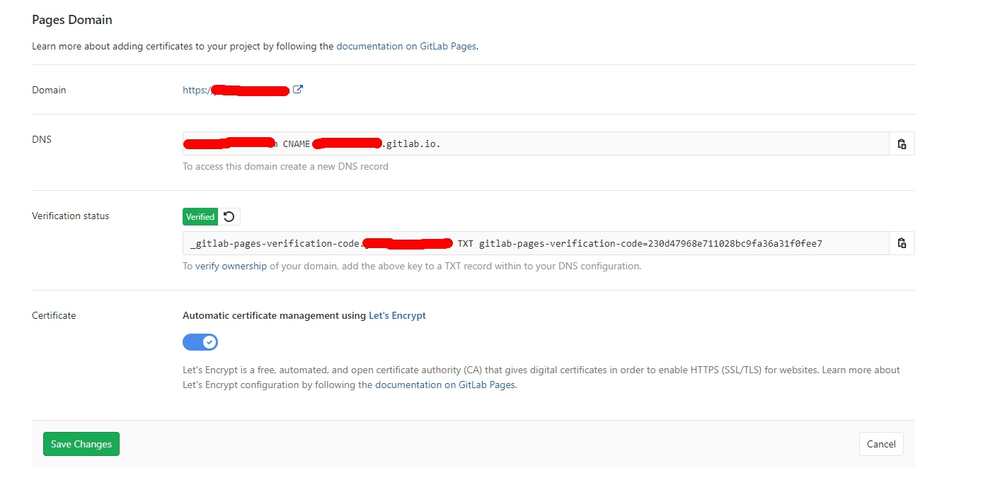
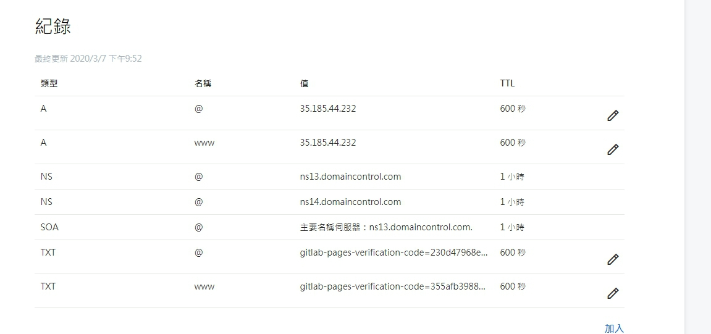

### The idea comes from...

I read a blog [將 Github Page 串上自己的域名](https://medium.com/@moojing/個人技術站一把罩-部落格建置大全-二-將-github-page-串上自己的域名-8f7e11cf2687) on Medium.com, and I thought about my bad experience in setting gitlab pages. I think I have to write a blog now, and let me remember how to set it again.

### Hugo
#### First, install go and hugo:

My system is Ubuntu 19.04, so I follow [Go wiki](https://github.com/golang/go/wiki/Ubuntu) instructions.
```
sudo add-apt-repository ppa:longsleep/golang-backports
sudo apt update
sudo apt install golang-go
```
<!-- more -->
These commands will install latest Go.
Then, let's install hugo following [hugo](https://gohugo.io/getting-started/installing/#snap-package):
```
snap install hugo --channel=extended
```

Now, test it:

Okay, system requirements are prepared.

We can use `hugo new site SITE_NAME` to initialize a site, `hugo server -D` to see you page.

### Gitlab pages

Open a `public` repository. (You will have `earth` icon.)


Then, add a gitlab-ci yml file to run CI/CD on gitlab
```yml
image: registry.gitlab.com/pages/hugo:latest

variables:
  GIT_SUBMODULE_STRATEGY: recursive

test:
  script:
  - hugo
  except:
  - master

pages:
  script:
    - hugo --gc
  artifacts:
    paths:
    - public
    expire_in: 1 day
  only:
  - master
```
Finish! add, commit, and push it!
> Check your CI/CD pipeline is passed

The last step on Gitlab is to set pages domain. Go to `Settings` > `Pages` > `New Domain` add your domain.


You will get a `CNAME` and a `TXT` settings to set in your godaddy.


But the setting is tricky. Let's see my Godaddy.

### Finally, Godaddy settings



I set two `A` records point to `35.185.44.232`, two `TXT` records corresponding to `A` and its `TXT` value. Note that `TXT` keys are only `@` and `www`. I've tried many settings, and only these settings are workable. Alternatively, you can use [Cloudflare](https://www.cloudflare.com/) with the whole keys and values that gitlab provided.

That's all. Go back to Gitlab pages setting to verify your domain, and then open your website in the browser.

### Summary

I use `A` record instead of `CNAME`, and set `@` and `www` as `TXT` records' key. Otherwise, I can't verify my domain. There are many setting tutorial on the Internet. Just find and try it!

--------
1. [Gitlab doc](https://docs.gitlab.com/ce/user/project/pages/custom_domains_ssl_tls_certification/index.html)
2. [Hugo doc](https://gohugo.io/hosting-and-deployment/hosting-on-gitlab/)
