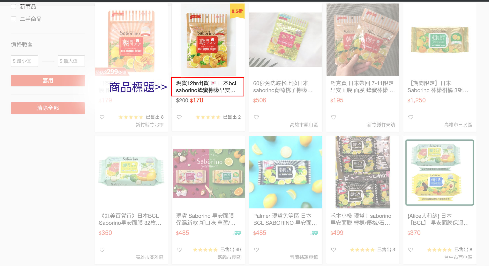

在shopee關鍵字廣告進行一段時間了，成效沒有預期的好而且費用也越來越貴，我們就來改變行銷策略做關鍵字的優化吧～優化對網站流量增加很重要，可以讓大家在搜尋的第一頁看到你的廣告，進而讓你的網站獲得大量流量。
不過要怎麼優化shopee關鍵字排名是多數人會讓遇到的困惑之一，其中關鍵字跟商品內容的一定要有非常高的相關性，才有辦法獲得較高的排名，就讓我們看看有哪些優化方式可以讓關鍵字獲得較高的排名吧！

#### - 選擇對的關鍵字
在常見的實際案例中，選擇關鍵字是一開始很多人常犯的錯誤，大家都想要非常熱門關鍵字，我們都知道熱門關鍵字可以為網站帶來很多訂單跟曝光，但是熱門關鍵字十分競爭。
如果你是剛進蝦皮的新店家，在廣告預算不高的狀況，很難在短時間內跟原本已經獲得高權重、高排名的店家競爭，建議先避免競爭度非常激烈的“熱門關鍵字”，退而選擇“相似關鍵字”就是很好的策略，別以為相似關鍵字沒有價值喔，他們是熱門關鍵字衍生出來的，每個人的搜尋習慣不同，在搜尋同一個關鍵字可能透過各種詞彙組合找尋相同網頁，
例如“早安面膜”是你主要的關鍵字，但想要取得第一頁的排名很困難，你可以根據這個關鍵字找尋類似關鍵字來進行優化，因此可以得出“日本早安面膜、早安面膜現貨、檸檬早安面膜等相似關鍵字，試著尋找買家除了熱門關鍵字外，想找他們要的商品內容還會使用哪些相似關鍵字，這樣做可以讓競爭度較低的關鍵字，較容易獲得高的排名。

<!-- more -->

#### - 商品標題優化
完成關鍵字後還沒結束喔，標題的敘述也是很重要的！很多人會忘記標題優化的部分，那標題敘述在哪裡？蝦皮賣場的標題指的是你的商品名稱。

為什麼要優化標題？好的標題可以吸引買家注意並點擊進入你的商店，內容再好買家不點擊進入你的商店根本沒用，所以要創造吸引人的標題，買家才會點擊進入到你的商店。

#### - 商品圖優化
圖片會比文字更能夠吸引買家點擊廣告，商品圖該如何呈現才能讓你的廣告點擊變多？
商品圖大、簡單的背景色，買家更能看清楚你的商品!
文字只留重點資訊，因為手機的數位版面會縮小圖片，如果參雜太多文字除了買家會看不清楚、也會讓人有壓迫感，留點空白讓閱讀者有喘息的機會吧~

#### - 關鍵字修正優化
關鍵字廣告進行一段時間後，會發現某些你買的關鍵字搜尋量及點擊率不高，代表這些關鍵字跟你的商品內容關聯性不高，也不是買家想找的商品內容，建議你把這些關鍵字關掉吧！！！然後把這些預算放在點擊高有轉換的關鍵字上，讓廣告發揮最大效益。

透過以上的優化重點，你的蝦皮關鍵字廣告會有最佳的排名，你可以反覆檢視關鍵字內容再重複進行優化，不斷提升你的商店質量。
