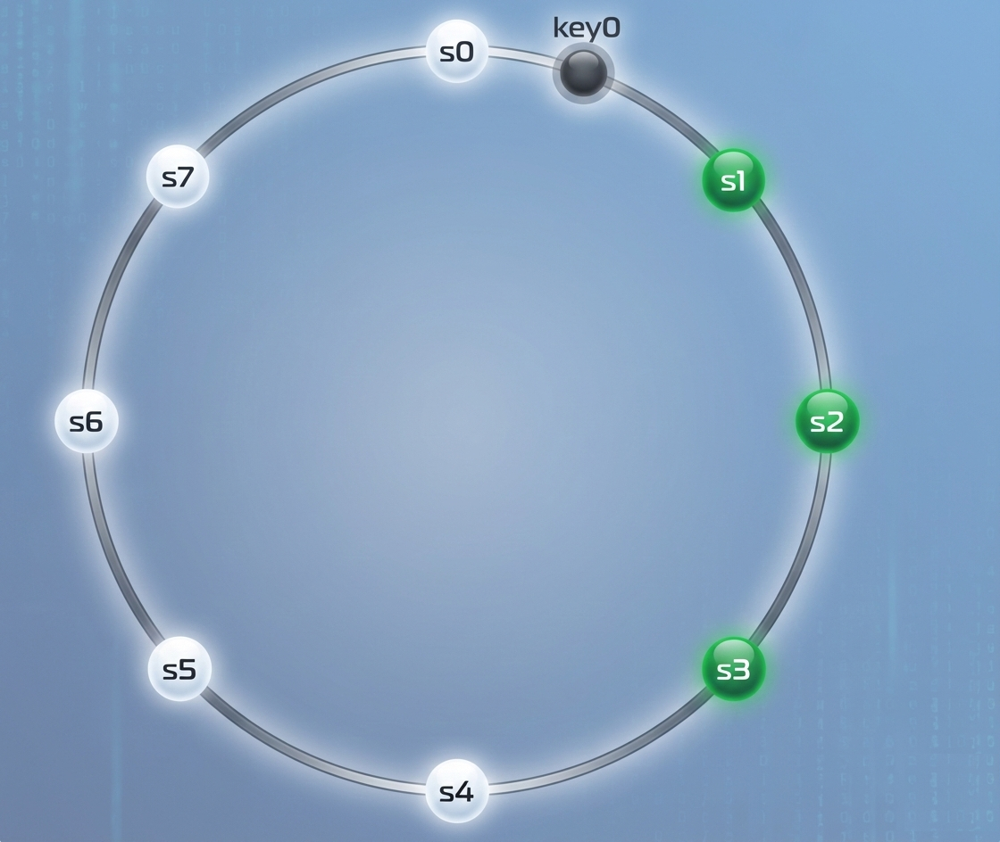
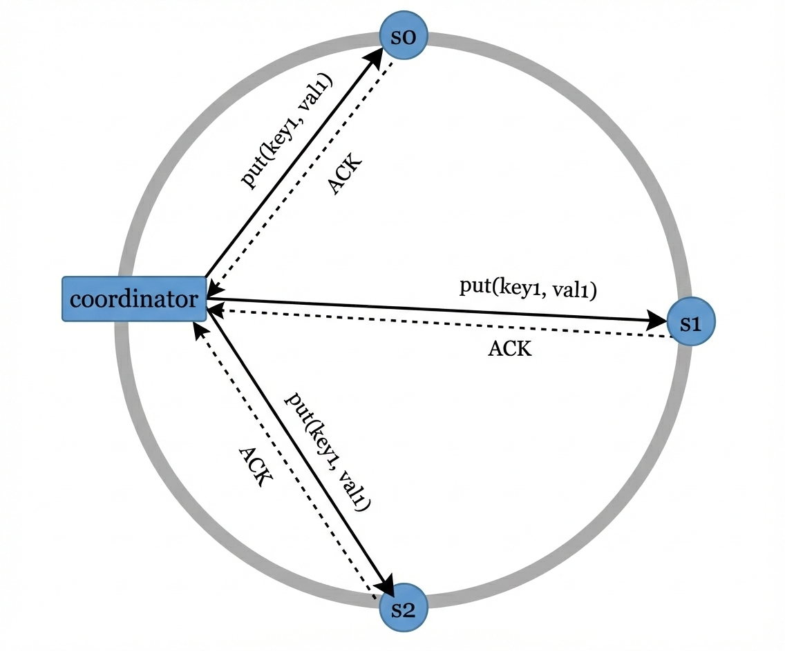
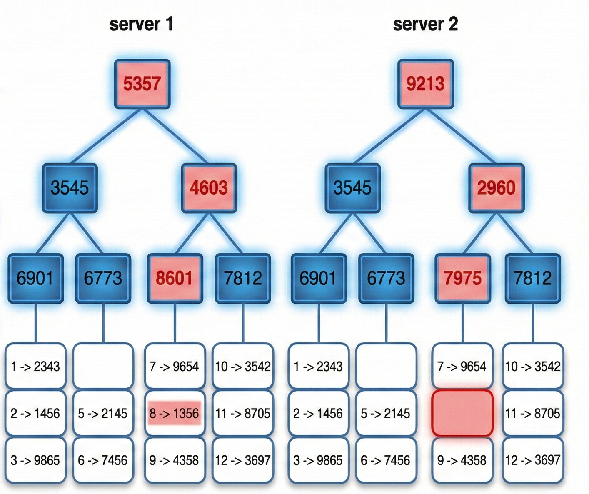
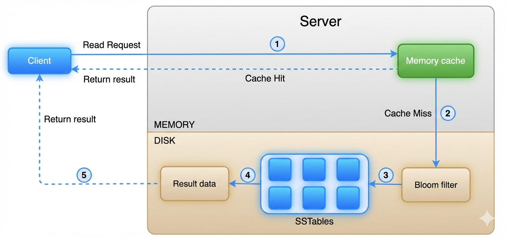

今天要來筆記的是Key-value Store，是一種非關聯式資料庫，也就是一般用在redis, Amazon DynamoDB, 跟 Memcached裡，儲存資料的方法，`Key`是unique的、為了效能要越短越好；`Value`則可以是字串、List、Object、或任意資料結構。而這篇會講到如何設計一個Key-value store去達成`get(key), put(key, value)`、以及他們可能會遇到的問題。

<!-- more -->

### TOC

### 問題定義及設計範疇

在讀、寫、記憶體使用、一致性、可用性中去tradeoff，這篇設計架構滿足下面幾項：

- Key-value pair 很小（< 10 KB）
- 能夠儲存大量資料
- 高可用性（即使部分節點故障仍能回應）
- 高擴展性（可支援大量資料）
- 自動擴展（依流量自動增減節點）
- 可調整一致性（tunable consistency）
- 低延遲

### 分散式Key-value Store

**單一server**的儲存即便做好**資料壓縮**跟**存常用的資料在memory、不常用的在disk**這兩個最佳化，也很快就會到達系統上限，所以我們就直接從分散式架構討論。

而分散式架構裡，第一個要面對的就是CAP(Consistency, Availability, Partition Tolerance)理論，通常無法同時滿足這三個條件，在權衡之下一定會犧牲一個指標。
CAP的定義如下：

- Consistency（一致性）： 所有節點在同一時間看到相同資料
- Availability（可用性）： 每個請求都能收到回應
- Partition Tolerance（分區容錯）： 系統在網路分割時仍能運作

可以看到這張圖裡面，最中間三個都overlap的區域不存在，因為沒有CAP同時滿足的情境。而要挑其中一種犧牲的話，可以有下面這些組合：

| 系統類型                                | 特性                 | 影響/說明                                        | 實務範例                                                         |
| --------------------------------------- | -------------------- | ------------------------------------------------ | ---------------------------------------------------------------- |
| CP (Consistency + Partition Tolerance)  | 支援一致性和分區容錯 | 犧牲可用性；必須阻止部分節點寫入以避免不一致     | 銀行系統：需顯示最新餘額，網路分割時返回錯誤，直到資料同步完成   |
| AP (Availability + Partition Tolerance) | 支援可用性和分區容錯 | 犧牲一致性；系統仍接受讀取，可能讀到舊資料       | 社群網站或推薦系統：即使部分節點分割，仍可繼續讀寫，資料稍後同步 |
| CA (Consistency + Availability)         | 支援一致性和可用性   | 犧牲分區容錯；實務上不可行，因為網路分割無法避免 | 不存在於實務系統中                                               |

### 系統核心元件

ByteByteGo這裡參考了Amazon Dynamo, Apache Cassandra, and Google BigTable這些Key-value store system，主要會介紹下面這些的元件：

- Data partition

資料分區主要用先前介紹過的[一致性hashing](./system-design-consistent-hashing)裡面hashing ring設計，透過下面的做法達成：

> - 將伺服器放在 Hash Ring 上
> - Key 經雜湊後映射到 Ring
> - 順時針找到第一台伺服器存放

Hash ring做的資料分區有2個優點：

> 1. 自動擴展(Automatic scaling) - 伺服器可以根據load去新增或移除
> 2. 支援異質節點(Heterogeneity) - virtual node可以根據不同server capacity去做調整

- Data replication

資料的複製可以根據hashing ring做延伸，找到同方向前n個server去做複製，為了避免同個data center出現同個可用性問題，也應該避免放在同個data center內的其他server裡。

> - 每筆資料複製到 N 個節點
> - 順時針選擇 N 個不同節點
> - 複本分散於不同資料中心

- Consistency

讀寫仲裁共識(Quorum consensus)可以保證一致性，在講解之前，先來給一下定義：

> - **N**：副本數（The number of replicas）- 每一筆資料會被複製到的節點數量。
> - **W**：寫入仲裁數（Write quorum）- 一次寫入操作必須獲得 **至少 W 個副本節點的確認（ACK）**，該寫入才會被視為成功。<u>注意是ack數量，不代表是寫入數量</u>。
> - **R**：讀取仲裁數（Read quorum）- 一次讀取操作必須等待 **至少 R 個副本節點的回應**，該讀取才會被視為成功。

這張圖說明了為什麼`W=1`不代表只寫一份到server，當`put(key, value)`送出去，只要有1個ack回來就算是`W=1`了，後面回來的ack可以忽視（也代表其實有其他server上也有資料）。而W, R, N 的設定是latency and consistency之間的tradeoff，

| 設定條件             | 系統行為 / 特性                            | 適合情境                                      |
| -------------------- | ------------------------------------------ | --------------------------------------------- |
| `R = 1`, `W = N`     | 讀取只需 1 個 replica 回應，讀取延遲最低   | 讀多寫少的系統（例如：內容查詢、商品瀏覽）    |
| `W = 1`, `R = N`     | 寫入只需 1 個 replica ACK，寫入延遲最低    | 寫多讀少的系統（例如：log 收集、事件寫入）    |
| `W + R > N`          | 讀寫 quorum 有重疊，**保證強一致性**       | 需要高度一致性的系統（常見：`N=3, W=2, R=2`） |
| `W + R ≤ N`          | 讀寫 quorum 可能無重疊，**不保證強一致性** | 可接受短暫不一致的系統（最終一致性）          |
| 動態調整 `N / W / R` | 在延遲、可用性與一致性之間取得平衡         | 依業務需求調整（tunable consistency）         |

> 這篇[鐵人賽文章](https://ithelp.ithome.com.tw/m/articles/10217619)還有更深入的說明

另一個重要的指標是一致性模型(Consistency models)，根據**資料一致性的程度**，分成下面三種：

> - 強一致性（Strong Consistency）- **任何一次讀取操作都一定會回傳最新一次寫入的結果**。換句話說，Client 永遠不會讀到過期（stale）的資料。
> - 弱一致性（Weak Consistency）- **後續的讀取操作不一定能看到最新的資料**。系統不保證資料會立即同步到所有副本。
> - 最終一致性（Eventual Consistency）- 是一種特殊形式的弱一致性。只要給系統**足夠的時間**，所有更新最終都會被傳播到所有副本，並且所有節點上的資料最終會達到一致狀態。

`強一致性`通常是透過**在所有副本尚未就最新寫入達成共識之前，禁止新的讀取或寫入操作**的方式達成。但這種做法對於高度可用（Highly Available）的系統來說並不理想，因為它可能會阻塞新的請求，導致系統暫時無法提供服務。

這篇文章推薦的，也是Dynamo 與 Cassandra 採用的 **最終一致性（Eventual Consistency）**：

> - 系統允許<u>**同時寫入導致的不一致資料版本**</u>存在
> - Client 在讀取資料時，可能會讀到多個不一致的版本
> - Client 需要負責進行<u>**衝突合併（reconciliation）**</u>

- Inconsistency resolution - versioning

概念接續上一個段落`Consistency`，這邊討論同時寫入時產生conflict該怎麼處理。

一切先定義一個**vector clock**(`[server, version]`)，透過這個vector可以確認資料D (Data)的先後順序跟衝突。在Data, Server(`Si`), version count(`vi`)之間可以表示成 ``D([S1, v1], [S2, v2], …, [Sn, vn])` ，接下來進行以下運算

> - Increment vi if [Si, vi] exists.
> - Otherwise, create a new entry [Si, 1].

因為同時寫入，這時候很有可能發生下面的時序圖

可以看到其中的**vector clock**有兩種形式：

> - 每一個參與節點的版本計數器都大於或等於版本 X 中對應節點的計數器
>   `D([s0, 1], [s1, 1])` --> `D([s0, 1], [s1, 2])`，前面的是祖先，所以沒有衝突

> - 存在任何一個節點，使得版本 Y 的向量時鐘中的計數器**小於**版本 X 中對應節點的計數器
>   `D([s0, 1], [s1, 2])` --> `D([s0, 2], [s1, 1])`，S1就造成了衝突產生

所以上面的圖裡，最後要`SX`去協調、合併最終數據。不過這也造成client的負擔、以及vector count可能會快速成長的兩個問題，而快速成長又可能會導致解決衝突(reconciliation)時效率降低或無法準確判斷版本之間的祖先關係。但Amazon DynamoDB這樣大的服務到目前還沒發生過，所以仍然是一個**可接受的解決方案**。

- Handling failures

分散式系統中故障是不可避免的，這段說明了**如何偵測故障（Failure Detection）**、**如何處理暫時性故障（Temporary Failures）**、**如何處理永久性故障（Permanent Failures）與資料中心故障**。

在**偵測故障**時，有可能只是暫時異常或網路延，不能單憑一台server回報某server故障，就馬上發出alert警報。所以又有下面這兩種做法：

| 方法                        | 作法                             | 優點             | 缺點                     |
| --------------------------- | -------------------------------- | ---------------- | ------------------------ |
| All-to-all Multicasting     | 每個節點都與所有節點互相確認存活 | 設計直觀         | 節點數多時，網路成本爆炸 |
| Gossip Protocol（八卦協議） | 節點隨機交換心跳資訊             | 高擴展性、低成本 | 故障偵測非即時           |

可以看到All-to-all multicasting就很好理解，但也效率很低。

> All-to-all multicasting
> 

Gossip protocal的運作方式就會稍微好一些：

> 1.  每個節點維護一份 membership list（節點清單 + 心跳計數）
> 2.  節點定期增加自己的 heartbeat counter
> 3.  節點隨機將心跳資訊傳給其他節點
> 4.  收到資訊後更新本地 membership list
> 5.  若某節點 heartbeat 長時間未更新，視為 offline
>      <u>節點是否「真的掛掉」是由多個節點共同確認，而不是單點判斷。</u>

> gossip protocal
> 

圖中當s0發現s2的heartbeat太久沒更新時，帶著s2得資訊告訴它自己的membership，待其他人也確認s2 heartbeat逾時沒更新，就宣告s2是offline。

知道了它是offline，有可能是網路短時間斷線、有可能是Server 重啟、也有可能是短時間過載，就要探討到底是`temporary failures` 還是 `permanent failures`。

**Handling temporary failures**

比起前面嚴格的quorum，有另一種提高可用性的**Sloopy Quorum**

| 傳統 Quorum          | Sloppy Quorum            |
| -------------------- | ------------------------ |
| 嚴格要求指定節點     | 只要找到「健康節點」即可 |
| 節點掛掉可能阻擋請求 | 自動略過故障節點         |
| 偏一致性             | 偏可用性                 |

故障期間可以延伸使用提示交接(**Hinted Handoff**)處理錯誤

> - 故障期間 - 健康節點暫時代替故障節點存資料
> - 故障恢復 - 暫存節點將資料「交還」給原節點

**Handling permanent failures**

如果硬體損壞，則要透過**Anti-Entropy**確保所有 replicas 的資料最終一致。考量成本也不能每次都全數同步。這篇介紹了雜湊樹(**Merkle Tree**)去快速找到不一樣的區塊：

> 1.  將 key space 切成 buckets
> 2.  對每個 bucket 內資料計算 hash
> 3.  自底向上建立 Merkle Tree
> 4.  先比 root hash
> 5.  若不同，逐層往下找差異
> 6.  只同步不一致的 bucket

最終把Server 1 跟 Server 2上12個key-space資料切buckets以後，找到資料8不一樣。同步的成本只跟資料差異量成正比，而不是資料總數。

> In real-world systems, the bucket size is quite big. For instance, a possible configuration is one million buckets per one billion keys, so each bucket only contains 1000 keys.

那如果整個資料中心故障(**data center outage**)，系統能做的就只能異地備援，將資料附寫到多個資料中心，使用者連到其他資料中心去抓資料。

---

- System architecture diagram

這套去中心化的系統架構裡，每個node可能有不同的服務(Client API, Failure Detection, conflict resolution, failures repair mechanism等等)。

主要有下面6個特性：

> - **Client 透過簡單的 API 與 Key-Value Store 溝通**  
>   系統對外只暴露簡單介面，例如 `get(key)` 與 `put(key, value)`，  
>   Client 不需要知道資料實際儲存在哪個節點。
> - **Coordinator（協調節點）作為 Client 與系統之間的代理**  
>    Coordinator 負責接收 Client 的請求，並轉發給正確的節點，  
>    同時收集各個節點的回應並回傳結果給 Client。
> - **節點透過一致性雜湊（Consistent Hashing）分佈在雜湊環上**  
>    所有節點都被放置在同一個 hash ring 上，用來決定資料的分區與複寫位置。
> - **系統為完全去中心化設計（Fully Decentralized）**  
>    新增或移除節點都可以自動完成，不需要人工重新分配資料或設定角色。
> - **資料會被複寫到多個節點（Replication）**  
>    透過多副本機制提升系統的可用性與可靠性，即使部分節點失效，系統仍可正常運作。
> - **不存在單點故障（No Single Point of Failure）**  
>    每個節點都擁有相同的職責與能力，任何節點都可以接收請求並參與系統運作。

- Write path

參考Cassandra的架構，寫入流程(**Write path**)有下面3個步驟

> 1. **寫入 Commit Log**
> 2. **寫入 Memory Cache（記憶體快取）**
> 3. **Flush 到 SSTable（磁碟）**  
>    這邊 SSTable 是一種依 key 排序的 `<key, value>` 資料結構，能有效支援高效查詢與順序寫入。

- Read path

系統處理讀取請求時，可以依照下面的順序取得資料：

> 1. **檢查 Memory Cache**  
>    如果有資料，直接走1底下的虛線回傳。如果快取中不存在該資料，進入下一步。
> 2. **查詢 Bloom Filter**  
>    系統使用 **Bloom Filter** 來快速判斷哪些 SSTable _可能_ 包含該 key。  
>    Bloom Filter 可以快速排除「一定不存在」的 SSTable，避免不必要的磁碟 IO。
> 3. **查詢 SSTables**  
>    根據 Bloom Filter 的結果，系統只會存取可能包含該 key 的 SSTables。
> 4. **取得資料結果**  
>    SSTables 回傳對應的資料內容。
> 5. **回傳結果給 Client**  
>    最終資料會透過節點回傳給 Client。

### Conclusion

這篇涵蓋了常見的重要概念與技術。先總結一下在**分散式 Key-Value Store**中，各種設計目標（或問題）以及對應採用的解決技術。

| 目標／問題                                      | 採用技術                                                                   |
| ----------------------------------------------- | -------------------------------------------------------------------------- |
| 能夠儲存大量資料（Big Data）                    | 使用一致性雜湊（Consistent Hashing）將負載分散到多台伺服器                 |
| 高可用性的讀取（High Availability Reads）       | 資料複寫（Data Replication） 多資料中心部署（Multi-datacenter Setup） |
| 高可用性的寫入（Highly Available Writes）       | 使用版本控制（Versioning）與向量時鐘（Vector Clocks）進行衝突解決          |
| 資料集分割（Dataset Partition）                 | 一致性雜湊（Consistent Hashing）                                           |
| 可逐步擴展（Incremental Scalability）           | 一致性雜湊（Consistent Hashing）                                           |
| 異質節點支援（Heterogeneity）                   | 一致性雜湊（Consistent Hashing）                                           |
| 可調整一致性（Tunable Consistency）             | Quorum 共識機制（Quorum Consensus）                                        |
| 處理暫時性故障（Handling Temporary Failures）   | Sloppy Quorum 與 Hinted Handoff                                            |
| 處理永久性故障（Handling Permanent Failures）   | Merkle Tree（雜湊樹）                                                      |
| 處理資料中心故障（Handling Data Center Outage） | 跨資料中心複寫（Cross-datacenter Replication）                             |

很多大方向的概念，這些都藏在常用的服務(DynamoDB and BigTable)裡。雖然不確定未來會不會設計到這麼底層的邏輯，但裡面還是有些資料結構(Merkle Tree, SSTable)的很有機會用到，先了解這些也不錯。而且即便未來沒有涉入這麼底層的設計，那些常用服務也很可能會把configuration開出來，需要設定時也要有對應的背景知識才容易上手。

If you like this post, please connect with me on LinkedIn and give me some encouragement. Thanks.
