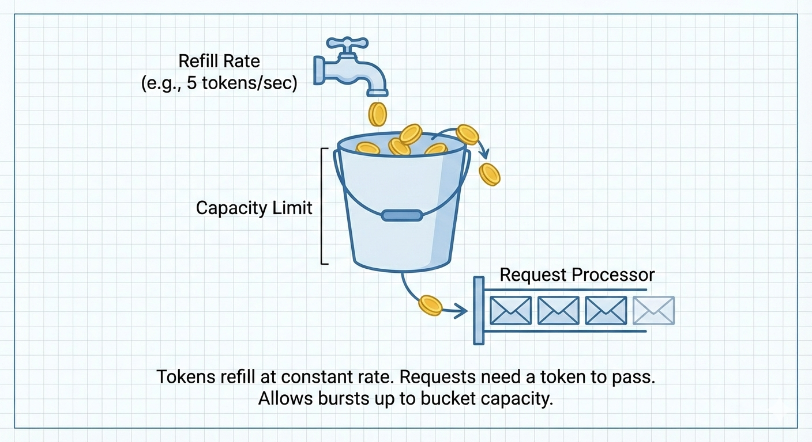
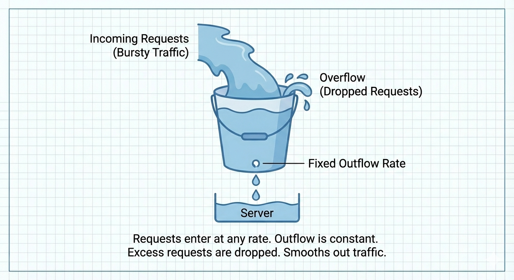
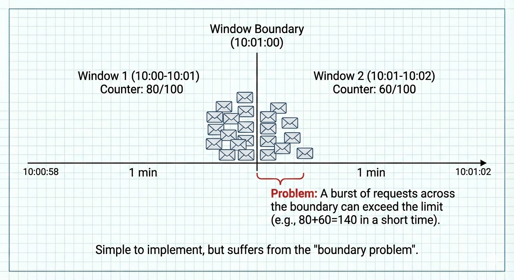
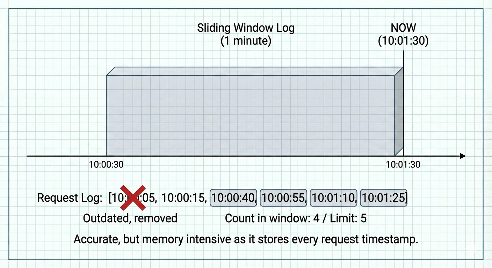
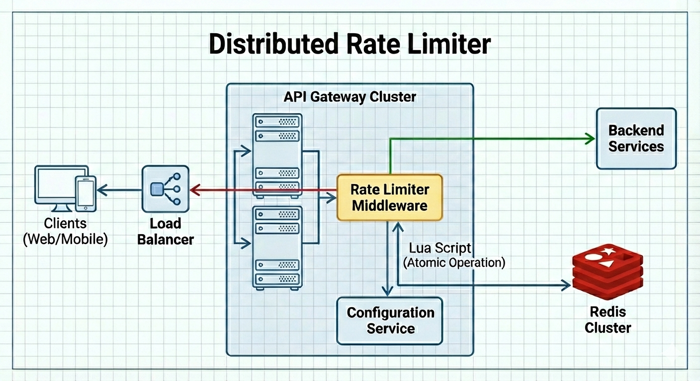

這篇要介紹的是**Rate Limiter**，是ByteByteGo System design裡面第一個design環節。現在很多後端主流框架都有內建或有對應套件，但對應的演算法卻被封裝起來，知其然不知其所以然。
今天這篇靠AI生成點簡單的示意圖，讓一張圖道盡千言萬語。

<!-- more -->

### TOC

### Token bucket algorithm

每個request都要有token才可以pass到backend service，request到達時如果bucket裡面沒有token，request就會被丟掉。

### Leaking bucket algorithm

request會進入bucket裡面，然後rate limiter會固定速度消耗request。當bucket滿了的話，新進來的request則會被丟掉。

### Fixed window counter algorithm

定義每秒處理多少request，以一秒一個window去消耗它們。如果requests集中在後半秒+前半秒，比較容易踩到超量的問題。

### Sliding window log algorithm

除了可以定義window裡可接受的requests以外，還會把超過window、太舊的request丟掉，以免被太久以前的request塞住。

### Sliding window counter algorithm

有點類似Fixed window counter + Sliding window log，超過window的丟掉、前個window剩下的request依照時間比例計算後加入counter，而現在超過counter的request也會被丟掉。

### High-level architecture

最後來看看架構圖，以前在做後端確實也都是把middleware擋在進入controller之前，除此之外前端還會多一點debounce / throttle，去擋一些UI上的連點。但遇到後端API處理速度限制的情境，就只能靠middleware處理了。
一個系統應該會有多種不同的rate limiter演算法相互支援，也可以先根據最簡單的情境，慢慢去調整、fine-tune。

### Comparison

最後靠AI整理一下各個演算法的優缺點：

| 演算法 (Algorithm)                             | 核心概念 (Concept)                       | 優點 (Pros)                                                                                                                                               | 缺點 (Cons)                                                                                                                   | 適用場景 (Use Case)                                              |
| :--------------------------------------------- | :--------------------------------------- | :-------------------------------------------------------------------------------------------------------------------------------------------------------- | :---------------------------------------------------------------------------------------------------------------------------- | :--------------------------------------------------------------- |
| **Token Bucket** (權杖桶)                   | 依照固定速率往桶裡丟金幣，拿金幣換入場券 | 1. **允許突發流量**：只要桶裡有權杖，短時間可處理大量請求。 2. **記憶體效率高**：只需存容量與當前數量。 3. **業界標準**：被 Amazon 等大廠廣泛使用。 | 1. **參數調校較難**：需同時調整「桶大小」與「填充速率」。 2. 實作並發鎖相對複雜。                                          | 需要應對突發流量的通用 API 服務。                                |
| **Leaking Bucket** (漏桶)                   | 底部有小洞的桶子，水以固定速率滴出       | 1. **平滑流量 (Traffic Shaping)**：輸出速率絕對穩定。 2. **記憶體效率高**：佇列大小固定。                                                              | 1. **無法應對突發**：瞬間流量大時，新請求會直接被丟棄。 2. **資源閒置**：即使後端很閒，請求仍須排隊慢慢出。                | 需要穩定流出速率的場景 (如網路封包處理)。                        |
| **Fixed Window Counter** (固定視窗計數器)   | 將時間切塊，每個區塊獨立計數             | 1. **最簡單**：易理解、易實作。 2. **極省資源**：每個視窗只需存一個整數。 3. **Redis 友善**：利用 `INCR` 即可達成。                                 | 1. **邊界問題 (Boundary Problem)**：視窗切換瞬間可能允許 2 倍流量通過。 2. 不夠平滑。                                      | 對精確度要求不高，容許邊界突發的簡單應用。                       |
| **Sliding Window Log** (滑動視窗日誌)       | 記錄每個請求的時間戳 (Timestamp)         | 1. **非常精確**：完全解決邊界問題。 2. **公平**：嚴格隨時間滑動判斷。                                                                                  | 1. **記憶體消耗大**：需存下所有請求的時間戳。 2. **運算成本高**：每次需遍歷日誌計算總和。 3. **難擴展**：不適合高並發。 | 流量小但在乎精確度的場景。                                       |
| **Sliding Window Counter** (滑動視窗計數器) | 上一個視窗與當前視窗的加權平均           | 1. **最佳平衡**：兼具固定視窗的效率與滑動視窗的準確。 2. **解決邊界問題**：透過權重計算平滑邊界流量。 3. **記憶體效率高**。                         | 1. **非絕對精確**：假設請求在上一視窗是均勻分佈的 (但在實務上誤差極小)。 2. 理解門檻稍高。                                 | **系統設計面試推薦方案**。 適合高並發、高準確度的分布式系統。 |

If you like this post, please connect with me on LinkedIn and give me some encouragement. Thanks.
