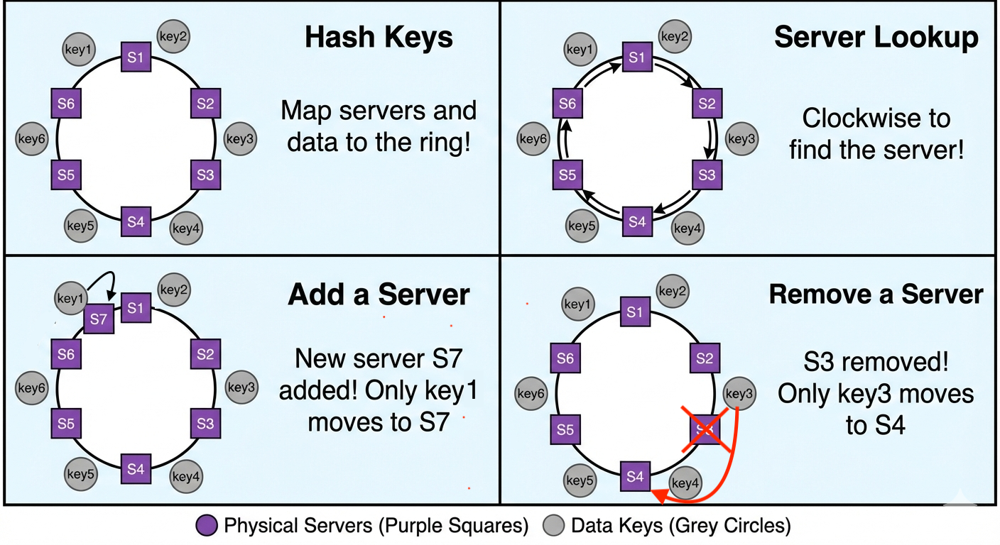
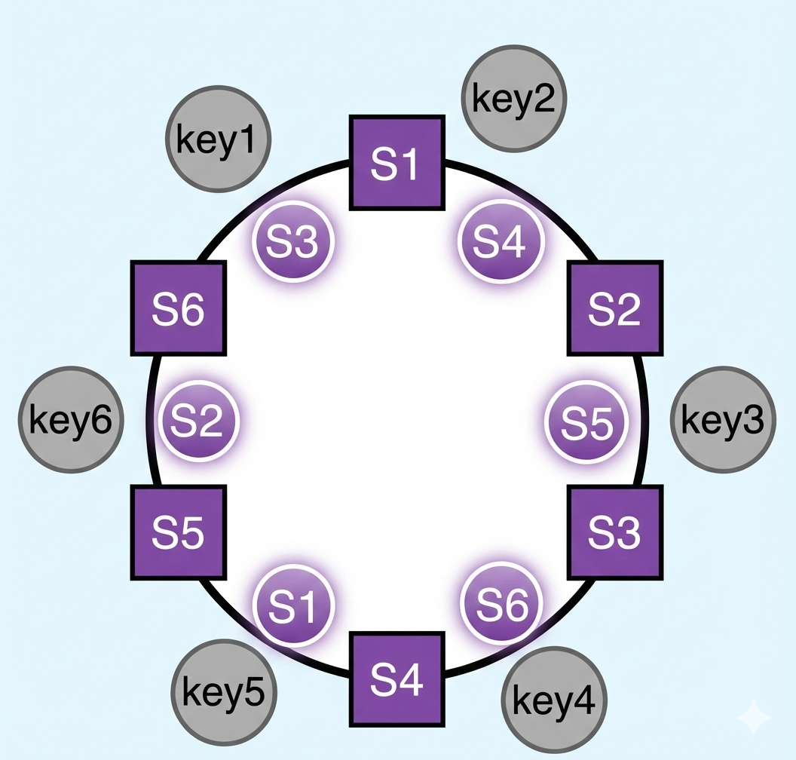

ByteByteGo這篇介紹的是**一致性雜湊**，一般來說會用到雜湊，目的是為了把流量透過固定的演算法，分散到某台機器上面，那什麼是一致性雜湊，不好的雜湊演算法又會有什麼問題呢？這篇筆記來說一下ByteByteGo怎麼介紹的。

<!-- more -->

### TOC

### rehashing problem

對於**一致性雜湊**，Wikipedia的說法是：

> Consistent hashing is a special kind of hashing such that when a hash table is re-sized and consistent hashing is used, only k/n keys need to be remapped on average, where k is the number of keys, and n is the number of slots. In contrast, in most traditional hash tables, a change in the number of array slots causes nearly all keys to be remapped

| key | 4 Servers   (s0, s1, s2, s3) | 3 Servers   (s0, s2, s3) |
| --- | ------------------------------- | --------------------------- |
| 1   | s1                              | s2                          |
| 2   | s2                              | s3                          |
| 3   | s3                              | s0                          |
| 4   | s0                              | s2                          |
| 5   | s1                              | s3                          |
| 6   | s2                              | s0                          |
| 7   | s3                              | s2                          |
| 8   | s0                              | s3                          |

以上面的結果來看，4台servers跟s1 offline時的3台servers比起來，所有的user都會被雜湊函數重新分配，就不太符合**Consistent hashing**的定義，這時候就有了雜湊還**hash ring**的概念出現。

### hash ring

hash ring在key分配節點上，都以同個方向下去找到最適合的server，新增或移除server就只要把原先配對異常的key，用同個方向下去找到更適合的節點即可。
用這個方式有下面三個優點：

- 最小化資料重新分配 — 當節點數改變時，只需要重新分配極少數 key。
- 更好的可擴展性 — 不必為了 scale up/down 而重新編排大量資料。
- 提高可靠性 — 節點失效時系統仍然能保持大部分 key 不變。

但可以想像他伴隨著兩個問題

- 資料分佈不均： 由於雜湊的隨機性，伺服器在環上的位置可能不均勻，導致某些伺服器承載過多資料。
- 串級失效： 某台伺服器故障後，其負荷會全部壓在下一台伺服器上

所以又衍伸出了**Virtaul Nodes**的進化版本。

### Virtual Nodes

現在加上了圓形的nodes，他不是真的機器，是當被hash雜湊配對到時，知道實際上要redirect去到哪個node。當然這也需要更多的空間來儲存關於虛擬節點的資料，真的用到這情境應該代表nodes數量相當多，需要增加的virtual nodes也是倍數關係，就需要一點trade-off了。

### Conclusion

總結來說，一致性雜湊解決了傳統雜湊在伺服器數量變動時導致大量資料遷移的問題。透過 **Hash Ring** 的設計，我們能最小化資料的重新分配。進一步引入 **Virtual Nodes** 則有效解決了資料分佈不均與潛在的串級失效風險，雖然犧牲了一點儲存空間，但換來了更佳的負載平衡與系統穩定性。這在分散式系統設計（如 Dynamo, Cassandra）中是非常關鍵的概念。

If you like this post, please connect with me on LinkedIn and give me some encouragement. Thanks.
