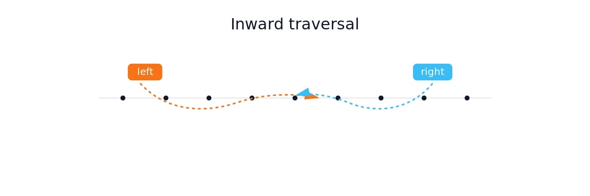
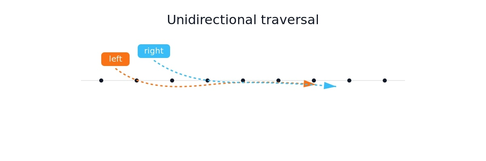
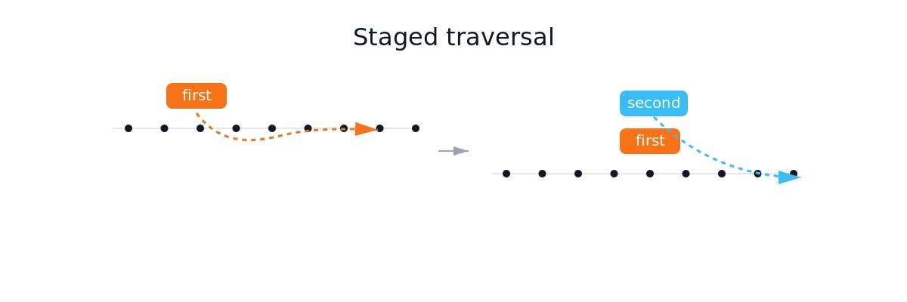

import demo from './demo.mp4';
import triplet from './triplet.mp4';
import palindrome from './palindrome.mp4';
import largest_container from './largest_container.mp4';
import shift_zero from './shift_zero.mp4';
import next_permutation from './next_permutation.mp4';

最近買了ByteByteGo裡的`Lifetime Plan`方案，才把**Coding interview patterns**裡的`Two pointers algorithm`跟**System design interview**裡的`Design A Rate Limiter`念完，就先用這篇來筆記一下`Two pointers algorithm`

{/*<!-- more -->*/}

### TOC

```javascripti
for (let i = 0; i < n; i++) {
  for (let j = i + 1; j < n; j++) {
    // nums[i]  nums[j]
  }
}
```

或許我們大家在對`array`上的演算法，常常會寫成這種巢狀迴圈，但這種演算法卻是 `O(n^2)` 的時間複雜度，寫得時候很順手，寫完往往是個效能上的不定時炸彈。

### Two pointers strategies
有時候，可以觀察一下我們的array，如果它結構上是可預測動態的資料，那我們就很適合用`Two pointers algorithm`改寫。`Two pointers`又可以分成3種實作策略：

- Inward traversal 向內遍歷
  
  兩個指標往對方的方向搜尋，直到交錯後找出最適當的資料。

- Unidirectional traversal 單向遍歷
  
  兩個指標往同個方向搜尋，搜尋道最後面時找出適當的資料。通常左邊的是紀錄資訊、右邊的是要進一步搜尋的資料。

- Staged traversal 分段遍歷
  
  先把第一個指標的位置找個適當的地方固定下來，再根據第一個指標的位置去調整第二個指標做搜尋。

概念講完，這邊就介紹了幾個比較常見的考題。

### Pair Sum - sorted

<video autoplay controls>
  <source src={demo} type="video/mp4" />
</video>

看看這個影片，就是 `Pair Sum` 的解題過程。
關鍵是因為這整個array是小到大排序過的，所以左邊一定比右邊小。

> 意思是：<br/>
> 當相加大於target，勢必要調整相加的其中一個數字小一點，也就是右邊往左移；當相加小於target，勢必要調整相加的其中一個數字大一點，也就是左邊往右移；相加後跟target相等，則把左邊跟右邊這兩個index return出來。

```python
from typing import List

def pair_sum_sorted(nums: List[int], target: int) -> List[int]:
    left = 0;
    right = len(nums) - 1;
    if right < 1:
        return [];
    while left < right:
        if nums[left] + nums[right] == target:
            return [left, right];
        elif nums[left]+nums[right] < target:
            left += 1;
        else:
            right -= 1;
    return []
```

### Triplet Sum

這解題思路沿用前一個，只是target改成current_index, left從`current_index+1`開始、right一樣擺在最後 `len(nums) - 1`。唯一要注意的是要把重複的移除，而且這邊題目是要values，所以我們可以先把nums 做排序後再來找答案。


```python
from typing import List

def triplet_sum(nums: List[int]) -> List[List[int]]:
    nums.sort()
    results = []
    if len(nums) <= 2:
        return []

    def two_sum(start: int, target: int) -> List[List[int]]:
        left = start + 1;
        right = len(nums) - 1;
        sub_sums = []
        while left < right:
            if nums[left] + nums[right] == target:
                sub_sums.append([target * -1, nums[left], nums[right]])
                left += 1
                while left < right and nums[left] == nums[left - 1]:
                    left += 1
            elif nums[left] + nums[right] < target:
                left += 1;
            else:
                right -= 1;
        return sub_sums

    for index in range(len(nums)):
        if index > 0 and nums[index] == nums[index - 1]:
            continue
        arr = two_sum(index, -1 * nums[index])
        if len(arr):
            results = results + arr

    return results
```

可以看到中間有兩段關鍵的 `nums[left] == nums[left - 1]` 跟 `nums[index] == nums[index - 1]` ，就是在跳過 `跟前一個一樣` 這件事。來看看演算法動畫：

<video autoplay controls>
  <source src={triplet} type="video/mp4" />
</video>


### Is Palindrome Valid

這題思路相對簡單，左邊往右邊跑，找到第一個字母或數字，然後右邊往左邊跑，找到第一個字母或數字，一樣的話，兩邊都往中間跑一個字元繼續下去，不一樣的話直接回傳False。
```python
def is_palindrome_valid(s: str) -> bool:    
    left = 0;
    right = len(s) - 1;

    while left <= right:
        while left < right and s[left].isnumeric() == False and s[left].isalpha() == False:
            left += 1
        while left < right and s[right].isnumeric() == False and s[right].isalpha() == False:
            right -= 1
        if s[left] != s[right]:
            return False;
        left += 1;
        right -= 1;   
    return True
```

<video autoplay controls>
  <source src={palindrome} type="video/mp4" />
</video>

> 影片中可以看到他直接過濾掉了非數字跟非字母，然後就是inward comparison了

### Largest Container

這題探討要如何才有最大的盛水量`width * height`，width很自然是 `right - left`，而height則是 `min(nums[left], nums[right])`（否則水會漏光），接著就是往中間靠近，永遠移動小的height的那個index。

```python
from typing import List

def largest_container(heights: List[int]) -> int:
    largest_size = 0;
    left, right = 0, len(heights) - 1;
    
    while left < right:
        min_index = left if heights[left] < heights[right] else right;
        size = (right - left) * heights[min_index] 
        if size > largest_size:
            largest_size = size
        if heights[left] <= heights[right]:
            left += 1;
        else:
            right -= 1;
    return largest_size

```

<video autoplay controls>
  <source src={largest_container} type="video/mp4" />
</video>


### Shift Zero to the End

這題就不是inward traversal了，改成要用unidirectional traversal思維，白話文就是，從左往右看，把左邊`第一個0`和`0`後面第一個`非0`互換位置，這樣`0`就會慢慢跑去後面了。

```python
from typing import List

def shift_zeros_to_the_end(nums: List[int]) -> None:
    left = 0;
    while left < len(nums) - 1:
        while left < len(nums) - 1 and nums[left] != 0:
            left += 1;
        
        right = left;
        while right < len(nums) - 1 and nums[right] == 0:
            right += 1;

        if right == len(nums) or left == len(nums):
          break
        nums[left], nums[right] = (nums[right], nums[left])
        left += 1

```
<video autoplay controls>
  <source src={shift_zero} type="video/mp4" />
</video>

> 寫完才發現我的寫法跟講解得不太一樣，我包了兩層的loop，目的是要快速跳過前面的非0

### Next Lexicographical Sequence

這一題我就一直轉不過來了，他解題觀念看起來很簡單，但我一直想不通跟`Next Lexicographical Sequence`的關聯性：

1. 從右向左找第一個下降點 (Pivot)： 找到第一個 nums[i] < nums[i+1] 的位置。
2. 從右向左找第一個比 Pivot 大的數： 找到第一個 nums[j] > nums[pivot] 並交換它們。
3. 反轉 Pivot 之後的所有數字： 將剩餘部分反轉，使其變成最小排列。

> 演算法簡簡單單的，關聯性卻很難想像。abcd單純的排列組合還可以理解這演算法，但另一個範例`ynitsed`對其出發點跟驗證就很卡關了。

```python
def next_lexicographical_sequence(words: str) -> str:
    s = list(words)
    pivot = len(s) - 2

    while pivot >= 0 and s[pivot] >= s[pivot + 1]:
        pivot -= 1;
    if pivot < 0:
        return ''.join(s[::-1])
    
    right = len(s) - 1;
    while s[right] <= s[pivot]:
        right -= 1

    s[pivot], s[right] = (s[right], s[pivot])
    s[pivot + 1:] = s[pivot + 1:][::-1]
    return ''.join(s)
```

<video autoplay controls>
  <source src={next_permutation} type="video/mp4" />
</video>

### Conclusion
第一篇的ByteByteGo閱讀筆記先寫Two-pointers algorithm，找到問題與演算法的關聯性以後，解題就很單純。但如果無法把演算法與解題思路關聯起來，是真的看了都還不懂。ByteByteGo這套有趣的是他也有自己的leetCode系統，然後會跟你說解題思路、面試注意事項等等，就算不是要準備面試也很有閱讀的價值。

這篇文章裡的這些影片，都是透過Gemini產生`Python Manim` codes跑出來的：
```
幫我用 Manim 介紹two-pointers algorithm
```
產生的程式碼丟進去 [Try Manim](https://try.manim.community/) Jupyter跑就好，有動畫看以後更清楚怎麼解題比較合適。

If you like this post, please connect with me on LinkedIn and give me some encouragement. Thanks.
