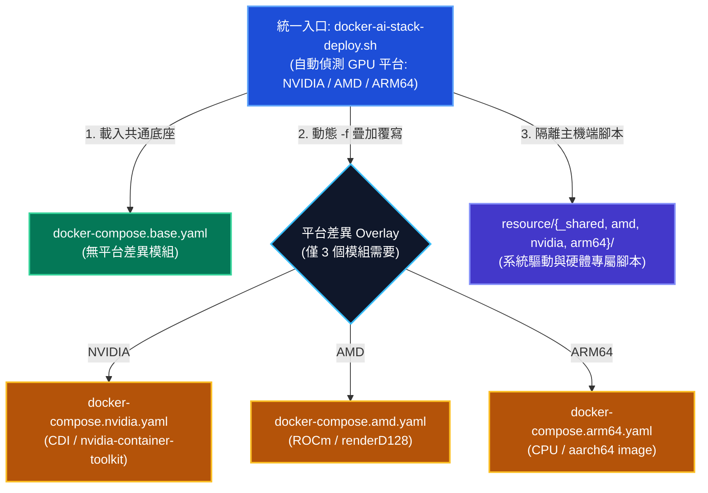

## 問題陳述：一條寫在 CLAUDE.md 裡的規則

重構前，專案的 `CLAUDE.md` 有一條專門的章節：

> **K8s 三個 Stack 必須同步**
>
> 任何 `deployments/k8s-nvidia/` 下的修改，必須同步到 `k8s-amd/` 和 `k8s-arm64/`，且在 **同一次提交** 中。
>
> （摘自重構前的 `CLAUDE.md`）

這條規則反映了當時的現況。同一份 Architecture 章節裡還寫著「 **K8s** 三 stack 以獨立完整副本維護，靠流程規則保持同步」，白紙黑字承認： **沒有機制，只有紀律**。而紀律要付利息。

<!-- more -->

### TOC

利息付在哪？連主 agent 的最終 review 條款都寫進去了：「 **主 agent 最終 review** — 確認無遺漏。K8s 側要確認三份 stack 一致」。也就是說，每一次 code review 的成本乘以三，不是因為改動複雜，而是因為要 **用眼睛比對三棵樹**。

為什麼會長出三份副本？因為這套 stack 要同時跑在 NVIDIA、AMD、ARM64 三種節點上，而最早的做法是最直觀的做法：複製整棵目錄樹，改需要改的地方。這在第一天是對的：零抽象成本、每份都能單獨讀懂、改 nvidia 絕對弄不壞 arm64。

問題是三份副本會 **各自腐爛**。而腐爛是安靜的。

先看純重複的部分。K8s 側三份 stack 共 76 條相對路徑是三份都有的，其中 **41 個檔案三份內容完全一致**，也就是逐字複製、零平台差異。這 41 個檔案單份就有 22,760 行，乘以三是 68,280 行，其中 45,520 行是零資訊量的複製品。

而 **真正只屬於單一平台的檔案只有 5 個，而且全部是 metrics-service dashboard JSON**（nvidia 的 `gpu-nvidia-dcgm.json`、amd 的 `gpu-amd.json`、arm64 的三份）。三棵 84,508 行的樹，平台專屬的部分是五個 JSON。

Compose 側的數字是同一個故事的另一種講法。三份 compose stack 裡，29 條路徑是三份逐字相同的純副本， **另有 29 條三份都有卻已經漂移**。後面這 29 條才是真正的成本，因為沒有任何工具在抓它。

漂移長什麼樣子？`docker-ai-stack-monitor.sh` 三份是 **互補的殘缺片段**，而不是一份好的加兩份壞的：

- nvidia 版算出了 `has_failure` 卻沒有對應的告警分支（只有效能過載會 publish 到 `Message Queue_TOPIC_ALARM`，服務掛了不會告警）
- arm64 版反而是三份裡最完整的：健康報告、服務失敗告警、效能告警都有 publish
- amd 版是 38 行的 stub，`check_and_notify()` 是空的，卻仍然註冊了每 60 秒空跑一次的 systemd unit

同一類的還有：amd 的 `deploy.sh service-ui` 啟動的是一個 **不存在的服務名**（這個動作從來沒成功過）、arm64 的同一動作只起 `service-ui-main` 不起 workers、nvidia 的 compose 版 `custom-gateway` 沒有 `deploy.sh`，`master-deploy.sh` 只能 fallback 到 `docker compose up`（有 WARN，服務仍會起來），但 `deploy.sh` 才會做的 OTA 設定就沒被執行。

這些不是「某人某天忘了同步」的單一事故。這是三份副本的 **穩態**：每一份都在自己的路徑上獨立演化，而沒有人有全貌。

客觀來說，三份副本也有好處：改 nvidia 不會弄壞 arm64、每份都能單獨讀懂單獨部署、新人不用先理解 overlay 語意就能看懂一支 `deploy.sh`。收斂之後這些全部失去，換來的是「只有一個地方可以改壞」。這是一筆交易，不是純賺。

---

## 一、Compose 側：先對齊，再收斂

Compose 側先動，整批工作壓縮成 28 次改動。

### 前後結構

重構前：deployments/ 下六個 stack 目錄（compose 佔三份）

```
deployments/
├── compose-amd/                        63 檔 / 7,458 行
│   ├── system-setup-rocm-docker/
│   ├── infra-webssh-portainer/
│   ├── ai-interface/
│   ├── ... 共 16 個模組目錄
│   ├── master-deploy.sh                192 行
│   └── .env.example
├── compose-nvidia/                     60 檔 / 7,211 行
│   ├── system-setup-nvidia-docker/     ← 連目錄名都不同
│   ├── ... 同樣 16 個模組
│   └── master-deploy.sh                193 行
└── compose-arm64/                      63 檔 / 7,339 行
    ├── system-setup-nvidia-docker/
    ├── ... 同樣 16 個模組
    └── master-deploy.sh                199 行
    ─────────────────
    合計 186 檔 / 22,008 行
```

重構後：單一 stack，平台差異走 overlay

```
deployments/
├── docker-ai-stack-deploy.sh           108 行（新增的統一入口）
└── compose-stack/                      96 檔 / 16,526 行
    ├── lib/
    │   ├── common.sh                   232 行 ← docker_ai_stack_compose / docker_ai_stack_res / docker_ai_stack_env_files
    │   └── log.sh                      140 行 ← 取代 143 個各自定義的日誌函式
    ├── master-deploy.sh                344 行（三份 584 行併成一份）
    ├── .env.amd.example                449 行 ┐
    ├── .env.arm64.example              372 行 ├ 刻意不合併，見下文
    ├── .env.nvidia.example             371 行 ┘
    ├── system-setup-gpu-driver-and-docker/    ← 目錄名統一
    │   └── resource/{_shared,amd,nvidia,arm64}/
    ├── infra-webssh-portainer/
    │   └── docker-compose.base.yaml    ← base-only，無 overlay
    ├── ai-interface/
    │   ├── docker-compose.base.yaml
    │   ├── docker-compose.amd.yaml     ┐
    │   ├── docker-compose.nvidia.yaml  ├ 真正需要 overlay 的三個模組之一
    │   └── docker-compose.arm64.yaml   ┘
    ├── rag-stack/                      （base + 3 overlay）
    ├── observability-metrics-service/  （base + 3 overlay）
    └── ... 共 15 個模組目錄
```

17 個 compose 檔 = 8 個模組的 base + 3 個模組各 3 份 overlay。 **只有 3 個模組真的需要平台專屬 overlay**（`ai-interface`、`rag-stack`、`observability-metrics-service`），其餘模組皆為 base-only、完全無平台差異。這個比例本身就是「三份副本裡有多少是白抄」的答案。



### 順序不能反：先對齊行為，再談合併

重構的第一步不是動 compose，而是把三份 **拉齊到同一個行為**，包括統一 ai-interface、裁剪模組、重寫 `docker-ai-stack-monitor.sh`。理由很簡單：如果三份行為本來就不同，合併就變成「選一份當贏家」，另外兩份的行為會在無人知曉的情況下被靜默改掉。

第二步是 **先建立驗收基準與驗證工具**：加一支 290 行的 `docs/verify-compose-config.sh`，比對 `docker compose config` 的渲染輸出，把「搬家不改行為」從口號變成可機器驗證的客觀依據。當時記載的訊號是「22 個模組全部 render IDENTICAL」，以及合併後的模組除三個 bind source 路徑外與 baseline 逐位元相同、八個內容雜湊全未變。

> ⚠️ 補充說明：這些 render 結果是引用當時的自述， **本文未重新實測**（本機無 docker daemon）。而且這支工具在 Phase 5 收尾時連同舊三 stack 一起被刪除（後來又被刪除），比對的 baseline 快照未保存，無法重現當時的報告。工具功成身退是設計，不是遺失。

第三步是 **分批搬**：先搬兩個 compose 檔本來就三份逐字相同的模組（infra、landing-portal）當 skeleton，再搬九個，最後搬五個 shell 分岔較重的。過程刻意接受一段「中途不可部署」的狀態，理由當時就寫下來了：

> The branch is not deployable until the migration finishes… That is the agreed trade-off for moving rather than duplicating.

移動而非複製。這一句是整個重構的紀律來源：一旦允許「先複製過去、之後再刪舊的」，就等於自願再開一段三份並存期。

### 三個骨架級的關鍵決定

**1. base 檔叫 `docker-compose.base.yaml` 而不是 `docker-compose.yaml`**
後者會被 compose 自動載入。在模組目錄裸跑 `docker compose up`，會 **靜默只套 base、漏掉平台 overlay**，服務起得來，只是 GPU 那半不見了。改成 `.base.yaml` 之後，同一指令直接報 `no configuration file provided`。這是刻意要的失敗：大聲壞掉優於安靜錯掉。

**2. `docker_ai_stack_compose()` 明確傳 `--project-directory`**
compose 的專案名由該目錄推導，而專案名是 named volume 的前綴。不釘死的話，模組目錄一旦改名，既有主機上的所有 volume 全部變孤兒。當時已驗證六組 module/platform 仍 render 出 `name: infra-webssh-portainer`。

**3. 模組路徑類變數只 `export DOCKER_AI_STACK_PLATFORM`**
`DOCKER_AI_STACK_MODULE_DIR` / `DOCKER_AI_STACK_MODULE` / `DOCKER_AI_STACK_DIR` 刻意不 export（顏色變數另循歷來行為 export）；模組若以 `sudo -E bash ./deploy.sh` 被呼叫，會繼承父層的 module 目錄，跑去 stack 根目錄找 base 檔。

順帶一提 `DOCKER_AI_STACK_PLATFORM` 的合法性檢查：用 for 迴圈逐字比對，而 **不是** `case " ${DOCKER_AI_STACK_PLATFORMS[*]} " in *" $x "*)` 的子字串比對。後者會讓 `DOCKER_AI_STACK_PLATFORM="amd nvidia"` 這種含空白的組合靜默通過並被 export。

### lib/ 抽取的紅利不在行數

量化：舊三 stack 的 96 個 `.sh` 裡有 **77 個各自定義日誌函式，合計 143 個** `LOG`/`WARN`/`ERROR`/`INFO`/`OK` 定義。合併後 43 個 `.sh` 裡只剩 1 個檔案有定義（`lib/log.sh` 本身，3 個定義），41 個檔案改成引用共用 lib。

但真正的紅利不是省了 140 個函式定義。是這個： **arm64 的 infra 原本只定義了 `GREEN`、根本沒有 `ERROR()`**，該模組失敗時會靜默結束。抽共用函式的價值在於把 bug 收斂到一處，收斂之後它才看得見。

同一批順手清掉的還有 env 載入。舊寫法 `export $(grep -v '^#' … | xargs)` 會弄壞含空白或引號的值，而 landing portal 寫進去的正是 `GPU_INFO="GPU 0: NVIDIA … (UUID: …)"`。連帶 `sed 's/\r//g'` 與 `tr -d '\r'` 的 workaround 也隨 LF 正規化一併消失。

新的 env 走三層 cascade（`docker-ai-stack-tuning.env` → stack `.env` → module `.env`），且刻意跑兩條路徑：`--env-file` 給 compose、`source` 給 shell 自身邏輯（因為 `ensure_db` 在 compose 被呼叫之前就需要 `PG_USER`）。

### 反高潮：三份 `.env.example` 刻意沒有合併

這是整輪最值得寫的一節。中途 **真的試過**「單一檔 + 區塊註解」，然後在 **同一輪裡又拆了回去**。

原因是：註解只是註解。`--env-file` 會把整份檔原封不動餵給 compose，所以「某個 key 在某平台必須 **缺席**」這個語意，在單一檔結構下根本做不到。

而缺席是真實需求。`PARSER_IMAGE` 在 AMD 必須未設定，才會推導出本地 ROCm build：

```bash
# .env.amd.example:347-354：PARSER_IMAGE 永遠保持註解狀態
# ${PARSER_IMAGE:-…parser-service-serve-${PARSER_ROCM_VARIANT}:${PARSER_ROCM_REF}}
```

同一份檔案裡只要出現 nvidia 那行 `ghcr.io/parser-service-project/parser-service-serve-cu130:v1.30.0@sha256:…`，AMD 就會 **靜默改拉 CUDA image**（不報錯，只是 GPU 加速沒了）。

`WORKFLOW_URL` 是同一個坑的另一面，而且更陰險：三份都是空字串，任何 **值比對** 都會判定它「可以共用」。真正的差異藏在兩個值比對看不到的地方：compose 的 fallback（amd 用 `host.docker.internal`、其他用 `localhost`），以及 `deploy.sh` 拿「空值」當自動偵測 hostname 的觸發條件。

於是檔頭寫死了一條規則： **只要有任一平台不同，三份各放一份，即使值一樣**。理由寫得很不客氣：

> Deciding case-by-case whether a key is "safe to share" got it wrong twice.

判斷力已經被證明不可靠兩次，就改用不需要判斷力的規則。

### Compose 側數據

| 指標 | 重構前 (3 Stack 副本) | 重構後 (單一 Compose Stack) | 差異（增減幅） |
| :--- | :--- | :--- | :--- |
| **Stack 目錄數** | 3 個 (`amd`, `nvidia`, `arm64`) | 1 個 (`compose-stack/`) | **−2 個 (−66.7%)** |
| **總檔案數** | 186 檔 (63 + 60 + 63) | 96 檔 | **−90 檔 (−48.4%)** |
| **總設定行數** | 22,008 行 (7,458 + 7,211 + 7,339) | 16,526 行 | **−5,482 行 (−24.9%)** |
| **`master-deploy.sh`** | 584 行 (192 + 193 + 199 三份) | 344 行 (單一統整入口) | **−240 行 (−41.1%)** |
| **日誌函式定義** | 143 個 (分散於 77 檔各自定義) | 3 個 (收斂至 `lib/log.sh`) | **−140 個 (−97.9%)** |
| **模組目錄數** | 15 個 (各帶 3 份副本) | 13 個 (加 `lib/`、`migrations/`) | **收斂為單一樹** |

> **路徑與重構細節統計：**
>
> - **三份逐字相同路徑**：29 條（對應 87 個實體檔，其中 58 個為純副本）
> - **三份存在但已漂移**：29 條
> - **真正平台專屬路徑**：9 條
> - **整體改動統計**：共 28 次改動，波及 299 檔（+14,140 / −18,916 行，其中 compose 路徑 234 檔，+8,381 / −13,872 行）
>
> **檔案數少了 48%，行數只少了 25%。** 這個落差很合理：合併的同時補上了 `lib/`、統一入口 `docker-ai-stack-deploy.sh`、`MIGRATION.md` 與大量中文註解。這個重構的產出不是「更短」，是「只有一個地方可以改壞」。

---

## 二、K8s 側：從三套平行副本到單一目錄樹收斂

Compose 側合併完之後，`CLAUDE.md` 出現了分裂人格：compose 那一段寫「不再有三份同步的問題」，K8s 那一段寫「三 stack 以獨立完整副本維護，靠流程規則保持同步」。 **這種不對稱就是重構的觸發器**：同一份規則文件裡並存兩種相反的架構主張，讀的人不知道該信哪一半。

> 💡 **階段說明**：K8s 側的第一階段核心在於 **「三樹歸一」**：將原本分散在三套目錄中的純 K8s Manifest 與腳本收斂進單一 `deployments/k8s-stack/`，拔除到處寫死的值並抽離共用函式庫；至於後續進一步升級為 Helm Chart、利用 `-f values` 進行動態疊加覆寫的細節，則由下一篇專文深度展開。

### 前後結構

重構前：三棵幾乎全等的樹

```
deployments/
├── k8s-nvidia/                         77 檔 / 27,795 行
│   ├── bootstrap/
│   ├── database/
│   ├── ai-interface/
│   ├── ... 共 17 個模組目錄（bootstrap … landing-portal）
│   ├── custom-gateway/
│   ├── init.sh                         ← 每份各帶一支，零共用
│   ├── master-deploy.sh
│   └── reinstall-all.sh
├── k8s-amd/                            79 檔 / 28,872 行 （同樣 17 個模組）
└── k8s-arm64/                          81 檔 / 27,841 行 （同樣 17 個模組）
    ──────────────────
    合計 237 檔 / 84,508 行
    其中 41 個檔案三份內容全等 = 22,760 行 × 3
    真正平台專屬：5 個 metrics-service dashboard JSON
```

重構後：單一 K8s 目錄樹，平台差異走三層收斂機制

```
deployments/k8s-stack/                  154 檔 / 36,563 行
├── lib/
│   ├── common.sh                       334 行 ← k8s_ai_stack_init / k8s_ai_stack_config
│   ├── utils.sh                        162 行 ← kubeconfig 探測、GPU 偵測
│   └── log.sh                          118 行
│   ───────
│   合計 614 行，供 15 支 deploy.sh 共用
├── MIGRATION.md                        439 行
├── bootstrap/
│   └── deploy.sh
├── database/                           ← 標準純 K8s YAML Manifest
│   ├── cluster.yaml
│   └── values-dbadmin.yaml
├── ai-interface/
│   ├── core-engine/                    ← 服務結構標準化
│   │   └── templates/*.yaml
│   ├── values-service-ui.yaml
│   ├── values-nvidia.yaml              ┐
│   ├── values-amd.yaml                 ├ 平台差異第一層（設定分離）
│   └── values-arm64.yaml               ┘
├── monitoring-alerting/
│   └── resource/{_shared,amd,nvidia,arm64}/ ← 平台差異第二層（主機端檔案去重）
├── observability/
│   ├── metrics-service/
│   └── resource/{_shared,arm64}/
└── gateway/                            ← 核心路由 Manifest
    ├── gateway.yaml
    ├── auth-service.yaml
    └── resource/{_shared,amd}/

平台差異第三層：k8s-stack-config ConfigMap + k8s_ai_stack_config helper
    → 39 個檔案引用，k8s_ai_stack_config 呼叫 41 次、k8s_ai_stack_config_load 22 次
```

### 策略：新蓋一棟、舊的凍結、最後一次拆

K8s 側沒有原地改。`deployments/k8s-stack/` 一開始完全不存在，是從零建起來的。在舊三 stack 被刪除之前，專案裡 **同時存在四棵 K8s 目錄樹**（三舊一新，新的當時已經 152 檔 / 36,047 行）。

並存期很醜。但它讓每個模組的搬遷能單獨驗證、單獨回退，這是與 compose 側「移動而非複製」相反的選擇。差別在於：compose 側每個模組的搬遷是機械的（golden-file 可比對），K8s 側邊搬邊重構目錄與設定，兩邊必須同時保持可運行狀態。

**刪除那一刻的數字很有戲**：一次改動，271 個檔案、刪掉 91,027 行。而且它不只是 `rm -rf`，同一次改動還要改 `docs/SDD.md`（34 行）、`docs/deployment/K8s.md`（17 行）與 `docs/SSO_SETUP.md`（6 行）裡的引用路徑。那一步的標題本身就寫著「修正全專案引用」。 **刪東西的成本從來不只在被刪的那個目錄。**

```bash
$ git show --stat 41b3424 | tail -n 7
 deployments/k8s-nvidia/master-deploy.sh | 261 -
 deployments/k8s-nvidia/reinstall-all.sh | 232 -
 deployments/k8s-stack/MIGRATION.md      |   2 +-
 docs/SDD.md                             |  34 +-
 docs/SSO_SETUP.md                       |   6 +-
 docs/deployment/K8s.md                  |  17 +-
 271 files changed, 430 insertions(+), 91027 deletions(-)
```

### 平台差異的三層收斂機制

合併並非簡單把三個目錄丟進同一個資料夾，而是將原本重複分散的邏輯透過三層架構解耦：

- **第一層：平台設定檔分離**
  抽取各平台的變數覆寫檔（`values-nvidia.yaml`、`values-amd.yaml`、`values-arm64.yaml`），讓主體 YAML Manifest 保持純淨且單一。

- **第二層：`resource/{_shared,<platform>}/` 主機端檔案去重**
  7 個模組導入 `resource/` 目錄結構，將主機端部署腳本與設定依平台精確分類，三平台相同的集中於 `_shared/`。

- **第三層：`k8s-stack-config` ConfigMap + `k8s_ai_stack_config` helper**
  三份副本裡的大量差異，本質上不是平台差異，而是 **到處寫死（Hardcode）**：Port 號、DB 名、PG 帳號、`PG_HOST`。這些值在三份檔案裡各寫一次，任何一次改動就是三處修改。真正的解法是把它們收進一個全域 ConfigMap，所有服務與腳本統一讀取。

這是一連串改動接完的：

```
lib 加 k8s_ai_stack_config helper
統一走 helper，清掉 6 個死 key
Port 號與 PG 帳號改讀 k8s-stack-config，拆掉中間層
PG_DB_NAME 接上 initdb
PG_HOST 接完最後兩個模組，全 stack 零寫死
```

最後一步直接叫「 **全 stack 零寫死** 」。滲透結果：39 個檔案引用 `k8s-stack-config`。

另外，`K8S_AI_STACK_PLATFORM` 未設時會自動偵測，行為與 compose 側對齊（這是兩次重構之間刻意做的收斂，讓兩側的心智模型一致）。最終的 k8s-stack 有 31 個檔案引用 `K8S_AI_STACK_PLATFORM`。

### shell 那一半

舊三份 stack 沒有任何共用函式庫，每份各自帶一支 `init.sh`。新 stack 抽出 `lib/{common,log,utils}.sh` 共 614 行，供 15 支 `deploy.sh` 共用。

而 `lib/` 自己又重構了兩輪：

```
kubeconfig 探測與 GPU 偵測收斂進 lib/utils.sh
lib/common.sh 純函式化，副作用集中到 k8s_ai_stack_init
host-side 腳本改用共用 kubeconfig 探測，修掉三處靜默降級
```

第三步是重點： **抽共用的過程直接抓出三處靜默降級**。這與 compose 側 arm64 缺 `ERROR()` 是同一種紅利：把散在三處的實作放到一起，差異才會浮出水面。

### 踩過的坑

整輪改動裡 **修 bug 有 27 次，跟新功能一樣多**。大型重構的真實比例就長這樣，不會是清一色的 refactor。

點名幾個：

- **純數字的 Message Queue 密碼被 YAML 解析成 number，讓 metrics-service 直接 CrashLoopBackOff。** 分三次才收乾淨：先修現象、再修根因、最後才在 `.env.example` 補上型別限制的說明。

```diff
--- a/deployments/k8s-stack/observability/deploy.sh
+++ b/deployments/k8s-stack/observability/deploy.sh
+    *)
+      # 🔴 密碼長得像 number/bool/null 要 FATAL：避免 Grafana 展開後型別誤判 Crash
+      if printf '%s' "$_MQTT_PASS" | grep -qE \
+        '^([+-]?[0-9][0-9_]*(\.[0-9]*)?([eE][+-]?[0-9]+)?|[+-]?\.[0-9]+([eE][+-]?[0-9]+)?|[+-]?\.([iI][nN][fF]|[nN][aA][nN])|0[xXoObB][0-9a-fA-F_]+|[Tt]rue|TRUE|[Ff]alse|FALSE|[Yy]es|YES|[Nn]o|NO|[Oo]n|ON|[Oo]ff|OFF|[Nn]ull|NULL|~)$'; then
+        ERROR "observability: MQTT_PASSWORD 會被 YAML 推斷成 number/bool/null 而非 string，驗證失敗、完全起不來。"
+      fi
+      ;;
```

- **API Gateway 憑證改 `secretKeyRef`，13 條 route 改具名 Port（named port）**。原本用硬寫的 service port number，當底層 Pod port 改變時 Gateway 靜默失效；改用 named port 讓 Kubernetes 自行解析。
- **workflow-service / metrics-service / dbadmin 的 GatewayRoute 漏了 websocket**，這種 bug 在三份副本時代很可能只在某一份被發現。

```diff
--- a/deployments/k8s-stack/gateway/gateway.yaml
+++ b/deployments/k8s-stack/gateway/gateway.yaml
@@ -236,6 +237,7 @@ spec:
   match:
     hosts: ["workflow-service.${BASE_DOMAIN}"]
     paths: ["/*"]
+  websocket: true
   backends:
     - serviceName: workflow-service-main
       servicePort: http
```

- **cache-service `maxmemory-policy` 改 `noeviction`**。

### 不是純搬家

重構途中直接砍掉 `custom-gateway`（舊 nvidia stack 頂層有這個模組，新 stack 則直接移除）。

也長出新東西：

- **全站 HTTPS**（API Gateway wildcard TLS termination）
- **TLS 判斷宣告式化，並自動產憑證**
- `SSO_ENABLED` 改回預設關

這是合併的副作用： **終於看得見全貌**。三份副本的時候，「要不要全站上 HTTPS」這個問題要在三個地方各回答一次，成本高到不會有人主動提。

### K8s 側數據

| 指標 | 重構前 (3 Stack 副本) | 重構後 (單一 K8s Stack) | 差異（增減幅） |
| :--- | :--- | :--- | :--- |
| **Stack 目錄數** | 3 個 (`k8s-nvidia`, `k8s-amd`, `k8s-arm64`) | 1 個 (`deployments/k8s-stack/`) | **−2 個 (−66.7%)** |
| **總檔案數** | 237 檔 (77 + 79 + 81) | 154 檔 | **−83 檔 (−35.0%)** |
| **總設定行數** | 84,508 行 (27,795 + 28,872 + 27,841) | 36,563 行 | **−47,945 行 (−56.7%)** |
| **YAML Manifest 結構** | 237 檔 (分散三處獨立副本) | 154 檔 (共用 Manifest + 平台設定分離) | **收斂為單一標準結構** |
| **平台覆寫檔 (`values-<platform>.yaml`)** | 0 份 (整棵樹複製) | 20 份 (amd 8, nvidia 6, arm64 6) + 5 份非平台 values | **收斂為薄覆蓋層** |
| **共用 `lib/` 規模** | 0 行 (各模組自帶 `init.sh`，零共用) | 614 行 (`common` 334 / `utils` 162 / `log` 118) | **+614 行 (供 15 支腳本共用)** |
| **集中設定 (`k8s-stack-config`)** | 0 (寫死的值分散於三棵樹) | 39 檔引用 / 41 處呼叫 | **全 stack 零寫死（零 Hardcode）** |

> **路徑與重構細節統計：**
>
> - **三份共有的相對路徑**：76 條（其中 41 檔完全全等，單份 22,760 行，直接消除 45,520 行重複副本）
> - **真正平台專屬檔案**：5 個（全部為 metrics-service dashboard JSON）
> - **刪除舊三 Stack 瞬間**：單一 commit 271 檔，+430 / −91,027 行
> - **整體改動統計**：歷時 12 天共 81 次改動，波及 432 檔（+21,698 / −60,901 行，只計 K8s 路徑為 354 檔，+11,688 / −59,638 行）
> - **改動類型分布**：修 bug 27、新功能 27、文件 13、重構 9、雜項 4、格式 1
> - **新 Stack 檔案類型**：yaml 96、sh 37、json 13、py 4、tpl 2、md 1、example 1

---

## 三、兩側對照：同一問題、不同機制

| 面向 | Compose 側 | K8s 側 |
| :--- | :--- | :--- |
| **合併機制** | `docker compose -f base -f <platform>` 疊加 | 單一目錄樹收斂 + 平台設定/資源分離 + 後續 Helm 封裝 |
| **語意方向** | **疊加**：後面的檔覆蓋前面的，YAML 層級 merge | **分層**：設定值樹狀化與 ConfigMap 集中管理 |
| **平台專屬檔數** | 3 個模組 × 3 份 overlay = 9 個 overlay 檔 | 20 份平台覆寫檔 + 7 個模組 `resource/` 隔離 |
| **共用資源** | `resource/{_shared,<platform>}/`，6 個模組使用 | `resource/{_shared,<platform>}/`，7 個模組使用 |
| **平台選擇器** | `DOCKER_AI_STACK_PLATFORM` env（未設自動偵測） | `K8S_AI_STACK_PLATFORM` env（未設自動偵測，行為與 Compose 對齊） |
| **第三層抽象** | 無（值走三層 env cascade） | **`k8s-stack-config` ConfigMap + `k8s_ai_stack_config` helper** |
| **shell 共用** | `lib/{common,log}.sh` = 372 行 | `lib/{common,log,utils}.sh` = 614 行 |
| **搬遷策略** | 移動而非複製，接受中途不可部署的狀態 | 新蓋一棟 + 舊的凍結，四棵樹並存到最後一刻 |
| **等價性驗證** | golden-file 工具比對 `docker compose config` 渲染輸出 | 無等價性驗證（邊搬邊重構目錄與設定，兩側各自驗收） |
| **是否全面抽象化** | 是（全部走 base + overlay） | 否（保持彈性混搭，核心模組逐步封裝、共用 Manifest 保持純淨） |
| **升級既有節點** | 文件為主（core-engine 儲存變更附遷移步驟） | 單一目錄樹就地覆蓋與逐步收編 |
| **刻意不合併的東西** | 三份 `.env.<platform>.example`（缺席語意做不到） | 5 個 metrics-service dashboard JSON（真的只屬於單一平台） |
| **檔案數減幅** | −48.4%（186 → 96） | −35.0%（237 → 154） |
| **行數減幅** | −24.9%（22,008 → 16,526） | −56.7%（84,508 → 36,563） |

### 取捨怎麼分岔

兩個數字的方向相反很值得看： **compose 檔案減幅大、行數減幅小；K8s 相反**。

Compose 側行數只少 25%，是因為合併同時補了 `lib/`、統一入口、`MIGRATION.md` 與大量中文註解， **新增的東西吃掉了刪除的成果**。K8s 側行數少 56.7%，是因為它的重複基數大太多：41 個檔案逐字複製三份、22,760 行乘以三，光是消掉這一項就抵得上 compose 側的整份 stack。

換句話說： **K8s 側的技術債更深，所以還債的帳面數字更好看。** 這不代表 K8s 的重構做得比較好，只代表它拖得比較久。

機制上的分岔則是被編排系統本身決定的：

- **Compose 的 `-f` 疊加是「檔案級」的**，語意單純（後蓋前），但也因此 **沒有第三層** 可以放共用值；所以 compose 側的值只能走 env cascade，`.env.example` 才會被迫維持三份。
- **K8s 側的收斂則是「結構與設定集中化」**：第一階段把純 Manifest 統一收斂至單一目錄樹，消除 4 萬多行純副本，並透過 `k8s-stack-config` 做到「全 stack 零寫死」；第二階段再透過 Helm Chart 與 values 覆寫進一步模組化。

代價也不同。Compose 側付的是「裸跑 `docker compose up` 不再有效」，所以才需要 `.base.yaml` 這種 **刻意讓它壞掉** 的命名。K8s 側付的是前期四棵目錄樹並存的高額驗證成本，直到最後一步才一口氣刪除 9 萬行舊代碼。

---

## 四、量化總結

| | Compose 側 | K8s 側 | 合計 |
| :--- | ---: | ---: | ---: |
| 合併前 stack 數 | 3 | 3 | 6 |
| 合併前檔案數 | 186 | 237 | 423 |
| 合併前行數 | 22,008 | 84,508 | 106,516 |
| 合併後檔案數 | 96 | 154 | 250 |
| 合併後行數 | 16,526 | 36,563 | 53,089 |
| 檔案數減幅 | −48.4% | −35.0% | −40.9% |
| 行數減幅 | −24.9% | −56.7% | −50.2% |
| 三份逐字相同的路徑 | 29 條 | 41 / 76 條 | — |
| 真正平台專屬 | 9 條路徑 | 5 個檔案 | — |
| 共用 lib 行數 | 372 | 614 | 986 |
| 統一後的模組數 | 15 | — | — |
| 相關改動次數 | 28 | 81 | — |

> ⚠️ 數據補充說明：
>
> 1. 行數以 `wc -l` 計算， **含空行與註解**，未區分「有效設定行」。跨 stack 比較是公平的，但不宜對外宣稱為「程式碼行數」。
> 2. K8s 側的 81 次改動是整輪的總數，其中約 10 次同時觸及 compose，並非純 K8s。K8s 側的增刪已用路徑過濾（354 檔 / +11,688 / −59,638）。
> 3. compose-stack 在合併當下是 96 檔 / 16,526 行，最終是 96 檔 / 16,613 行；k8s-stack 在舊三 stack 刪除前是 152 檔 / 36,047 行，最終是 154 檔 / 36,563 行。中間的增長來自後續功能（TLS、workflow-service SSO ConfigMap 等）， **未逐項歸因**。

---

## 五、心得：什麼有效、什麼是事後才知道的

### 有效的

1. **先對齊行為，再談合併。**
   Compose 側花了整個 Phase 0 把三份拉齊，之後的合併才是機械動作。反過來做的話，合併會變成「選一份當贏家」，另外兩份的行為被靜默改掉，而且沒有人會發現，因為三份本來就沒人在對照。

2. **先建立驗證工具與 Baseline。**
   290 行的 golden-file 工具把「搬家不改行為」變成可機器自動驗證的客觀依據。而且它 **用完就刪**（Phase 5 隨舊 stack 一起下架），遷移驗證工具的壽命應該等於重構的壽命，留著只會變成沒人維護的第二套真相。
   K8s 側沒有這種現成的驗收工具，因為結構改動幅度大、缺乏直接比對的 Baseline。代價是它必須用「四棵樹並存」的笨辦法換取可回退性。 **兩種都行，但要知道自己選的是哪一種。**

3. **讓錯誤大聲壞掉。**
   `docker-compose.base.yaml` 這個命名的唯一目的，是讓裸跑 `docker compose up` 報 `no configuration file provided`，而不是靜默只套 base。同理，抽 `lib/log.sh` 之後 arm64 的 infra 才不會因為缺 `ERROR()` 而靜默結束。
   **這篇文章裡幾乎每一個 bug 的共同特徵都是「安靜」**：nvidia 沒有 alarm 分支、arm64 產了報告不送、amd 的 stub 每 60 秒空跑、`PARSER_IMAGE` 出現在共用區就默默改拉 CUDA image、三處 kubeconfig 靜默降級。安靜的失敗才是真正的技術債，會報錯的東西當天就修掉了。

4. **抽共用函式的紅利不在行數，在可見性。**
   143 個日誌函式收斂成 3 個省了多少行不重要，重要的是 **收斂的那一刻，缺 `ERROR()` 的那一份浮出來了**。K8s 側「修掉三處靜默降級」那一步是同一件事。想找出散在多份副本裡的 bug，最有效的方法是把它們放到同一個檔案裡。

5. **值的去重比結構的去重更關鍵。**
   K8s 側如果只做到 Helm values 那一層，重複只是換個地方放（values 檔一樣是三份）。真正消掉重複的是 `k8s-stack-config` 那一串改動，包括 Port 號、PG 帳號、`PG_HOST`、`PG_DB_NAME` 一路收進 ConfigMap，最後一步的標題叫「全 stack 零寫死」。
   **結構抽象化容易看見，到處寫死的值容易被忽略，但後者才是三份副本會漂移的主因。**

### 事後才知道的

1. **「這個 key 可以共用嗎」是一個判斷不了的問題。**
   `.env.example` 的合併在重構中間真的做了，然後在同一個重構過程中被推翻。因為 `WORKFLOW_URL` 三份都是空字串，任何值比對都判定它「安全共用」，但差異藏在 compose fallback 和「拿空值當觸發條件」的 `deploy.sh` 邏輯裡。`PARSER_IMAGE` 更極端：它需要的語意是 **缺席**，而合併之後缺席就不再是缺席。
   當時的原話是「Deciding case-by-case whether a key is 'safe to share' got it wrong twice」。最後的解法不是變得更聰明，是換一條 **不需要聰明** 的規則：只要有任一平台不同，三份各放一份，即使值一樣。 **判斷力被證明不可靠的地方，要換成規則，不是換成更小心的判斷。**

2. **刪除的成本不在被刪的目錄裡。**
   刪掉 91,027 行的那一步，但它同時得改 `docs/SDD.md`、`docs/deployment/K8s.md` 與 `docs/SSO_SETUP.md` 裡的引用路徑。那一步的標題就叫「修正全專案引用」。這是事後才浮現的工作量：規劃搬遷的時候會算「要搬幾個模組」，不會算「有幾個地方提到這個路徑」。

3. **重構的改動有一半是在修 bug。**
   K8s 側 81 次改動：修 bug 27、新功能 27、純重構只有 9。如果事前跟人說「這是一次純粹的架構搬遷」，事後回看會顯得像失敗。但這才是真實比例：把三份東西放到一起，本來就會照出三份都沒被發現的問題（純數字 Message Queue 密碼讓 metrics-service CrashLoopBackOff、13 條 route 用了非具名 Port、三個服務的 GatewayRoute 漏 websocket）。 **這些 fix 不是重構造成的，是重構暴露的。** 只是帳會記在重構頭上。

4. **合併之後，「要不要做 X」這個問題的成本才降到可以問。**
   全站 HTTPS（API Gateway wildcard TLS termination）、TLS 判斷宣告式化並自動產憑證，這些都是重構途中長出來的，不是原計畫。在三份副本的時代，任何跨切面的改動都要在三個地方各回答一次，成本高到不會有人主動提起。
   這是收斂最不容易量化、但可能最重要的產出： **不是省下的行數，是變得可以被提出的問題。**

---

最後回到開頭那條規則。現在的 `CLAUDE.md` 寫著：

> **平台差異走單一結構收斂，不再有三份同步**

**行數減 50.2% 是結果；那條規則的消失才是目的。**
