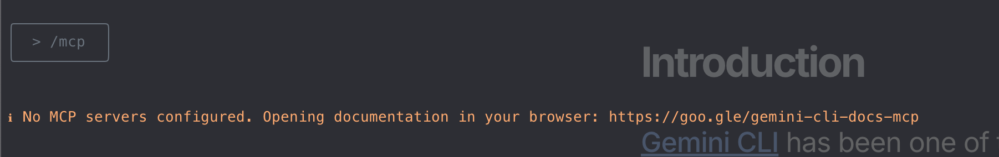

In this article, I won't introduce what MCP is. I will introduce how to setup Figma MCP server, use Gemini as MCP client to co-work with Figma, run an prompt to get Figma design with Gemini.

### TOC

<!-- more -->

### Figma MCP Introduction

Unlike the others MCP server which need to install code to run MCP server. We only need to install the latest [Figma desktop app](https://www.figma.com/downloads/) and toggle on MCP server from app, and then Figma MCP server should be installed on your host.


After installation, we can try the link `http://127.0.0.1:3845/sse` and it should be open you browser as following result.


For now, we've installed Figma MCP server successfully, and then I'll go ahead to set up Figma MCP server to Gemini.

> How to install Gemini? Just check this article: [Install Gemini CLI](../install-gemini-cli)

### Setup Gemini and Figma MCP server

If we open Gemini and type `/mcp`, we should see the empty MCP server list


To connect Gemini with Figma MCP server is quite simple. We just need to add the following setting into `~/.gemini/setting.json` or your project setting file.

> Where is my setting.json? check this tutorial: [configuration](https://raw.githubusercontent.com/google-gemini/gemini-cli/refs/heads/main/docs/cli/configuration.md)

- **User settings file:**
  - **Location:** `~/.gemini/settings.json` (where `~` is your home directory).
  - **Scope:** Applies to all Gemini CLI sessions for the current user.
- **Project settings file:**
  - **Location:** `.gemini/settings.json` within your project's root directory.
  - **Scope:** Applies only when running Gemini CLI from that specific project. Project settings override user settings.
- **System settings file:**
  - **Location:** `/etc/gemini-cli/settings.json` (Linux), `C:\ProgramData\gemini-cli\settings.json` (Windows) or `/Library/Application Support/GeminiCli/settings.json` (macOS). The path can be overridden using the `GEMINI_CLI_SYSTEM_SETTINGS_PATH` environment variable.

Let's look at my setting.json. After setting the configuration, just type `/mcp` in Gemini CLI again and then we'll see the configured MCP servers now.

```json
{
  "theme": "GitHub",
  "selectedAuthType": "gemini-api-key",
  "mcpServers": {
    "Figma Dev Mode MCP": { "url": "http://127.0.0.1:3845/sse" }
  }
}
```


So, We've connected Gemini with Figma MCP server, and we can use Gemini to communicate with Figma now.

### Communicate With Figma

Before communicating, we have to open `Dev-Mode` on Figma.

- Design mode:
  - 
- Dev mode:
  - 

Final step, find out your figma file link by `right-click > copy link to selection`, paste the link to Gemini CLI, and ask Gemini do something by prompt.


Let's try this prompt:

> use figma download this link {YOUR_LINK} and save as image.svg


All done. You can use Gemini with Figma MCP server now, and you can let Gemini generate frontend code, backend db schema, or system user-story documents. Let's recall what we've done:

1. install Figma app,
2. toggle on Figma MCP server on the app,
3. use `Dev mode`,
4. set Gemini mcpServers setting,
5. get figma file link, and
6. propmt to Gemini.

If you like this post please connect my LinkedIn and give me encouraging, thanks.
