The Model Context Protocol (MCP) is extremely useful. An AI assistant helps you decide when and how to use connected tools, so you only need to configure them. After integrating MCP logging management systems into several of my projects, it has saved me a significant amount of time.

In this article, I'm going to integrate [Grafana](https://github.com/grafana/mcp-grafana) with the [Gemini CLI](https://github.com/google-gemini/gemini-cli) and [n8n](https://docs.n8n.io/integrations/builtin/cluster-nodes/root-nodes/n8n-nodes-langchain.agent/). I will chat with the `Gemini CLI` and `n8n` and have them invoke the `Grafana MCP server`.

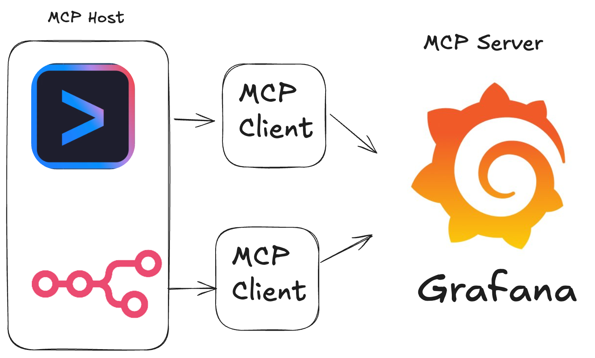

### TOC

<!-- more -->

### Prerequisites

I'll be using these tools, so you may need to install them first.

- [docker, docker compose](https://www.docker.com/get-started/)
- [Gemini CLI](https://www.docker.com/get-started/)
  - previous [post](../install-gemini-cli)
- [n8n docker compose](https://github.com/n8n-io/n8n-hosting/tree/main)
- [Grafana](https://grafana.com/)

There are many ways to set up the Grafana MCP. I'm going to connect to the Grafana MCP server using Docker in the Gemini CLI and using a binary file in n8n. I ran Grafana in Docker on my localhost (http://host.docker.internal:9120), but you can point to your own Grafana service.

### Grafana Service Account

A service account `token` allows an MCP client to connect and authenticate with Grafana. Therefore, we need to create a service account and generate a token for it. Let's go through the steps:

1. Click the menu on the left,
2. Click `Administration`,
3. Click `Service accounts` under `Users and access`,
4. Create a service account by clicking `Add service account`,
5. Generate a token by clicking `Add service account token`.
6. Copy your token!

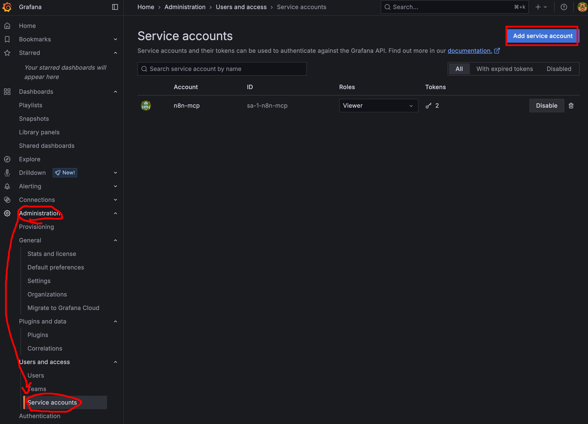
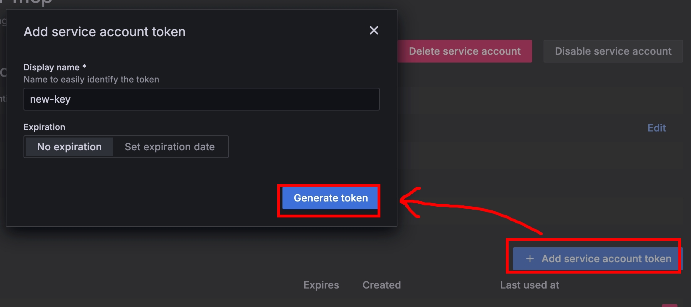

Once you have the token and Grafana URL, you can set them as environment variables for the Grafana MCP server.

### Gemini CLI using Grafana MCP

Don't worry; it's quite simple if you remember my article about the [Figma MCP](../use-figma-mcp-server-with-gemini-cli). I'll follow [that guide](use-figma-mcp-server-with-gemini-cli/) to use Docker to connect `Gemini` and `Grafana`.

```json
"mcpServers": {
  "grafana": {
    "command": "docker",
    "args": [
      "run",
      "--rm",
      "-i",
      "-e",
      "GRAFANA_URL",
      "-e",
      "GRAFANA_API_KEY",
      "mcp/grafana",
      "-t",
      "stdio"
    ],
    "env": {
      "GRAFANA_URL": "http://host.docker.internal:9120",
      "GRAFANA_API_KEY": "YOUR_GRAFANA_SERVICE_ACCOUNT_TOKEN"
    }
  }
}
```

When I type `/mcp` in the Gemini CLI, it will list all available tools. I can also ask Gemini to do things like `Summarize grafana board`, get the `"Docker Prometheus Monitoring" board summary`, or `query_prometheus rate(node_cpu_seconds_total{mode="system"}[5m])`.
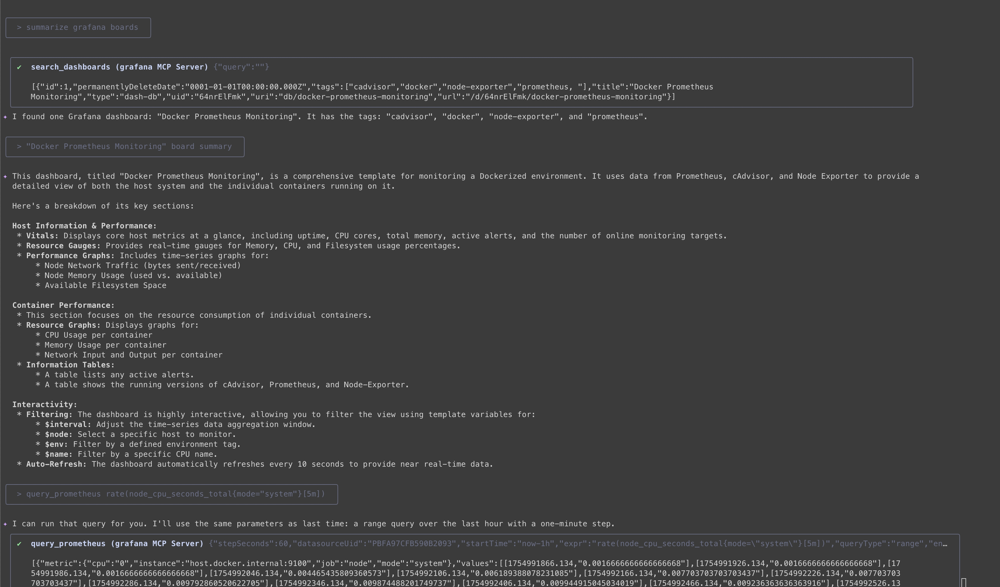

Now, let's see how to use `Grafana` with `n8n`.

### N8n using Grafana mcp

I did not install Docker in the n8n container, so I decided to run the `mcp-grafana` binary file directly.

> Download here: https://github.com/grafana/mcp-grafana/releases

Just run these commands inside your container to install it.

```shell
$ wget https://github.com/grafana/mcp-grafana/releases/download/v0.6.2/mcp-grafana_Linux_x86_64.tar.gz
$ tar -xvzf mcp-grafana_Linux_x86_64.tar.gz
```

After that, n8n nodes should be able to run Grafana using the `/home/node/mcp-grafana` command. Before we try the command, we have to add the `n8n-nodes-mcp` community node to n8n and set up an AI agent workflow. Let's take a look.
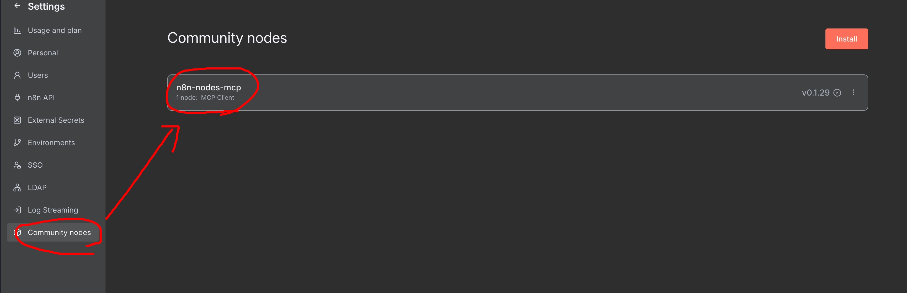
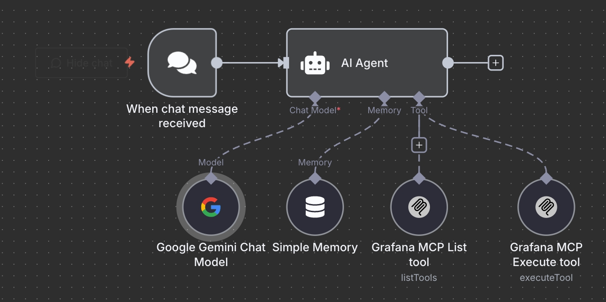

- AI Agent Node:
  I set the system prompt to `You are a helpful Grafana MCP assistant`, and then triggered it with the `Connected Chat Trigger` node.
- Google Gemini Chat Model:
  The important thing is that the host for the `Credential Google Gemini(PaLM) Api` should be `https://generativelanguage.googleapis.com`. Then, paste your [Gemini API key](https://aistudio.google.com/apikey) into the `API Key` field.
- Simple Memory:
  The `Context Window Length` is set to `10` because we need to communicate with the assistant multiple times.
- MCP Client Tool - listTools:
  Remember to use the `MCP client tool` we just downloaded from the community. For this node, I set the `Operation` to `List Tools`.
  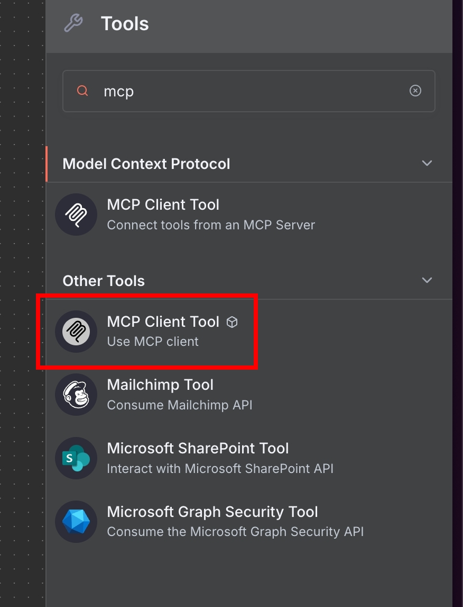
  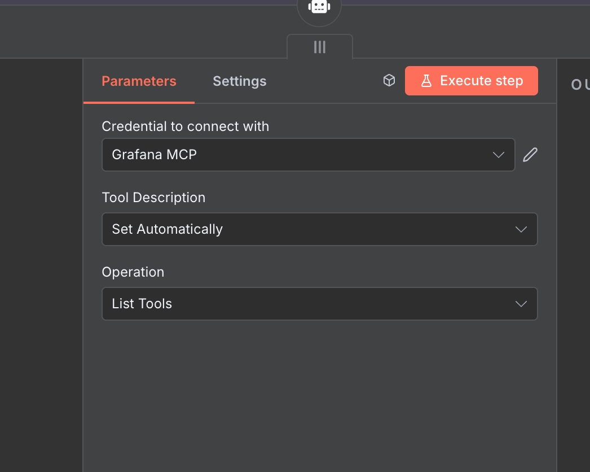
- MCP Client Tool - executeTool:
  For this node, I set `Operation` to `Execute Tool` and `Tool Name` to `{{ $fromAI('tool') }}`. Pay attention to the green area that says `Let the model define this parameter`—just click it!
  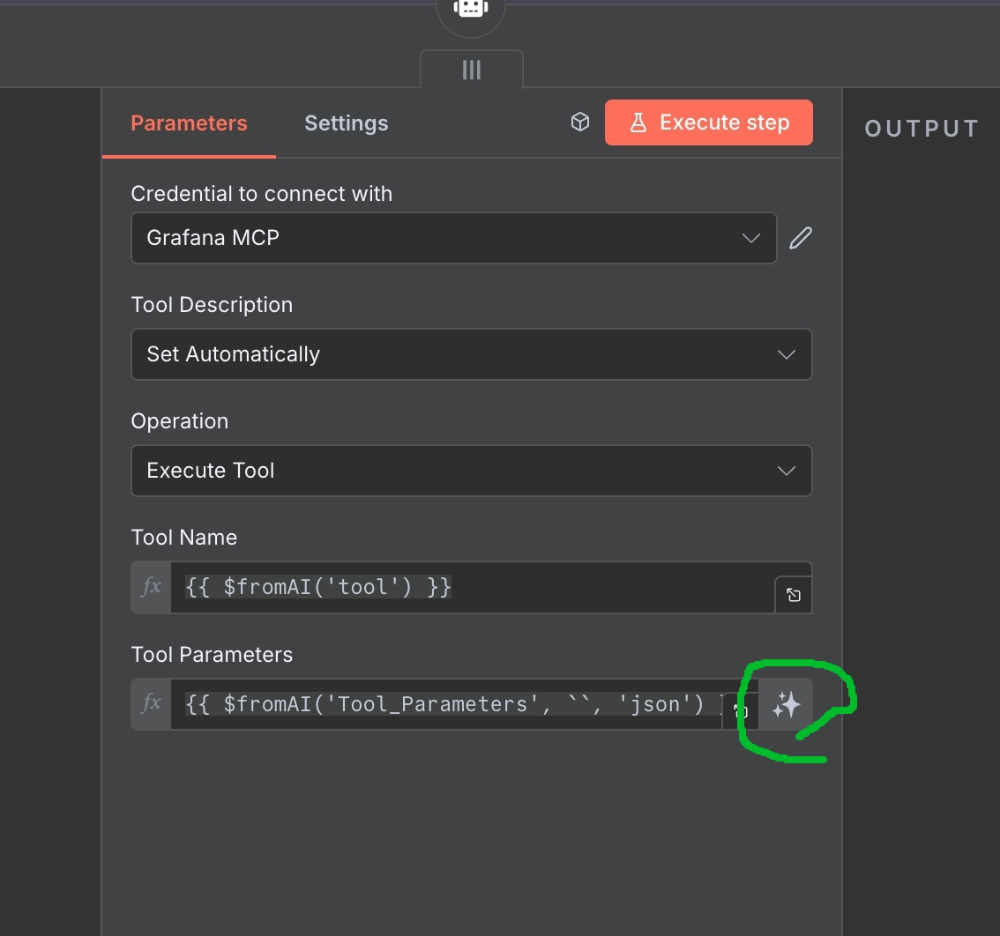
- Grafana MCP Credential:
  This credential connects using `Command Line (STDIO)`. Set the command to `/home/node/mcp-grafana` and set the `GRAFANA_URL` and `GRAFANA_API_KEY` environment variables.
  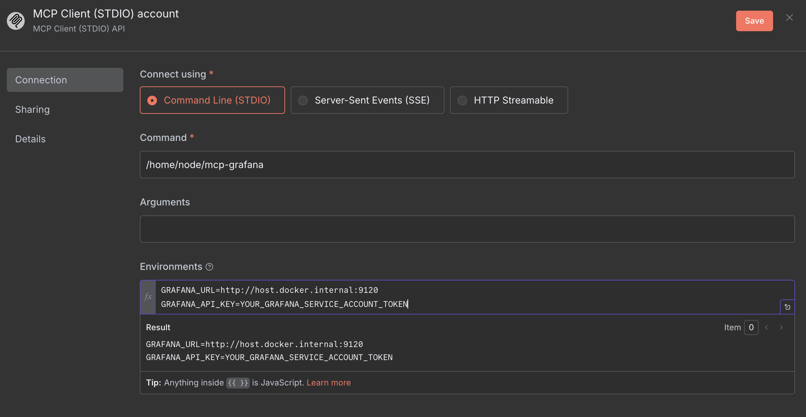

Okay! Let's try some prompts for this MCP:

> { "tool": "query_prometheus", "Tool_Parameters": { "datasourceUid": "PBFA97CFB590B2093", "expr": "rate(node_cpu_seconds_total{mode="system"}[5m])", "queryType": "range", "startTime": "now-1h", "endTime": "now", "stepSeconds": 60 } }

```
The Prometheus query returned time series data for the rate of system CPU usage over the last hour, sampled every 60 seconds, for 11 CPU cores (labeled 0 through 10).

Here is a summary of the data for each CPU core:

CPU 0:
  Latest Value: 0.0148
  Average Value: 0.0155
CPU 1:
  Latest Value: 0.0061
  Average Value: 0.0059
CPU 2:
  Latest Value: 0.0064
  Average Value: 0.0058
CPU 3:
  Latest Value: 0.0037
  Average Value: 0.0053
CPU 4:
  Latest Value: 0.0044
  Average Value: 0.0054
CPU 5:
  Latest Value: 0.0065
  Average Value: 0.0053
CPU 6:
  Latest Value: 0.0050
  Average Value: 0.0060
CPU 7:
  Latest Value: 0.0045
  Average Value: 0.0051
CPU 8:
  Latest Value: 0.0049
  Average Value: 0.0047
CPU 9:
  Latest Value: 0.0068
  Average Value: 0.0045
CPU 10:
  Latest Value: 0.0035
  Average Value: 0.0046
This data indicates the proportion of time each CPU core spent in "system" mode over 5-minute intervals. I can provide a more detailed analysis, create a visualization, or filter the data further if you need.

```

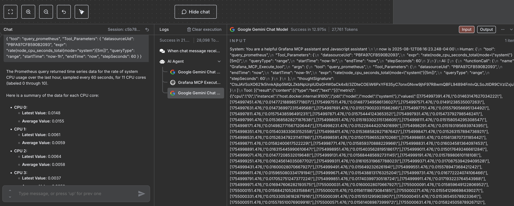

### Conclusion

And there you have it! The Model Context Protocol (MCP) is a game-changer, allowing you to connect services like Grafana to multiple AI agents with incredible ease. Forget writing boilerplate code for HTTP requests or wrestling with APIs. With MCP, a few configuration steps are all you need to get your services talking to each other, making powerful integrations more accessible than ever.

> `If you liked this post, please connect with me on LinkedIn and give me some encouragement. Thanks.`
