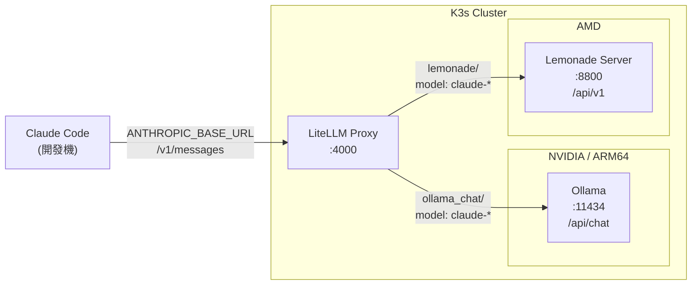
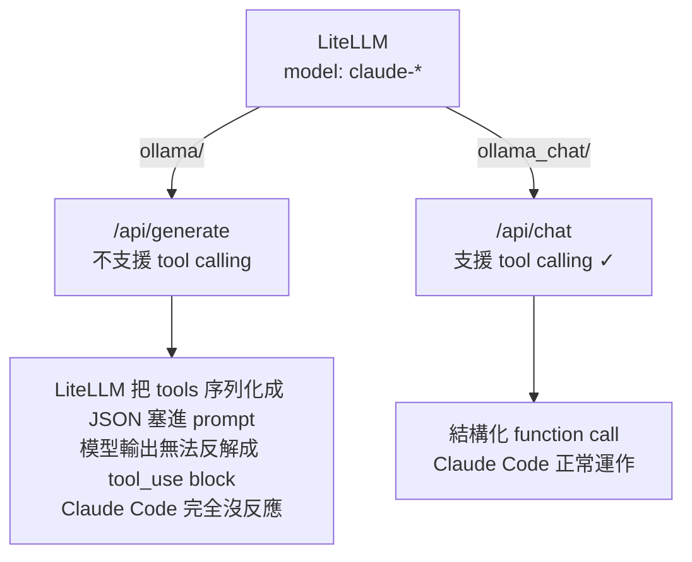
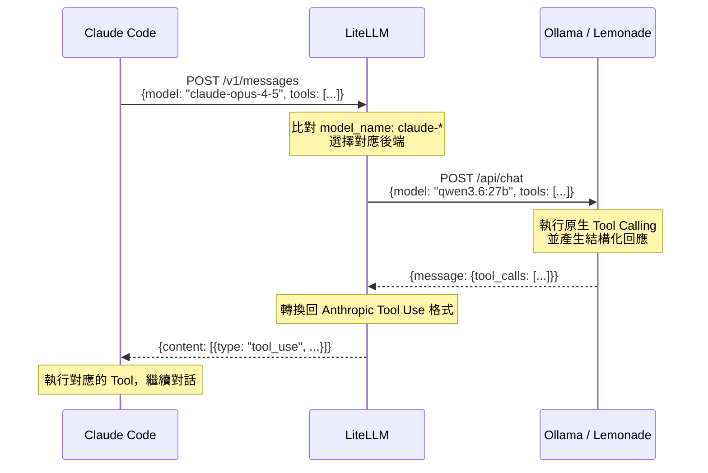

**Claude Code** 是 Anthropic 推出的強大命令列 AI 助手，預設會連接到 Anthropic 的雲端 API。然而，如果你身處**高安全性內網環境**、**無網路的教學現場**，或者想**節省 API 費用**，那麼將 Claude Code 橋接到本地運行的大型語言模型（LLM）是一個非常理想的解決方案。

本文將詳細說明如何透過 **LiteLLM Proxy**，將 Claude Code 的請求無縫轉發至本地的 **Ollama** 或 **Lemonade** 服務，並分享我們在實際整合過程中踩過的核心坑洞與解決方案。

### TOC

<!-- more -->

## 系統架構

在我們的設定中，Claude Code 執行於開發機，而本地 LLM 服務則部署於 K3s 集群中。整體架構如下：



---

## 為什麼需要 LiteLLM？

**Claude Code** 的底層是硬編碼（Hardcoded）只認 Anthropic API 格式（即 `/v1/messages` 端點），並預期接收 Anthropic 特有的資料結構。而本地的 LLM 服務（如 Ollama、Lemonade）通常只提供自己專屬的 API 或 OpenAI 相容格式，兩者的資料格式無法直接對接。

此時，**LiteLLM** 便扮演了關鍵的「協議轉譯代理（Proxy）」角色：

1. **格式轉譯**：接收 Claude Code 發出的 Anthropic 格式請求，並無縫轉換為本地 LLM 所需的格式。
2. **參數過濾**：自動過濾掉本地模型不支援的雲端參數（例如 Anthropic 專有的特定欄位）。
3. **響應封裝**：將本地模型產生的回應，重新包裝回 Anthropic 格式回傳給 Claude Code，讓客戶端誤以為仍在與 Anthropic 雲端通訊。

---

## 核心踩坑：`ollama/` 與 `ollama_chat/` 的關鍵差異

這是許多人在整合本地模型與 Agent 框架時最容易忽略、也最常踩到的雷區。



Claude Code 作為一個 Agent，極度依賴 **Tool Calling（工具調用）** 功能來執行檔案讀寫、執行 Terminal 指令以及進行搜尋。

* **使用 `ollama/` 前綴時**：
  LiteLLM 底層會呼叫 Ollama 的 `/api/generate` 接口。由於該接口不支援原生 Tool Calling，LiteLLM 會嘗試使用「後備機制（Fallback）」，將工具定義序列化為 JSON 文字硬塞進 System Prompt 中，期望模型能以特定格式輸出。然而，本地模型（如 Qwen 等）通常無法穩定遵循這種複雜的 Prompt 格式，導致輸出無法被 LiteLLM 還原為 `tool_use` 區塊，最終造成 Claude Code 毫無反應。
  * **症狀**：LiteLLM 的日誌中會出現 `functions_unsupported_model` 的警告。

* **使用 `ollama_chat/` 前綴時**：
  LiteLLM 會改為呼叫 Ollama 的 `/api/chat` 接口，這能啟用 Ollama 原生的結構化 Tool Calling 功能，使本地模型能以結構化 JSON 穩定返回工具調用結果，Claude Code 即可完美運作。

> [!IMPORTANT]
> **結論**：連接 Ollama 時，模型前綴**一律要使用 `ollama_chat/`**，絕對不要用 `ollama/`。

---

## LiteLLM 設定檔指南

請參考以下 `config.yaml` 的配置。在此配置中，我們分別為 NVIDIA/ARM64 環境（執行 Ollama）與 AMD 環境（執行 Lemonade）定義了對應的轉發模型。

```yaml
litellm_settings:
  # 自動過濾掉本地模型不支援的 API 參數，避免請求被後端拒絕
  drop_params: true
  # 當模型沒有正確使用 Tool Calling 結構，但將呼叫寫在內文中時，嘗試進行文字解析作為備援
  parse_tool_call_from_content: true

model_list:
  # NVIDIA / ARM64 環境 → Ollama
  - model_name: claude-*
    litellm_params:
      model: ollama_chat/qwen3.6:27b # 務必使用 ollama_chat/ 前綴
      api_base: 'http://ollama:11434'
    model_info:
      max_tokens: 32768
      max_input_tokens: 32768
      max_output_tokens: 32768

  # AMD 環境 → Lemonade（使用 /no_think 略過思考 Token，節省輸出長度）
  - model_name: claude-*
    litellm_params:
      model: lemonade/Qwen3.5-35B-A3B-GGUF
      api_base: 'http://lemonade:8800/api/v1'
      api_key: 'your-api-key'
      system_prompt: '/no_think'
    model_info:
      max_tokens: 64000
      max_input_tokens: 131072
      max_output_tokens: 64000
```

---

## 完整請求流程

下圖展示了 Claude Code、LiteLLM 與本地後端之間的互動流程：



---

## Claude Code 用戶端設定

在你的開發機上，只需將環境變數指向 LiteLLM Proxy 的位址。編輯你的 Shell 設定檔（例如 `~/.zshrc` 或 `~/.bashrc`），並加入以下設定：

```bash
export ANTHROPIC_BASE_URL="http://<litellm-host>:4000"
export ANTHROPIC_API_KEY="<litellm-master-key>"
```

儲存後，執行 `source ~/.zshrc`（或重新開啟終端機），接著直接輸入 `claude` 即可開始使用本地模型！

---

## 驗證執行狀態

若要確認一切是否設定正確，可以檢查 LiteLLM 的日誌來確認其轉發狀態，判斷請求是否有被正常解析與轉送：

* **Kubernetes (K3s) 環境**：
  ```bash
  kubectl logs -f deployment/litellm -n tigerai --tail=100
  ```
* **Docker 環境**：
  ```bash
  docker logs -f <litellm-container-name> --tail 100
  ```

---

## 快速總結

| 整合要點 | 建議設定值 | 說明 |
| :--- | :--- | :--- |
| **Ollama 前綴** | `ollama_chat/` | 啟用原生 Tool Calling 的關鍵，不可使用 `ollama/` |
| **Lemonade 前綴** | `lemonade/` | 對接 Lemonade 伺服器的對應前綴 |
| **`drop_params`** | `true` | 防止本地模型因為不認識 Anthropic 雲端參數而報錯 |
| **`parse_tool_call_from_content`** | `true` | 作為 Tool Calling 的後備解析機制，提升穩定度 |
| **用戶端變數** | `ANTHROPIC_BASE_URL` | 將 Claude Code 的請求重導向至 LiteLLM 代理伺服器 |
