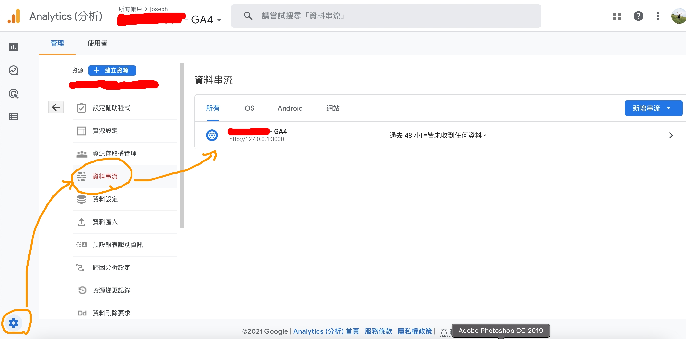
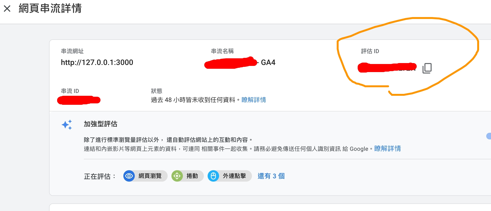
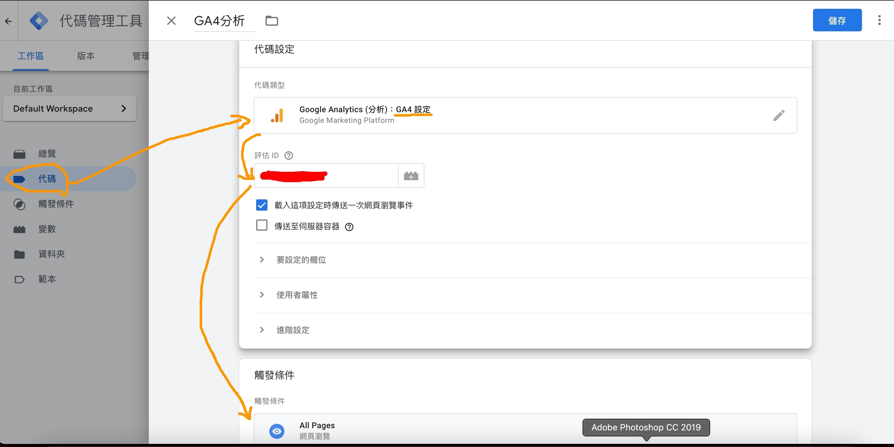
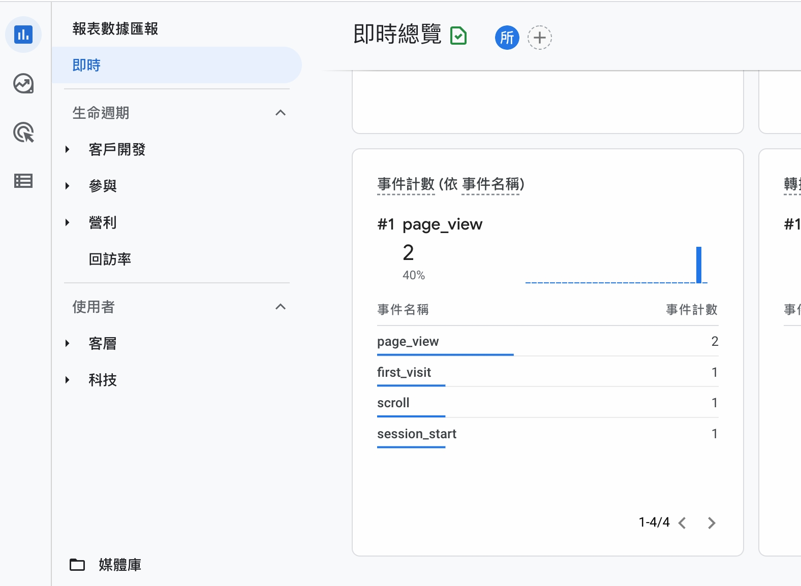
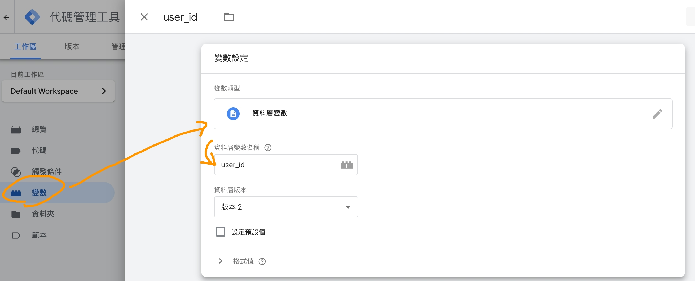
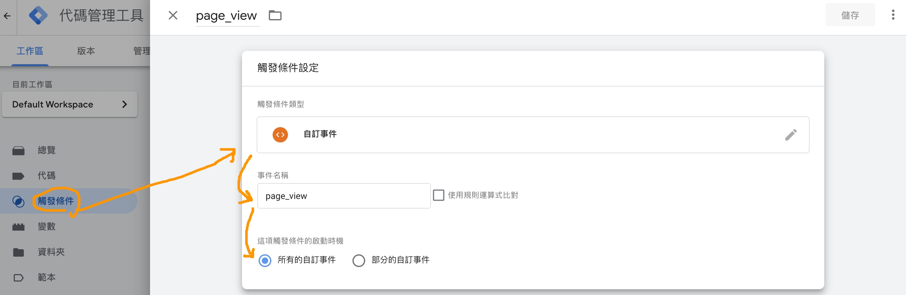
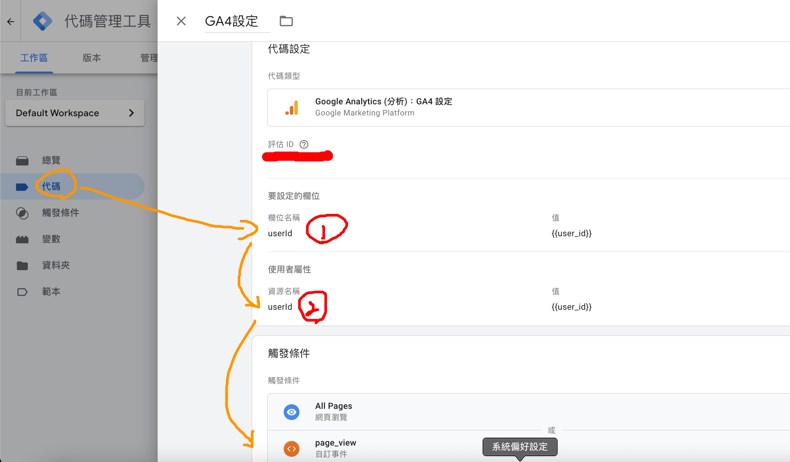
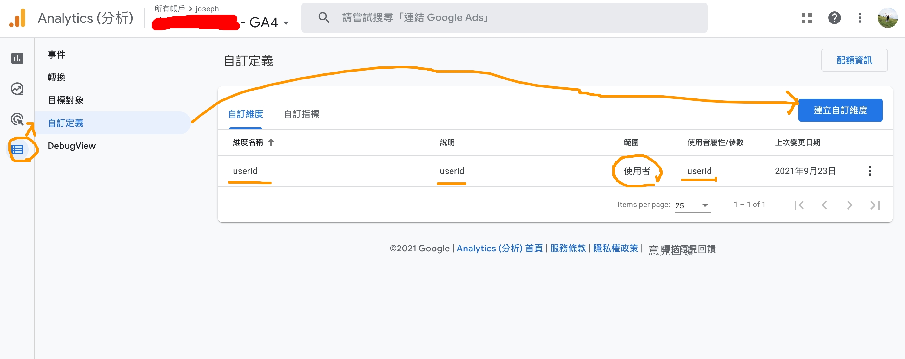
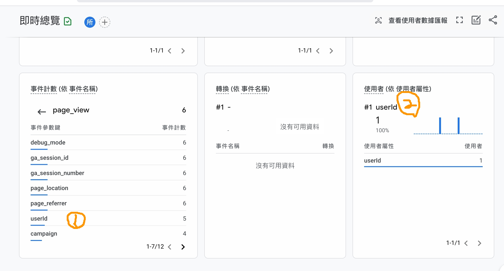

這篇文章我決定用中文寫，主要原因是中文的資料太少，而且也很多不是[Google Analytics 4](https://support.google.com/analytics/answer/10089681?hl=zh-Hant) + [Google Tag Manager](https://tagmanager.google.com/) (GA4+GTM) 的設定，所以我覺得用中文記錄一下，好讓大家要搜尋的可以搜得到。

在以前GA追蹤埋追蹤碼時，我們要紀錄的`user_id`經過規劃後會視情況放在`category`, `action`, `label`, `value`或複雜一點的[custom dimensions](https://support.google.com/analytics/answer/2709828#example-user&zippy=%2Cin-this-article)裡，GA經過長時間的演進，再加上GTM的助攻，現在已經可以有各種變化、也有多種[templates](https://tagmanager.google.com/gallery/#/)可以套用在網站及應用程式裡。

至於要怎麼做呢？首先一樣從[GTM](https://tagmanager.google.com/)上方的`管理` > `安裝 Google 代碼管理工具`把追蹤程式碼塞到我們的網站上，然後回到GA4去取得`評估ID`。
> 如果你只有通用型GA分析的話，也可以從`管理` > `Google Analytics (分析) 4 資源設定輔助程式`開啟GA4追蹤功能


<!-- more -->

圖裡的`評估ID`等一下在設定GTM的時候會用到。

# 先串GTM跟GA
進到[GTM](https://tagmanager.google.com/)，從左邊`代碼`裡新增一個代碼設定：`Google Analytics (分析)：GA4 設定`，貼上剛剛的`評估ID`，然後最下面觸發條件選擇`All Pages`。


`儲存`然後右上角的`提交`，設定完回到GA4，在瀏覽網頁的時候就會有一些`page_view`的事件。


這邊就讓你的GA4跟以前通用型GA一樣了。

# 再串user_id

串`user_id`的時候，我們要設定GTM、GA4、還有也要寫code，我們從GTM開始。
### 先在GTM設定user_id


我們在左邊`變數`的地方新增一個`資料層變數`，這邊輸入的`user_id`要跟程式碼裡`push`進dataLayer的一致。


這一步是我遲疑的地方，在左邊`觸發條件`裡我手動新增一個`page_view`的`自訂事件`，準備去把每個`user_id`一起追蹤進去。雖然`All Pages`應該可以被觸發，但測試時一直沒進去，設定這個觸發條件才可以。


接著回去修改剛剛的`代碼`，把`要設定的欄位`跟`使用者屬性`加上欄位名稱及資源名稱`userId`，而數值的部分可以透過選擇或是直接key上去，都是{{user_id}}。
`要設定的欄位`的`userId`會顯示在GA4的`事件`裡，而`使用者屬性`則會顯示在`依使用者屬性`裡。

這邊為什麼不是`user_id`而是`userId`？因為之後在GA4設定的時候我一直餵不進去`user_id`，反而`userId`可以。

### 接著設定GA4

在`自訂定義`裡新增維度，範圍選`使用者`，而`使用者屬性/變數`這邊就是我說的只能輸入`userId`，不接受`user_id`的地方。

> 這邊的設定會影響`依使用者屬性`這部分的追蹤，`事件`的部分不會影響。

最後是code的部分，我以React / NextJs為例。

### 看看code

**gtag.js**
```javascript
const pushDataLayer = (event) => {
  if (window && window.dataLayer) {
    window.dataLayer.push(event);
  }
};

export const pageview = (url) => {
  const pageEvent = {
    event: 'page_view',
    page: url,
  };

  pushDataLayer(pageEvent);
  return pageEvent;
};

export const setUserId = (userId) => {
  const pageEvent = {
    user_id: userId,
  };

  pushDataLayer(pageEvent);
  return pageEvent;
};
```

**pages/_app.js**

```javascript
  useEffect(() => {
    const cookies = parseCookies()
    const handleRouteChange = (url) => {
      if (cookies.userId) {
        gtag.setUserId(cookies.userId);
      }
      gtag.pageview(url)
    }
    router.events.on('routeChangeComplete', handleRouteChange)
    return () => {
      router.events.off('routeChangeComplete', handleRouteChange)
    }
  }, [router.events])
```

在`setUserId`裡可以看到key是`user_id`，而`handleRouteChange`裡在`pageview`之前要先`setUserId`，把`user_id`塞進dataLayer裡。

最後就來看看結果了。

這張圖的1跟2呼應到上面修改代碼時的`要設定的欄位`跟`使用者屬性`，每個`page_view`都會紀錄`userId`，使用者屬性也有把`userId`記錄下來。

這是設定第二次了，即便如此我還是失敗了很久，希望文章寫下來以後不會忘記。
