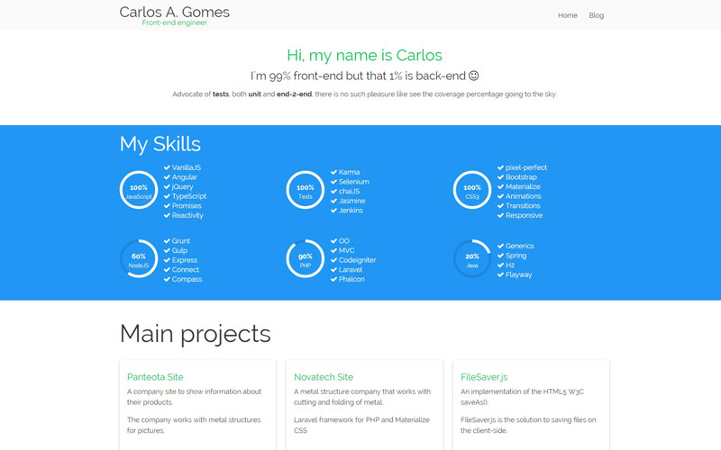

# Welcome to Materialize Hexo Theme



[Live Demo Here](https://carlos-algms.github.io/)

<!-- more -->

## Features Overview

- Home and Blog pages with different layouts
- Responsive
- Google Analytics
- Pagination
- Pages
- Categories Support
- About page
- Sass Scss

## External libraries used

- [Materialize CSS](https://materializecss.com/)
- [Font Awesome](https://fontawesome.com/icons/)
- [Lightbox2](https://github.com/lokesh/lightbox2)
- [jQuery Circle Progress](https://kottenator.github.io/jquery-circle-progress/)

## Installation

### Install the theme

You can install the theme by using:

```
$ git clone https://github.com/carlos-algms/hexo-theme-materialize.git themes/materialize
```

Then update your blog's main `_config.yml` to set the theme to `materialize`:

i.e:

```yaml
# Extensions
## Plugins: http://hexo.io/plugins/
## Themes: http://hexo.io/themes/
theme: materialize
```

After this, uninstall `hexo-generator-index`
since this theme will use a custom index, we do not need this generator.

```shell
npm uninstall --save hexo-generator-index
```

Create your custom index file on `source/index.html`:

```html
---
layout: index
title:
comments: false
---

<h1>Hello World</h1>
```

## Configure your site urls

You can configure any url you may want to serve your blog content,
follow the suggested one:

```yml
permalink: blog/:title/
tag_dir: blog/tags
archive_dir: blog
category_dir: blog/categories
```

## Post Configurations

Each post supports the standard `title`, `date`, `updated`, `categories`, and `tags`.

Example:

```yaml
title: Welcome to Materialize
tags: ['ThisIsATag', 'Intro', 'Welcome']
date: 2017-04-08 23:32:59
updated: 2021-01-25 10:00:00
---

```

## Theme Configuration

The theme's configuration is done on your project's root folder in the file `_config.yml`.

### Menu

The menu items listed on the top-right

```yaml
# Header
menu:
  Home: /
  Blog: /blog
```

**PS:** The `Blog` menu **must match** your `archive_dir` config.

### Google Analytics

If set, page-views will be tracked automatically, in production only, not on local development

```yaml
# Google Analytics Tracking ID
google_analytics: UA-XXXXXX-Y
```

Or even the new G4 Analytics:

```yaml
# Google Analytics G4 Tracking ID
google_analytics: G-XXXXXXXXXX
```

### Favicon

Favicon file without the extension.  
Please, provide a `png` file AND a `.ico` for legacy browsers.

```yaml
favicon: images/favicon
```

### Social Media

When set, it will create the openGraph tags in the `<head>` of your site.

```yaml
twitter:  userXX
google_plus: user-XX
fb_admins: idem
fb_app_id: idem
```

### RSS
In case you ara generating you XML file, use this settings to create a link to the xml file in the `<head>` tag.

```yaml
rss: /atom.xml
```

### Excerpt link

The "Read More +" label used in the button.

```yaml
excerpt_link: Read More
```

**PS:** To create the "Read More" button, just add `<!-- more -->` anywhere in your post.

## Creator

This theme was created by Carlos A. Gomes, check out my [github](https://github.com/carlos-algms) and [blog](http://carlos-algms.github.io/).

## Bugs

If you have a question, feature request or a bug you need me to fix, please [click here](https://github.com/carlos-algms/hexo-theme-materialize/issues/new) to file an issue.

## License

MIT

Enjoy :)
